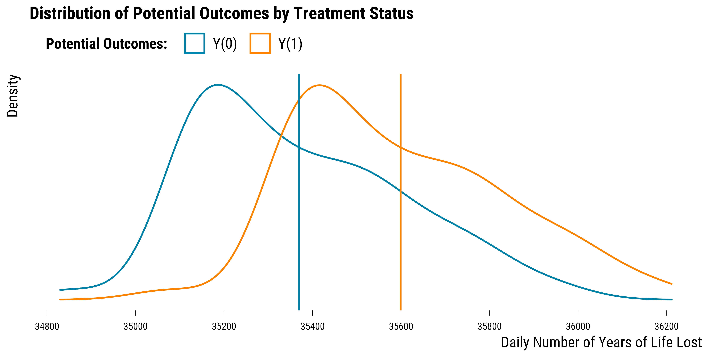

<style>
body {
text-align: justify}
</style>

In this document, we provide all steps and R codes required to simulate the environmental data. For each day, we simulate the number of years of life lost (YoLL) with and without the occurrence of an heat wave. **Should you have any questions, need help to reproduce the simulation or find coding errors, please do not hesitate to contact us at leo.zabrocki@psemail.eu**

# Required Packages

To reproduce exactly the `1_script_simulating_data.html` document, we first need to have installed:

* the [R](https://www.r-project.org/) programming language 
* [RStudio](https://rstudio.com/), an integrated development environment for R, which will allow you to knit the `1_script_simulating_data.Rmd` file and interact with the R code chunks
* the [R Markdown](https://rmarkdown.rstudio.com/) package
* and the [Distill](https://rstudio.github.io/distill/) package which provides the template for this document. 

Once everything is set up, we load the following packages:

<div class="layout-chunk" data-layout="l-body-outset">
<div class="sourceCode"><pre class="sourceCode r"><code class="sourceCode r"><span class='co'># load required packages</span>
<span class='kw'><a href='https://rdrr.io/r/base/library.html'>library</a></span><span class='op'>(</span><span class='va'><a href='https://yihui.org/knitr/'>knitr</a></span><span class='op'>)</span> <span class='co'># for creating the R Markdown document</span>
<span class='kw'><a href='https://rdrr.io/r/base/library.html'>library</a></span><span class='op'>(</span><span class='va'><a href='https://here.r-lib.org/'>here</a></span><span class='op'>)</span> <span class='co'># for files paths organization</span>
<span class='kw'><a href='https://rdrr.io/r/base/library.html'>library</a></span><span class='op'>(</span><span class='va'><a href='https://tidyverse.tidyverse.org'>tidyverse</a></span><span class='op'>)</span> <span class='co'># for data manipulation and visualization</span>
<span class='kw'><a href='https://rdrr.io/r/base/library.html'>library</a></span><span class='op'>(</span><span class='va'><a href='https://wilkelab.org/ggridges/'>ggridges</a></span><span class='op'>)</span> <span class='co'># for ridge density plots</span>
<span class='kw'><a href='https://rdrr.io/r/base/library.html'>library</a></span><span class='op'>(</span><span class='va'><a href='http://www.rforge.net/Cairo/'>Cairo</a></span><span class='op'>)</span> <span class='co'># for printing custom police of graphs</span>
<span class='kw'><a href='https://rdrr.io/r/base/library.html'>library</a></span><span class='op'>(</span><span class='va'><a href='https://github.com/rstudio/DT'>DT</a></span><span class='op'>)</span> <span class='co'># for displaying the data as tables</span>
</code></pre></div>

</div>


We finally load our custom `ggplot2` theme for graphs:

<div class="layout-chunk" data-layout="l-body-outset">
<div class="sourceCode"><pre class="sourceCode r"><code class="sourceCode r"><span class='co'># load ggplot custom theme</span>
<span class='kw'><a href='https://rdrr.io/r/base/source.html'>source</a></span><span class='op'>(</span><span class='fu'>here</span><span class='fu'>::</span><span class='fu'><a href='https://here.r-lib.org//reference/here.html'>here</a></span><span class='op'>(</span><span class='st'>"2.scripts"</span>,
                  <span class='st'>"functions"</span>,
                  <span class='st'>"script_theme_tufte.R"</span><span class='op'>)</span><span class='op'>)</span>
<span class='co'># define nice colors</span>
<span class='va'>my_blue</span> <span class='op'>&lt;-</span> <span class='st'>"#0081a7"</span>
<span class='va'>my_orange</span> <span class='op'>&lt;-</span> <span class='st'>"#fb8500"</span>
</code></pre></div>

</div>


# Environmental Data

We base our simulation on a dataset that includes all residents of the island of Montreal, Canada, who died from non-accidental causes in the city during the summer periods (June-August) between 1990 and 2007. Daily observations with missing values were dropped to ease the simulation procedure. We load the environmental dataset `aw_environmental_data.rds` located in the `1.data` folder:

<div class="layout-chunk" data-layout="l-body-outset">
<div class="sourceCode"><pre class="sourceCode r"><code class="sourceCode r"><span class='co'># load environmental data</span>
<span class='va'>data</span> <span class='op'>&lt;-</span>
  <span class='fu'><a href='https://rdrr.io/r/base/readRDS.html'>readRDS</a></span><span class='op'>(</span><span class='fu'>here</span><span class='fu'>::</span><span class='fu'><a href='https://here.r-lib.org//reference/here.html'>here</a></span><span class='op'>(</span><span class='st'>"1.data"</span>, <span class='st'>"raw_environmental_data.rds"</span><span class='op'>)</span><span class='op'>)</span>
</code></pre></div>

</div>


We display below five of the variables included in the data:

<div class="layout-chunk" data-layout="l-body-outset">
<div class="sourceCode"><pre class="sourceCode r"><code class="sourceCode r"><span class='co'># display part of the data</span>
<span class='fu'><a href='https://rdrr.io/pkg/DT/man/datatable.html'>datatable</a></span><span class='op'>(</span><span class='va'>data</span> <span class='op'>%&gt;%</span> <span class='fu'>select</span><span class='op'>(</span><span class='va'>id</span>, <span class='va'>date</span>, <span class='va'>yll</span>, <span class='va'>total_death</span>, <span class='va'>heat_wave</span><span class='op'>)</span><span class='op'>)</span>
</code></pre></div>

```{=html}
<div id="htmlwidget-6cfce67249dd32a382ed" style="width:100%;height:auto;" class="datatables html-widget"></div>
<script type="application/json" data-for="htmlwidget-6cfce67249dd32a382ed">{"x":{"filter":"none","data":[["1","2","3","4","5","6","7","8","9","10","11","12","13","14","15","16","17","18","19","20","21","22","23","24","25","26","27","28","29","30","31","32","33","34","35","36","37","38","39","40","41","42","43","44","45","46","47","48","49","50","51","52","53","54","55","56","57","58","59","60","61","62","63","64","65","66","67","68","69","70","71","72","73","74","75","76","77","78","79","80","81","82","83","84","85","86","87","88","89","90","91","92","93","94","95","96","97","98","99","100","101","102","103","104","105","106","107","108","109","110","111","112","113","114","115","116","117","118","119","120","121","122","123","124","125","126","127","128","129","130","131","132","133","134","135","136","137","138","139","140","141","142","143","144","145","146","147","148","149","150","151","152","153","154","155","156","157","158","159","160","161","162","163","164","165","166","167","168","169","170","171","172","173","174","175","176","177","178","179","180","181","182","183","184","185","186","187","188","189","190","191","192","193","194","195","196","197","198","199","200","201","202","203","204","205","206","207","208","209","210","211","212","213","214","215","216","217","218","219","220","221","222","223","224","225","226","227","228","229","230","231","232","233","234","235","236","237","238","239","240","241","242","243","244","245","246","247","248","249","250","251","252","253","254","255","256","257","258","259","260","261","262","263","264","265","266","267","268","269","270","271","272","273","274","275","276","277","278","279","280","281","282","283","284","285","286","287","288","289","290","291","292","293","294","295","296","297","298","299","300","301","302","303","304","305","306","307","308","309","310","311","312","313","314","315","316","317","318","319","320","321","322","323","324","325","326","327","328","329","330","331","332","333","334","335","336","337","338","339","340","341","342","343","344","345","346","347","348","349","350","351","352","353","354","355","356","357","358","359","360","361","362","363","364","365","366","367","368","369","370","371","372","373","374","375","376","377","378","379","380","381","382","383","384","385","386","387","388","389","390","391","392","393","394","395","396","397","398","399","400","401","402","403","404","405","406","407","408","409","410","411","412","413","414","415","416","417","418","419","420","421","422","423","424","425","426","427","428","429","430","431","432","433","434","435","436","437","438","439","440","441","442","443","444","445","446","447","448","449","450","451","452","453","454","455","456","457","458","459","460","461","462","463","464","465","466","467","468","469","470","471","472","473","474","475","476","477","478","479","480","481","482","483","484","485","486","487","488","489","490","491","492","493","494","495","496","497","498","499","500","501","502","503","504","505","506","507","508","509","510","511","512","513","514","515","516","517","518","519","520","521","522","523","524","525","526","527","528","529","530","531","532","533","534","535","536","537","538","539","540","541","542","543","544","545","546","547","548","549","550","551","552","553","554","555","556","557","558","559","560","561","562","563","564","565","566","567","568","569","570","571","572","573","574","575","576","577","578","579","580","581","582","583","584","585","586","587","588","589","590","591","592","593","594","595","596","597","598","599","600","601","602","603","604","605","606","607","608","609","610","611","612","613","614","615","616","617","618","619","620","621","622","623","624","625","626","627","628","629","630","631","632","633","634","635","636","637","638","639","640","641","642","643","644","645","646","647","648","649","650","651","652","653","654","655","656","657","658","659","660","661","662","663","664","665","666","667","668","669","670","671","672","673","674","675","676","677","678","679","680","681","682","683","684","685","686","687","688","689","690","691","692","693","694","695","696","697","698","699","700","701","702","703","704","705","706","707","708","709","710","711","712","713","714","715","716","717","718","719","720","721","722","723","724","725","726","727","728","729","730","731","732","733","734","735","736","737","738","739","740","741","742","743","744","745","746","747","748","749","750","751","752","753","754","755","756","757","758","759","760","761","762","763","764","765","766","767","768","769","770","771","772","773","774","775","776","777","778","779","780","781","782","783","784","785","786","787","788","789","790","791","792","793","794","795","796","797","798","799","800","801","802","803","804","805","806","807","808","809","810","811","812","813","814","815","816","817","818","819","820","821","822","823","824","825","826","827","828","829","830","831","832","833","834","835","836","837","838","839","840","841","842","843","844","845","846","847","848","849","850","851","852","853","854","855","856","857","858","859","860","861","862","863","864","865","866","867","868","869","870","871","872","873","874","875","876","877","878","879","880","881","882","883","884","885","886","887","888","889","890","891","892","893","894","895","896","897","898","899","900","901","902","903","904","905","906","907","908","909","910","911","912","913","914","915","916","917","918","919","920","921","922","923","924","925","926","927","928","929","930","931","932","933","934","935","936","937","938","939","940","941","942","943","944","945","946","947","948","949","950","951","952","953","954","955","956","957","958","959","960","961","962","963","964","965","966","967","968","969","970","971","972","973","974","975","976","977","978","979","980","981","982","983","984","985","986","987","988","989","990","991","992","993","994","995","996","997","998","999","1000","1001","1002","1003","1004","1005","1006","1007","1008","1009","1010","1011","1012","1013","1014","1015","1016","1017","1018","1019","1020","1021","1022","1023","1024","1025","1026","1027","1028","1029","1030","1031","1032","1033","1034","1035","1036","1037","1038","1039","1040","1041","1042","1043","1044","1045","1046","1047","1048","1049","1050","1051","1052","1053","1054","1055","1056","1057","1058","1059","1060","1061","1062","1063","1064","1065","1066","1067","1068","1069","1070","1071","1072","1073","1074","1075","1076","1077","1078","1079","1080","1081","1082","1083","1084","1085","1086","1087","1088","1089","1090","1091","1092","1093","1094","1095","1096","1097","1098","1099","1100","1101","1102","1103","1104","1105","1106","1107","1108","1109","1110","1111","1112","1113","1114","1115","1116","1117","1118","1119","1120","1121","1122","1123","1124","1125","1126","1127","1128","1129","1130","1131","1132","1133","1134","1135","1136","1137","1138","1139","1140","1141","1142","1143","1144","1145","1146","1147","1148","1149","1150","1151","1152","1153","1154","1155","1156","1157","1158","1159","1160","1161","1162","1163","1164","1165","1166","1167","1168","1169","1170","1171","1172","1173","1174","1175","1176","1177","1178","1179","1180","1181","1182","1183","1184","1185","1186","1187","1188","1189","1190","1191","1192","1193","1194","1195","1196","1197","1198","1199","1200","1201","1202","1203","1204","1205","1206","1207","1208","1209","1210","1211","1212","1213","1214","1215","1216","1217","1218","1219","1220","1221","1222","1223","1224","1225","1226","1227","1228","1229","1230","1231","1232","1233","1234","1235","1236","1237","1238","1239","1240","1241","1242","1243","1244","1245","1246","1247","1248","1249","1250","1251","1252","1253","1254","1255","1256","1257","1258","1259","1260","1261","1262","1263","1264","1265","1266","1267","1268","1269","1270","1271","1272","1273","1274","1275","1276","1277","1278","1279","1280","1281","1282","1283","1284","1285","1286","1287","1288","1289","1290","1291","1292","1293","1294","1295","1296","1297","1298","1299","1300","1301","1302","1303","1304","1305","1306","1307","1308","1309","1310","1311","1312","1313","1314","1315","1316","1317","1318","1319","1320","1321","1322","1323","1324","1325","1326","1327","1328","1329","1330","1331","1332","1333","1334","1335","1336","1337","1338","1339","1340","1341","1342","1343","1344","1345","1346","1347","1348","1349","1350","1351","1352","1353","1354","1355","1356","1357","1358","1359","1360","1361","1362","1363","1364","1365","1366","1367","1368","1369","1370","1371","1372","1373","1374","1375","1376"],[1,2,3,4,5,6,7,8,9,10,11,12,13,14,15,16,17,18,19,20,21,22,23,24,25,26,27,28,29,30,31,32,33,34,35,36,37,38,39,40,41,42,43,44,45,46,47,48,49,50,51,52,53,54,55,56,57,58,59,60,61,62,63,64,65,66,67,68,69,70,71,72,73,74,75,76,77,78,79,80,81,82,83,84,85,86,87,88,89,90,91,92,93,94,95,96,97,98,99,100,101,102,103,104,105,106,107,108,109,110,111,112,113,114,115,116,117,118,119,120,121,122,123,124,125,126,127,128,129,130,131,132,133,134,135,136,137,138,139,140,141,142,143,144,145,146,147,148,149,150,151,152,153,154,155,156,157,158,159,160,161,162,163,164,165,166,167,168,169,170,171,172,173,174,175,176,177,178,179,180,181,182,183,184,185,186,187,188,189,190,191,192,193,194,195,196,197,198,199,200,201,202,203,204,205,206,207,208,209,210,211,212,213,214,215,216,217,218,219,220,221,222,223,224,225,226,227,228,229,230,231,232,233,234,235,236,237,238,239,240,241,242,243,244,245,246,247,248,249,250,251,252,253,254,255,256,257,258,259,260,261,262,263,264,265,266,267,268,269,270,271,272,273,274,275,276,277,278,279,280,281,282,283,284,285,286,287,288,289,290,291,292,293,294,295,296,297,298,299,300,301,302,303,304,305,306,307,308,309,310,311,312,313,314,315,316,317,318,319,320,321,322,323,324,325,326,327,328,329,330,331,332,333,334,335,336,337,338,339,340,341,342,343,344,345,346,347,348,349,350,351,352,353,354,355,356,357,358,359,360,361,362,363,364,365,366,367,368,369,370,371,372,373,374,375,376,377,378,379,380,381,382,383,384,385,386,387,388,389,390,391,392,393,394,395,396,397,398,399,400,401,402,403,404,405,406,407,408,409,410,411,412,413,414,415,416,417,418,419,420,421,422,423,424,425,426,427,428,429,430,431,432,433,434,435,436,437,438,439,440,441,442,443,444,445,446,447,448,449,450,451,452,453,454,455,456,457,458,459,460,461,462,463,464,465,466,467,468,469,470,471,472,473,474,475,476,477,478,479,480,481,482,483,484,485,486,487,488,489,490,491,492,493,494,495,496,497,498,499,500,501,502,503,504,505,506,507,508,509,510,511,512,513,514,515,516,517,518,519,520,521,522,523,524,525,526,527,528,529,530,531,532,533,534,535,536,537,538,539,540,541,542,543,544,545,546,547,548,549,550,551,552,553,554,555,556,557,558,559,560,561,562,563,564,565,566,567,568,569,570,571,572,573,574,575,576,577,578,579,580,581,582,583,584,585,586,587,588,589,590,591,592,593,594,595,596,597,598,599,600,601,602,603,604,605,606,607,608,609,610,611,612,613,614,615,616,617,618,619,620,621,622,623,624,625,626,627,628,629,630,631,632,633,634,635,636,637,638,639,640,641,642,643,644,645,646,647,648,649,650,651,652,653,654,655,656,657,658,659,660,661,662,663,664,665,666,667,668,669,670,671,672,673,674,675,676,677,678,679,680,681,682,683,684,685,686,687,688,689,690,691,692,693,694,695,696,697,698,699,700,701,702,703,704,705,706,707,708,709,710,711,712,713,714,715,716,717,718,719,720,721,722,723,724,725,726,727,728,729,730,731,732,733,734,735,736,737,738,739,740,741,742,743,744,745,746,747,748,749,750,751,752,753,754,755,756,757,758,759,760,761,762,763,764,765,766,767,768,769,770,771,772,773,774,775,776,777,778,779,780,781,782,783,784,785,786,787,788,789,790,791,792,793,794,795,796,797,798,799,800,801,802,803,804,805,806,807,808,809,810,811,812,813,814,815,816,817,818,819,820,821,822,823,824,825,826,827,828,829,830,831,832,833,834,835,836,837,838,839,840,841,842,843,844,845,846,847,848,849,850,851,852,853,854,855,856,857,858,859,860,861,862,863,864,865,866,867,868,869,870,871,872,873,874,875,876,877,878,879,880,881,882,883,884,885,886,887,888,889,890,891,892,893,894,895,896,897,898,899,900,901,902,903,904,905,906,907,908,909,910,911,912,913,914,915,916,917,918,919,920,921,922,923,924,925,926,927,928,929,930,931,932,933,934,935,936,937,938,939,940,941,942,943,944,945,946,947,948,949,950,951,952,953,954,955,956,957,958,959,960,961,962,963,964,965,966,967,968,969,970,971,972,973,974,975,976,977,978,979,980,981,982,983,984,985,986,987,988,989,990,991,992,993,994,995,996,997,998,999,1000,1001,1002,1003,1004,1005,1006,1007,1008,1009,1010,1011,1012,1013,1014,1015,1016,1017,1018,1019,1020,1021,1022,1023,1024,1025,1026,1027,1028,1029,1030,1031,1032,1033,1034,1035,1036,1037,1038,1039,1040,1041,1042,1043,1044,1045,1046,1047,1048,1049,1050,1051,1052,1053,1054,1055,1056,1057,1058,1059,1060,1061,1062,1063,1064,1065,1066,1067,1068,1069,1070,1071,1072,1073,1074,1075,1076,1077,1078,1079,1080,1081,1082,1083,1084,1085,1086,1087,1088,1089,1090,1091,1092,1093,1094,1095,1096,1097,1098,1099,1100,1101,1102,1103,1104,1105,1106,1107,1108,1109,1110,1111,1112,1113,1114,1115,1116,1117,1118,1119,1120,1121,1122,1123,1124,1125,1126,1127,1128,1129,1130,1131,1132,1133,1134,1135,1136,1137,1138,1139,1140,1141,1142,1143,1144,1145,1146,1147,1148,1149,1150,1151,1152,1153,1154,1155,1156,1157,1158,1159,1160,1161,1162,1163,1164,1165,1166,1167,1168,1169,1170,1171,1172,1173,1174,1175,1176,1177,1178,1179,1180,1181,1182,1183,1184,1185,1186,1187,1188,1189,1190,1191,1192,1193,1194,1195,1196,1197,1198,1199,1200,1201,1202,1203,1204,1205,1206,1207,1208,1209,1210,1211,1212,1213,1214,1215,1216,1217,1218,1219,1220,1221,1222,1223,1224,1225,1226,1227,1228,1229,1230,1231,1232,1233,1234,1235,1236,1237,1238,1239,1240,1241,1242,1243,1244,1245,1246,1247,1248,1249,1250,1251,1252,1253,1254,1255,1256,1257,1258,1259,1260,1261,1262,1263,1264,1265,1266,1267,1268,1269,1270,1271,1272,1273,1274,1275,1276,1277,1278,1279,1280,1281,1282,1283,1284,1285,1286,1287,1288,1289,1290,1291,1292,1293,1294,1295,1296,1297,1298,1299,1300,1301,1302,1303,1304,1305,1306,1307,1308,1309,1310,1311,1312,1313,1314,1315,1316,1317,1318,1319,1320,1321,1322,1323,1324,1325,1326,1327,1328,1329,1330,1331,1332,1333,1334,1335,1336,1337,1338,1339,1340,1341,1342,1343,1344,1345,1346,1347,1348,1349,1350,1351,1352,1353,1354,1355,1356,1357,1358,1359,1360,1361,1362,1363,1364,1365,1366,1367,1368,1369,1370,1371,1372,1373,1374,1375,1376],["1990-06-04","1990-06-05","1990-06-18","1990-06-20","1990-06-21","1990-06-22","1990-06-23","1990-06-24","1990-06-25","1990-06-26","1990-06-27","1990-06-28","1990-06-29","1990-06-30","1990-07-01","1990-07-02","1990-07-03","1990-07-04","1990-07-05","1990-07-06","1990-07-07","1990-07-08","1990-07-09","1990-07-10","1990-07-11","1990-07-12","1990-07-13","1990-07-19","1990-07-25","1990-07-26","1990-07-27","1990-07-28","1990-07-29","1990-07-30","1990-07-31","1990-08-01","1990-08-02","1990-08-03","1990-08-04","1990-08-05","1990-08-06","1990-08-07","1990-08-08","1990-08-09","1990-08-10","1990-08-11","1990-08-12","1990-08-13","1990-08-14","1990-08-15","1990-08-16","1990-08-17","1990-08-18","1990-08-19","1990-08-20","1990-08-21","1990-08-22","1990-08-23","1990-08-24","1990-08-25","1990-08-26","1990-08-27","1990-08-28","1990-08-29","1990-08-30","1990-08-31","1991-06-01","1991-06-02","1991-06-03","1991-06-04","1991-06-10","1991-06-11","1991-06-12","1991-06-13","1991-06-14","1991-06-15","1991-06-16","1991-06-17","1991-06-18","1991-06-19","1991-06-20","1991-06-21","1991-06-22","1991-06-23","1991-06-24","1991-06-25","1991-06-26","1991-06-27","1991-07-06","1991-07-07","1991-07-08","1991-07-09","1991-07-10","1991-07-11","1991-07-12","1991-07-13","1991-07-14","1991-07-20","1991-07-21","1991-07-22","1991-07-23","1991-07-24","1991-07-25","1991-07-26","1991-07-27","1991-07-28","1991-07-29","1991-07-30","1991-07-31","1991-08-01","1991-08-02","1991-08-03","1991-08-04","1991-08-05","1991-08-06","1991-08-07","1991-08-08","1991-08-09","1991-08-10","1991-08-11","1991-08-12","1991-08-13","1991-08-14","1991-08-15","1991-08-16","1991-08-17","1991-08-18","1991-08-19","1991-08-20","1991-08-21","1991-08-22","1991-08-23","1991-08-24","1991-08-25","1991-08-26","1991-08-27","1991-08-28","1991-08-29","1991-08-30","1991-08-31","1992-06-01","1992-06-02","1992-06-03","1992-06-04","1992-06-05","1992-06-06","1992-06-07","1992-06-08","1992-06-09","1992-06-10","1992-06-11","1992-06-12","1992-06-13","1992-06-14","1992-06-15","1992-06-16","1992-06-17","1992-06-18","1992-06-19","1992-06-20","1992-06-21","1992-06-22","1992-06-23","1992-06-24","1992-06-25","1992-06-26","1992-06-27","1992-06-28","1992-06-29","1992-06-30","1992-07-01","1992-07-02","1992-07-03","1992-07-04","1992-07-05","1992-07-11","1992-07-12","1992-07-13","1992-07-14","1992-07-15","1992-07-16","1992-07-17","1992-07-18","1992-07-19","1992-07-20","1992-07-22","1992-07-23","1992-07-24","1992-07-25","1992-07-26","1992-07-27","1992-07-28","1992-07-29","1992-07-30","1992-07-31","1992-08-01","1992-08-02","1992-08-03","1992-08-04","1992-08-05","1992-08-07","1992-08-08","1992-08-09","1992-08-10","1992-08-11","1992-08-12","1992-08-13","1992-08-14","1992-08-15","1992-08-16","1992-08-17","1992-08-19","1992-08-20","1992-08-21","1992-08-22","1992-08-23","1992-08-24","1992-08-25","1992-08-26","1992-08-27","1992-08-28","1992-08-29","1992-08-30","1992-08-31","1993-06-01","1993-06-02","1993-06-03","1993-06-04","1993-06-05","1993-06-06","1993-06-07","1993-06-08","1993-06-09","1993-06-10","1993-06-11","1993-06-12","1993-06-13","1993-06-14","1993-06-15","1993-06-16","1993-06-17","1993-06-18","1993-06-19","1993-06-20","1993-06-21","1993-06-22","1993-06-24","1993-06-25","1993-06-26","1993-06-27","1993-06-28","1993-06-29","1993-06-30","1993-07-01","1993-07-02","1993-07-03","1993-07-04","1993-07-05","1993-07-06","1993-07-07","1993-07-22","1993-07-23","1993-07-24","1993-07-27","1993-07-28","1993-07-29","1993-07-30","1993-07-31","1993-08-16","1993-08-17","1993-08-18","1993-08-19","1993-08-20","1993-08-21","1993-08-23","1993-08-24","1993-08-25","1993-08-26","1994-06-01","1994-06-02","1994-06-03","1994-06-04","1994-06-05","1994-06-06","1994-06-07","1994-06-08","1994-06-09","1994-06-10","1994-06-11","1994-06-12","1994-06-13","1994-06-14","1994-07-01","1994-07-02","1994-07-03","1994-07-04","1994-07-05","1994-07-06","1994-07-07","1994-07-08","1994-07-09","1994-07-10","1994-07-16","1994-07-17","1994-07-23","1994-07-24","1994-07-25","1994-07-26","1994-08-05","1994-08-06","1994-08-07","1994-08-08","1994-08-09","1994-08-10","1994-08-11","1994-08-12","1994-08-14","1994-08-15","1994-08-16","1994-08-17","1994-08-18","1994-08-19","1994-08-20","1994-08-21","1994-08-22","1994-08-23","1994-08-24","1994-08-30","1994-08-31","1995-06-05","1995-06-06","1995-06-07","1995-06-08","1995-06-09","1995-06-10","1995-06-11","1995-06-12","1995-06-13","1995-06-14","1995-06-15","1995-06-16","1995-06-17","1995-06-18","1995-06-19","1995-06-20","1995-06-21","1995-06-22","1995-06-23","1995-06-24","1995-06-25","1995-06-26","1995-06-27","1995-06-28","1995-06-29","1995-06-30","1995-07-01","1995-07-02","1995-07-03","1995-07-04","1995-07-05","1995-07-06","1995-07-07","1995-07-08","1995-07-09","1995-07-10","1995-07-11","1995-07-12","1995-07-13","1995-07-14","1995-07-15","1995-07-16","1995-07-17","1995-07-18","1995-07-19","1995-07-20","1995-07-21","1995-07-22","1995-07-23","1995-07-24","1995-07-25","1995-07-26","1995-07-27","1995-07-28","1995-07-29","1995-07-30","1995-07-31","1995-08-01","1995-08-02","1995-08-03","1995-08-04","1995-08-05","1995-08-07","1995-08-13","1995-08-14","1995-08-15","1995-08-21","1995-08-22","1995-08-23","1995-08-24","1995-08-31","1996-06-01","1996-06-02","1996-06-03","1996-06-04","1996-06-05","1996-06-06","1996-06-07","1996-06-08","1996-06-09","1996-06-10","1996-06-11","1996-06-12","1996-06-13","1996-06-14","1996-06-15","1996-06-16","1996-06-17","1996-06-18","1996-06-19","1996-06-20","1996-06-21","1996-06-22","1996-06-23","1996-06-24","1996-06-25","1996-06-26","1996-06-27","1996-06-28","1996-06-29","1996-06-30","1996-07-01","1996-07-02","1996-07-03","1996-07-09","1996-07-10","1996-07-11","1996-07-12","1996-07-13","1996-07-14","1996-07-15","1996-07-16","1996-07-17","1996-07-18","1996-07-19","1996-07-20","1996-07-21","1996-07-22","1996-07-23","1996-07-24","1996-07-26","1996-07-27","1996-07-28","1996-07-29","1996-07-30","1996-07-31","1996-08-01","1996-08-02","1996-08-03","1996-08-04","1996-08-05","1996-08-06","1996-08-07","1996-08-08","1996-08-09","1996-08-10","1996-08-11","1996-08-12","1996-08-13","1996-08-14","1996-08-15","1996-08-16","1996-08-17","1996-08-18","1996-08-19","1996-08-20","1996-08-21","1996-08-23","1996-08-24","1996-08-25","1996-08-26","1996-08-27","1996-08-28","1996-08-29","1996-08-30","1996-08-31","1997-06-01","1997-06-02","1997-06-03","1997-06-04","1997-06-05","1997-06-06","1997-06-07","1997-06-08","1997-06-09","1997-06-10","1997-06-11","1997-06-12","1997-06-13","1997-06-14","1997-06-15","1997-06-16","1997-06-17","1997-06-18","1997-06-19","1997-06-20","1997-06-21","1997-06-22","1997-06-23","1997-06-24","1997-06-25","1997-06-26","1997-06-27","1997-06-28","1997-06-29","1997-06-30","1997-07-01","1997-07-02","1997-07-03","1997-07-05","1997-07-06","1997-07-07","1997-07-08","1997-07-09","1997-07-10","1997-07-11","1997-07-12","1997-07-14","1997-07-15","1997-07-22","1997-07-23","1997-07-24","1997-07-25","1997-07-26","1997-07-27","1997-07-28","1997-07-29","1997-07-30","1997-07-31","1997-08-01","1997-08-02","1997-08-07","1997-08-08","1997-08-09","1997-08-10","1997-08-11","1997-08-12","1997-08-13","1997-08-14","1997-08-15","1997-08-16","1997-08-17","1997-08-18","1997-08-19","1997-08-20","1997-08-21","1997-08-22","1997-08-23","1997-08-24","1997-08-25","1997-08-26","1997-08-27","1997-08-28","1997-08-29","1997-08-30","1997-08-31","1998-06-01","1998-06-02","1998-06-03","1998-06-04","1998-06-05","1998-06-06","1998-06-07","1998-06-08","1998-06-09","1998-06-10","1998-06-11","1998-06-12","1998-06-13","1998-06-14","1998-06-15","1998-06-16","1998-06-17","1998-06-18","1998-06-19","1998-06-20","1998-06-21","1998-06-22","1998-06-23","1998-06-24","1998-06-25","1998-06-26","1998-06-27","1998-06-28","1998-07-04","1998-07-05","1998-07-06","1998-07-07","1998-07-08","1998-07-09","1998-07-10","1998-07-11","1998-07-12","1998-07-13","1999-06-04","1999-06-05","1999-06-06","1999-06-07","1999-06-08","1999-06-09","1999-06-10","1999-06-11","1999-06-12","1999-06-13","1999-06-14","1999-06-15","1999-06-16","1999-06-17","1999-06-18","1999-06-19","1999-06-20","1999-06-21","1999-06-22","1999-06-23","1999-06-24","1999-06-25","1999-06-26","1999-06-27","1999-06-28","1999-06-29","1999-06-30","1999-07-01","1999-07-02","1999-07-03","1999-07-04","1999-07-05","1999-07-06","1999-07-07","1999-07-08","1999-07-09","1999-07-10","1999-07-11","1999-07-12","1999-07-13","1999-07-14","1999-07-15","1999-07-16","1999-07-17","1999-07-18","1999-07-19","1999-07-20","1999-07-21","1999-07-22","1999-07-23","1999-07-24","1999-07-25","1999-07-26","1999-07-27","1999-07-28","1999-07-29","1999-07-30","1999-07-31","1999-08-01","1999-08-02","1999-08-03","1999-08-04","1999-08-05","1999-08-06","1999-08-08","1999-08-09","1999-08-10","1999-08-11","1999-08-12","1999-08-13","1999-08-15","1999-08-16","1999-08-17","1999-08-18","1999-08-19","1999-08-20","1999-08-21","1999-08-22","1999-08-23","1999-08-24","1999-08-25","1999-08-26","1999-08-27","1999-08-28","1999-08-29","1999-08-30","1999-08-31","2000-06-01","2000-06-02","2000-06-03","2000-06-04","2000-06-05","2000-06-06","2000-06-07","2000-06-08","2000-06-10","2000-06-11","2000-06-12","2000-06-13","2000-06-14","2000-06-15","2000-06-16","2000-06-17","2000-06-18","2000-06-19","2000-06-20","2000-06-26","2000-06-27","2000-06-28","2000-06-29","2000-06-30","2000-07-01","2000-07-02","2000-07-03","2000-07-04","2000-07-05","2000-07-06","2000-07-07","2000-07-08","2000-07-09","2000-07-10","2000-07-11","2000-07-12","2000-07-13","2000-07-14","2000-07-15","2000-07-16","2000-07-17","2000-07-18","2000-07-19","2000-07-20","2000-07-21","2000-07-22","2000-07-23","2000-07-24","2000-07-25","2000-07-26","2000-07-27","2000-07-28","2000-07-29","2000-07-30","2000-07-31","2000-08-01","2000-08-02","2000-08-03","2000-08-04","2000-08-05","2000-08-06","2000-08-07","2000-08-08","2000-08-09","2000-08-10","2000-08-11","2000-08-12","2000-08-13","2000-08-14","2000-08-15","2000-08-17","2000-08-23","2000-08-24","2000-08-25","2000-08-26","2000-08-27","2000-08-28","2000-08-29","2000-08-30","2000-08-31","2001-06-09","2001-06-10","2001-06-11","2001-06-12","2001-06-13","2001-06-14","2001-06-15","2001-06-16","2001-06-17","2001-06-18","2001-06-19","2001-06-20","2001-06-21","2001-06-22","2001-06-23","2001-06-24","2001-06-25","2001-06-26","2001-06-27","2001-06-28","2001-06-29","2001-06-30","2001-07-01","2001-07-02","2001-07-03","2001-07-04","2001-07-05","2001-07-06","2001-07-07","2001-07-09","2001-07-10","2001-07-11","2001-07-12","2001-07-13","2001-07-14","2001-07-15","2001-07-16","2001-07-17","2001-07-18","2001-07-20","2001-07-21","2001-07-22","2001-07-23","2001-07-24","2001-07-25","2001-07-26","2001-07-27","2001-07-28","2001-07-29","2001-07-30","2001-07-31","2001-08-01","2001-08-02","2001-08-03","2001-08-04","2001-08-05","2001-08-06","2001-08-07","2001-08-08","2001-08-09","2001-08-10","2001-08-11","2001-08-12","2001-08-13","2001-08-14","2001-08-15","2001-08-16","2001-08-17","2001-08-18","2001-08-19","2001-08-20","2001-08-21","2001-08-22","2001-08-23","2001-08-24","2001-08-25","2001-08-26","2001-08-27","2001-08-28","2001-08-29","2001-08-30","2001-08-31","2002-06-01","2002-06-02","2002-06-03","2002-06-04","2002-06-05","2002-06-06","2002-06-07","2002-06-08","2002-06-09","2002-06-10","2002-06-11","2002-06-12","2002-06-13","2002-06-14","2002-06-15","2002-06-16","2002-06-17","2002-06-18","2002-06-19","2002-06-20","2002-06-21","2002-06-22","2002-06-23","2002-06-24","2002-06-25","2002-06-26","2002-06-27","2002-06-28","2002-06-29","2002-06-30","2002-07-01","2002-07-02","2002-07-03","2002-07-04","2002-07-05","2002-07-06","2002-07-07","2002-07-08","2002-07-09","2002-07-10","2002-07-11","2002-07-12","2002-07-13","2002-07-14","2002-07-15","2002-07-16","2002-07-17","2002-07-18","2002-07-19","2002-07-20","2002-07-21","2002-07-22","2002-07-23","2002-07-24","2002-07-25","2002-07-26","2002-07-27","2002-07-28","2002-07-29","2002-07-30","2002-07-31","2002-08-01","2002-08-02","2002-08-03","2002-08-04","2002-08-05","2002-08-06","2002-08-08","2002-08-09","2002-08-10","2002-08-11","2002-08-12","2002-08-13","2002-08-14","2002-08-15","2002-08-16","2002-08-17","2002-08-18","2002-08-19","2002-08-20","2002-08-21","2002-08-22","2002-08-23","2002-08-24","2002-08-25","2002-08-26","2002-08-27","2002-08-28","2002-08-29","2002-08-30","2002-08-31","2003-06-01","2003-06-02","2003-06-03","2003-06-04","2003-06-05","2003-06-06","2003-06-07","2003-06-08","2003-06-09","2003-06-10","2003-06-11","2003-06-12","2003-06-13","2003-06-14","2003-06-15","2003-06-16","2003-06-17","2003-06-18","2003-06-19","2003-06-20","2003-06-21","2003-06-22","2003-06-23","2003-06-24","2003-06-25","2003-06-26","2003-06-27","2003-06-28","2003-06-29","2003-06-30","2003-07-01","2003-07-02","2003-07-03","2003-07-04","2003-07-05","2003-07-06","2003-07-07","2003-07-08","2003-07-09","2003-07-10","2003-07-11","2003-07-12","2003-07-13","2003-07-14","2003-07-15","2003-07-16","2003-07-17","2003-07-18","2003-07-19","2003-07-20","2003-07-21","2003-07-22","2003-07-23","2003-07-24","2003-07-25","2003-07-26","2003-07-27","2003-07-28","2003-07-29","2003-07-30","2003-07-31","2003-08-01","2003-08-02","2003-08-03","2003-08-04","2003-08-05","2003-08-06","2003-08-07","2003-08-12","2003-08-13","2003-08-14","2003-08-15","2003-08-16","2003-08-18","2003-08-19","2003-08-20","2003-08-21","2003-08-22","2003-08-23","2003-08-24","2003-08-25","2003-08-26","2003-08-27","2003-08-28","2003-08-29","2003-08-30","2003-08-31","2004-06-01","2004-06-02","2004-06-03","2004-06-04","2004-06-05","2004-06-06","2004-06-07","2004-06-08","2004-06-09","2004-06-10","2004-06-11","2004-06-12","2004-06-13","2004-06-14","2004-06-15","2004-06-16","2004-06-18","2004-06-19","2004-06-20","2004-06-21","2004-06-22","2004-06-23","2004-06-24","2004-06-25","2004-06-26","2004-06-27","2004-06-28","2004-06-29","2004-06-30","2004-07-01","2004-07-02","2004-07-03","2004-07-04","2004-07-05","2004-07-06","2004-07-07","2004-07-08","2004-07-09","2004-07-10","2004-07-11","2004-07-12","2004-07-13","2004-07-14","2004-07-15","2004-07-16","2004-07-17","2004-07-18","2004-07-19","2004-07-20","2004-07-22","2004-07-23","2004-07-24","2004-07-25","2004-07-26","2004-07-27","2004-07-28","2004-07-29","2004-07-30","2004-07-31","2004-08-01","2004-08-02","2004-08-03","2004-08-04","2004-08-05","2004-08-06","2004-08-07","2004-08-08","2004-08-09","2004-08-10","2004-08-11","2004-08-12","2004-08-13","2004-08-14","2004-08-15","2004-08-16","2004-08-17","2004-08-18","2004-08-19","2004-08-20","2004-08-21","2004-08-22","2004-08-23","2004-08-24","2004-08-25","2004-08-26","2004-08-27","2004-08-28","2004-08-29","2004-08-30","2004-08-31","2005-06-01","2005-06-02","2005-06-03","2005-06-04","2005-06-05","2005-06-06","2005-06-07","2005-06-08","2005-06-09","2005-06-10","2005-06-11","2005-06-12","2005-06-13","2005-06-14","2005-06-15","2005-06-16","2005-06-17","2005-06-18","2005-06-19","2005-06-20","2005-06-21","2005-06-22","2005-06-23","2005-06-24","2005-06-25","2005-06-26","2005-06-27","2005-06-28","2005-06-29","2005-06-30","2005-07-01","2005-07-02","2005-07-03","2005-07-04","2005-07-05","2005-07-06","2005-07-07","2005-07-08","2005-07-09","2005-07-10","2005-07-11","2005-07-12","2005-07-13","2005-07-14","2005-07-15","2005-07-16","2005-07-17","2005-07-18","2005-07-19","2005-07-20","2005-07-21","2005-07-22","2005-07-23","2005-07-24","2005-07-25","2005-07-26","2005-07-27","2005-07-28","2005-07-29","2005-07-30","2005-07-31","2005-08-01","2005-08-02","2005-08-03","2005-08-04","2005-08-05","2005-08-06","2005-08-07","2005-08-08","2005-08-09","2005-08-10","2005-08-11","2005-08-12","2005-08-13","2005-08-14","2005-08-15","2005-08-16","2005-08-17","2005-08-18","2005-08-19","2005-08-20","2005-08-21","2005-08-22","2005-08-23","2005-08-24","2005-08-25","2005-08-26","2005-08-27","2005-08-28","2005-08-29","2005-08-30","2005-08-31","2006-06-01","2006-06-02","2006-06-03","2006-06-04","2006-06-05","2006-06-06","2006-06-07","2006-06-08","2006-06-09","2006-06-11","2006-06-12","2006-06-13","2006-06-14","2006-06-15","2006-06-16","2006-06-17","2006-06-18","2006-06-19","2006-06-20","2006-06-21","2006-06-22","2006-06-23","2006-06-24","2006-06-25","2006-06-26","2006-06-27","2006-06-28","2006-06-29","2006-06-30","2006-07-01","2006-07-02","2006-07-03","2006-07-04","2006-07-05","2006-07-06","2006-07-07","2006-07-08","2006-07-09","2006-07-10","2006-07-11","2006-07-12","2006-07-13","2006-07-14","2006-07-15","2006-07-16","2006-07-17","2006-07-18","2006-07-19","2006-07-20","2006-07-21","2006-07-22","2006-07-23","2006-07-24","2006-07-25","2006-07-26","2006-07-27","2006-08-06","2006-08-07","2006-08-08","2006-08-09","2006-08-10","2006-08-11","2006-08-12","2006-08-13","2006-08-14","2006-08-15","2006-08-16","2006-08-17","2006-08-18","2006-08-19","2006-08-20","2006-08-21","2006-08-22","2006-08-23","2006-08-24","2006-08-25","2006-08-26","2006-08-27","2006-08-28","2007-06-08","2007-06-09","2007-06-10","2007-06-11","2007-06-12","2007-06-13","2007-06-14","2007-06-15","2007-06-16","2007-06-17","2007-06-18","2007-06-19","2007-06-20","2007-06-21","2007-06-22","2007-06-23","2007-06-24","2007-06-25","2007-06-26","2007-06-27","2007-06-28","2007-06-29","2007-06-30","2007-07-01","2007-07-02","2007-07-03","2007-07-04","2007-07-05","2007-07-06","2007-07-07","2007-07-08","2007-07-09","2007-07-10","2007-07-11","2007-07-12","2007-07-13","2007-07-14","2007-07-15","2007-07-16","2007-07-17","2007-07-18","2007-07-19","2007-07-20","2007-07-21","2007-07-22","2007-07-23","2007-07-24","2007-07-25","2007-07-26","2007-07-27","2007-07-28","2007-07-29","2007-07-30","2007-07-31","2007-08-01","2007-08-02","2007-08-03","2007-08-04","2007-08-05","2007-08-06","2007-08-07","2007-08-08","2007-08-09","2007-08-10","2007-08-11","2007-08-12","2007-08-13","2007-08-14","2007-08-15","2007-08-16","2007-08-17","2007-08-18","2007-08-19","2007-08-20","2007-08-21","2007-08-22","2007-08-23","2007-08-24","2007-08-25","2007-08-26","2007-08-27","2007-08-28","2007-08-29","2007-08-30","2007-08-31"],[2922.04,2621.97,3031.35,2023.95,2181.11,2743.81,2535.97,2383.33,2770.91,2622.42,3013.34,2454.1,3767.51,2344.22,2111.15,2529.82,2623.22,2625.75,1825.01,2445.87,3091.82,2197.81,2525.82,1997.08,3411.41,1881.5,2411.8,3084.83,3210.73,2425.89,2152.39,2631.47,3278.51,2472.7,3323.8,2556.13,2760.1,1917.21,2215.01,2442.46,1721.65,2233.91,2141.34,2264.43,2538.36,2633.72,1418.72,2313.07,2498.61,2237.81,1956.01,2590.78,2189.38,2135.32,1384.39,2345.04,2622.92,2275.16,2193.26,2705.63,2454.21,2757.2,2555.45,2089.47,2212.84,2688.13,1887.46,2411.71,2424.06,1960.83,1985.22,3520.56,2319.57,2139.07,2173.03,2633.21,2512.54,1970.96,2697.33,2759.44,2027.23,2589.11,2609.65,2679.66,2602.9,3171.61,2480.51,2436.23,2472.86,2014.85,2547.9,2170.94,2750.79,2912.94,2496.8,3050.1,2916.91,1923.57,3234.14,1991.95,2314.49,2665.02,2235.1,2707.13,2806.51,1687.52,2323.96,2743.62,2190.37,2531.6,2314.62,2479.27,1697.02,1562.02,2491.22,2127.11,1681.66,2344.23,1897.31,2413.86,3389.66,2555.09,2068.87,2355.13,2043.18,1961.64,2094.36,1818.07,1488.76,2796.97,2323.38,2339.4,2178.97,2608.09,2133.33,3056.28,2179.17,2604,2825.12,2411.88,2043.62,2075.53,2501.54,2706.02,2580.31,2338.18,2242.34,2932.1,2271.41,2599.34,2061.22,2163.88,1814.51,2998.03,2499.48,1906.88,2935.4,3220.4,1481.16,2633.95,2681.98,2496.3,2469.98,2980.04,2661.84,2779.71,2389.56,1729.79,3287.31,2818.39,2344.08,2557.57,2227.24,3015.88,3636.74,2173.32,2536.3,2904.69,2102.98,2344.32,1921.36,3117.35,2646.4,2077.23,2501.86,1540.09,3042.38,2437.62,3410.97,2541.62,2618.74,2471.25,2081.88,2632.72,3269.6,2690.61,1980.21,2859.12,2031.22,1984.99,2048.94,2433.04,2416.4,2921.52,2797.65,2377,2348.31,1816.47,2279.86,2057.88,2674.81,2759.41,2511.94,2539.8,2791.01,2931.63,2311.66,2008.75,2577.45,2293.32,2621.68,1661.88,2318.76,2078.04,3150.79,2928.19,2815.94,2767.6,2097.19,2124.98,2561.94,2296.71,3112.33,2897.12,2952.95,3142.31,2901.08,2834.05,2699.98,2036.01,2552.15,2702.27,2065.02,2212.32,2384.12,2645.17,2786.3,3393.49,2839.68,2203.95,2941.87,3263.31,3045.98,2458.35,2542.91,2379.62,2797.24,3001.03,3156.74,3512.52,2124.8,2379.47,3295.17,2653.19,3282.93,2426.82,2123.56,2021.07,2571.3,2244.47,3352.55,2801.61,2607.96,1792.37,2016.16,2739.89,2505.84,2364.54,2929.57,3181.95,2853.91,2515.9,2447.97,2881.73,2388.48,2187.34,2656.85,1970.18,1982.15,3290.07,3502.23,2840.28,2986.14,2639.77,2452.07,2248.15,3540.71,2415.38,2639.44,1607.44,3266.21,2442.71,3527.14,3028.57,2214.47,2272.17,2391.46,2237.59,2182.29,2397.57,2813.34,2823.93,2916.9,2390.04,1812.07,1956.7,2529.91,2116.01,2068.3,2333.01,2196.77,2217.28,2136.17,1862.93,1923.32,2387.74,2668.78,2783.7,2635.2,2583.02,2808.45,3516.87,2284.68,2139.82,2502.21,2411.08,1739.97,2754.53,2800.25,3373.63,2693.92,2519.06,3101.87,3842.21,2680.66,2234.61,2638.45,3232.82,3179.21,3534.64,3088.04,2959.51,1880.28,2598.26,3140.09,3423.39,2009.49,3477.56,2246.41,2246.58,3576.92,2606.88,2197.19,2403.71,2528.45,2979.9,2504.93,2695.31,3277.99,2434.53,2486.3,2896.43,2175.09,2114.08,2622.93,2537.53,2082.15,1559.46,2629.23,2759.41,2380.77,2616.57,2006.96,2520.99,3436.23,3223.94,3321.41,2106.33,2309.28,2860.44,2393.85,2797.69,2847.94,2059.81,2252.66,2302.96,2849.56,2749.43,3026.02,2123.02,2098.11,3044.87,2654.3,2448.12,2301.19,2538.51,3431.56,1941.27,2223.91,2406.48,2691.07,2195.27,2597.76,2562.25,2773.54,1976.75,2420.19,2420.1,2661.33,2633.91,3150.63,3012.73,3176.7,2767.24,2797.29,2932.97,2414.21,2111.36,3018.14,3503.02,2597.59,2910.85,2652.64,2340.6,3546.39,2664.22,4185.42,2283.63,2521.6,3142.66,2889.23,2498.07,2955.52,2455.47,2687.52,2194.72,2649.34,2841.24,1767.17,2770.7,2813.69,2728.69,2563.34,2557.06,2271.86,1341.5,2555.17,2645.33,2181.62,2825.66,2736.97,2784.69,2918.17,2848.85,2106.02,2478.76,2656.85,3442.47,2205.93,2125.58,3582.22,3585.22,2643.13,2106.91,2146.38,2693.99,1651.47,2922.47,1979.63,2661.38,1929.76,2982.5,2307.62,3322.08,2588.1,2742.32,2152.19,1814.41,1881.45,2655.11,2468.88,3066.93,2510.11,3092.76,2881.86,2649.37,2876.83,3405.04,2684.67,2161.11,2413.49,2797.76,2689.75,2454.65,2225.25,2511.6,2706.4,2775.72,2228.8,2691.05,2633.79,2585.43,1933.89,1739.18,3400.66,3236.67,3017,2439.22,2157.08,2072.33,2220.99,2190.29,2395.05,1766.97,3783.24,2711.21,2511.99,2781.34,2417.49,2137.79,1662.44,2390.47,2625.62,2624.9,2446.97,2126.37,3267.47,2649.89,2107.27,2275.26,2124.07,2803.88,2854.36,3416.11,2465.71,2153.59,2177.72,2485.32,1719.06,2664.44,2405.73,2518.83,2218.63,2785.5,2629.52,2374.87,2603.3,2672.04,3087.75,2516.93,1884.13,3040.05,2607.93,3328.98,1560.18,1717.04,2194.88,2279.2,2681.29,2475.65,2100.44,2666.16,2551.04,2369.29,2829.1,2991.47,2795.62,3191.64,3315.59,2540.01,2694.62,2758.18,2519.27,3246.66,3240.96,2565.33,3431.27,2598.94,3259.46,2728.25,2755.24,2589.04,2276.02,2352.84,2854.77,2718.42,2597.07,1888.21,2352.04,2256.1,2419.68,3036.8,2737.02,3547.87,2783.78,3101,3311.13,3162.53,2600.4,2687.36,2469.09,2938.31,2382.72,2694.07,3024.99,2509.01,2509.07,2387.45,2023.27,3020.37,2663.26,2328.18,2715.8,3453.12,2901.53,2380.99,3237.61,2027.7,2641.84,2348.23,3803.44,2961.36,2272.22,3007.36,2561.06,3012.54,2397.43,2697.71,1692.61,1776.25,2533.5,2363.44,2797.71,2158.2,2646.11,2225.22,3094.53,2727.83,1773.96,2050.13,2533.12,2908.29,3192.74,2412.23,2296.41,2048.93,3169.79,2910.9,2847.06,3461.97,2454.48,2713.39,2562.27,2321.1,2052.1,2380.23,2223.23,3280.59,2545.77,2869.9,2444.24,2830.16,2939.33,1658.32,2455.64,2692.57,3069.4,1808.93,3132.63,3004.69,1848.13,1992.96,2047.22,2634.62,2665.87,2296.34,2840.18,1727.31,2747.57,2087.91,3031.59,2628.74,2707.99,2753.43,3052.57,3451.53,2704.16,2428.39,2727.86,2314.31,2886.31,3151.29,2268.83,2812.14,2832.58,3106.56,2440.33,2884.55,2594.12,2958.39,3777.51,2418.72,3147.63,2694.88,3136.04,2198.99,3549.27,3199.5,3063.37,3007.58,2537.32,2458.91,2193.24,2541.39,2647.65,2741.63,2866.32,2748.94,2663.55,2465.66,2731.38,2798.96,3015.05,3097.07,2682.94,3650.08,2539.78,2571.57,2720.87,2299.94,3702.35,2457.18,2731.9,2359.84,2734.7,2427.57,2958.65,2704.71,2269.28,1965.13,2811.16,1977.19,2115.28,2232.02,1831.78,2974.78,2316.48,2755.65,2800.02,3078.58,1075.69,2566.46,2167.9,3343.03,2419.09,2939.9,3256.19,2711.47,2480.48,2484.93,2116.97,2715.79,3301.21,2038.95,3783.51,2885.43,3804.87,4417.31,4023.84,2784.48,2110.6,3277.39,3156.7,3403.36,2637.94,2904.84,2931.62,2408.2,2966.83,2821.14,3152.49,2655.89,2063.17,2349.56,3262.47,2282.12,2803.12,1913.1,2597.82,1795.77,2733.37,2883.8,2509.54,3445.42,2412.45,2333.81,2121.99,2920.1,2686.05,2971.49,2685.74,2650.96,3333.47,3588.19,2980.55,2340.43,3238.07,2310.12,3591.25,3400.51,3136.73,3193.49,3312.12,2841.93,2218,3769.84,3208.82,2529.3,3249.12,3515.91,3843.24,3751.59,3041.52,3288.19,3921.61,3388.64,2798.36,3020.05,2856.71,2898.75,2809.17,2428.3,2232.74,2422.01,3249.1,2088.92,2256.7,3290.16,3760.54,2829.51,2742.17,2673.02,2630.64,2404.51,2255.01,3045.23,2374.66,3485.38,2654.38,2797.1,2908.13,2700.35,3091.77,1477.03,3031.24,2899.89,2843.61,3032.56,2967.26,4297.71,3391.4,3267.46,2625.86,3654.25,3155.46,2424.09,2766.12,3257.04,2604.84,2436.77,3089.56,2715.4,3239.65,3093.21,5208.31,4625.54,3417.46,3166.55,3734.3,3211.51,3593.72,2742.15,3362.28,2817.27,2299.73,2476.03,2995.17,3030.42,2278.4,3599.89,3027.2,3390.86,3248.65,3963.66,2971.92,3097.13,3323.36,2299.58,2930.79,3622.75,2883.33,2166.92,3027.9,2576.17,3445.73,3296.53,3656.03,2595.39,2844.2,1837.44,3116.99,2477.24,2593.02,3145.8,3042.63,4495.86,2833.26,3739.64,2700.03,2740.88,2220.51,3230.48,2759.44,3434.31,2332.38,3628.63,2885.68,1672.31,2161,2580.23,3433.63,3056.87,2509.47,3432.98,2815.51,2966.4,3042.57,3323.62,3098.49,3352.14,2881.09,2623.44,2649.69,2594.77,2906.33,3448.67,3052.6,3564.55,3211.59,3008.27,3003.77,2370.11,3049.95,2625.34,2928.6,3226.73,3774.61,3191.7,3898.8,4215.61,2209.7,3565.95,3728.22,2894.38,3447.91,3190.34,3262.82,2208.84,4059.59,2377.5,2761.7,2760.82,3536.09,2955.56,3726.47,3513.18,3131.78,3097.23,2117.39,3158.72,3672,2253.32,3010.25,2738.4,3059.78,1892.75,2409.18,3048.9,2109.84,2870.7,3500.05,1769.56,3200.54,2887.91,2676.31,2445.55,2689.96,3251.24,2213.38,2656.6,3262.94,2612.84,2649.48,2731.41,2616.01,2128.13,2619.79,2592.38,2919.21,3221.26,3506.58,2609.4,2603.14,3106.21,2637.11,2881.36,2884.21,2846.12,2144.22,3000.11,4167.21,3522.14,3123.83,2234.09,2299.47,3245.99,2474.95,3517.31,3454.81,2598.11,2681.2,3797.98,2385.08,2772.08,2623.06,2586.63,3037.81,2087.45,2654.42,2668.47,2838.95,2732.38,2561.53,3377.21,2292.93,1930.63,2498.73,2077.22,2543.89,2105.29,2074.21,2118.52,3560.53,2547.54,2918.19,2173.2,2419.51,3404.03,3468.68,3023.31,2745.46,2076.46,2177.41,2832.15,2433.71,2045.63,2644.12,2306.56,3185.24,2622.57,2467.59,2670.4,2586.85,2646.72,2426.55,2669.48,2313.57,3830.27,2489.12,2458.51,2483.95,2797.68,1996.75,2749.75,2630.45,2403.64,2743.16,1523.99,2353.11,2230.3,1554.19,3077.67,1958.32,2259.54,2936.98,2207.87,1915.07,2893.23,2976.31,2417.37,2263.14,2795.76,2124.74,2370.05,1457.76,2013.05,2502.93,2414.69,2866.21,2394.32,2463.4,2304.94,2274.45,3115.72,2504.88,2947.49,2581.9,3711.89,3255.82,2819.23,2839.2,4010.02,4223.4,3450.38,2473.12,2416.82,2760.16,2949.58,3410,3698.39,2691.71,1769.42,2399.64,2527.99,2238.54,2627.57,2583.61,2223.93,3164.6,3586.65,3335.27,2354.28,3383.06,2473.94,2419.3,2575.32,2039.18,2522.66,2256.34,2761.98,3003.79,2422.8,2806.88,2755.47,2764.34,3012.58,3225.81,2128.16,2031.73,3471.75,2675.83,2032.7,2337.43,2466.96,3102.72,2461.65,2594.15,2684.8,2940.13,2383.62,2663.37,2639.84,2732.86,2497.08,2828.65,2576.79,2124.25,2083.46,2175.14,2331.56,4230.21,2298.94,3221.09,2977.61,2225.94,3115.24,3140.47,3324.28,2755.07,2353.1,2782.86,1727.9,1555.77,2874.48,2897.15,2408.13,3173.38,2447.51,3206.21,3036.89,2694.01,2346.76,3285.5,2628.52,2683.72,3415.63,2917.43,3466.49,2778.07,2777.43,1885.08,3341.56,2375.08,2721.75,2929.47,2305.93,3312.41,2992.37,3312.74,2489.74,3028.5,3527.26,3188.44,3381.41,2704.3,3484.6,2858.87,2469.06,2676.39,3201.51,2466.46,2820.31,2901.56,2329.74,2151.95,2552.15,3277.34,1943.58,2614.55,1327.65,2290.45,2149.42,1794.86,2444.04,2179.47,2580.55,2879.18,3579.97,2969.22,1949.69,2990.69,3057.47,2558.49,1823.65,2498.37,1863.41,2190.26,2197.43,2224.27,2431.57,1975.41,2159.77,3394.39,2324.31,1982.56,2462.32,3662.9,2121.83,2547.29,2703.19,3170.02,3178.87,2828.99,3157.6,3542.81,2763.02,2892.64,2644.71,2562.88,3232.6,2065.16,2941.27,2820.78,2687.48,2566.74,3036.31,2784.08,3219.64,2525.91,2011.46,2519.14,2096.79,2300.55,2326.97,2656.8,2887.1,3351.07,3340.77,2636.18,3158.87,2193.98,3271.42,1795.39,2328.65,2605.6,2262.91,2535.13,2863.13,2043.69,2612.66,2120.18,2132.7,2438.19,2417.93,2657.48,2203.65,2542.43,2163.05,2572.08,3240.92,1981.38,2109.92,1588.94,2355.51,3145.91,1694.05,2662.01,2633.07,2687.83,2361.31,2527.56,2910.73,2790.54,2718.78,2977.25,3533.78,3898.38,2778.66,2948.02,1932.63,2314.61,3128.65,1913.94,2537.3,2886.87,2490.75,2904.53,2364.72,2648.5,2308.35,2745.66,2528.94,2839.74,2887.5,2072.07,2052.61,2598.79,2934.27,2600.15,3791.94,2307.01,2510.61,1746.25,2565.35,2516.63,3585.18],[43,39,43,29,32,38,37,33,42,37,45,36,52,34,30,36,39,36,28,35,45,32,36,28,47,29,35,45,45,33,31,37,45,36,48,36,39,27,33,35,25,32,31,34,35,37,21,33,36,34,28,38,32,31,18,34,37,32,32,39,35,39,37,29,33,38,30,33,35,30,29,51,33,30,31,37,36,28,38,42,31,36,39,39,38,46,37,36,36,28,37,32,38,41,36,43,43,28,46,27,34,38,33,39,41,25,33,38,34,36,32,36,26,23,36,32,24,34,25,36,47,37,28,34,29,28,31,26,22,41,34,33,32,37,31,44,33,36,40,37,31,29,35,40,37,34,34,40,32,39,31,32,27,43,34,29,42,44,21,37,37,35,35,42,38,40,33,24,47,39,33,37,33,45,52,30,36,41,30,35,29,43,36,30,35,23,43,34,48,36,39,35,28,38,44,38,28,40,28,28,29,35,35,42,40,35,36,26,32,31,37,40,36,34,40,43,31,31,36,33,37,25,34,30,43,40,41,40,29,30,36,33,43,43,43,42,41,40,38,30,36,37,30,33,34,38,39,46,39,32,43,46,43,35,36,34,38,42,44,48,30,32,45,35,49,34,30,29,38,32,46,40,37,26,30,39,37,37,39,45,40,36,35,41,33,32,37,27,29,46,47,40,41,38,36,32,49,36,37,23,48,35,49,42,31,33,35,33,32,37,40,40,43,36,25,29,34,30,31,35,32,33,32,26,28,31,38,39,36,37,40,49,33,30,35,33,26,40,42,47,39,35,44,54,37,32,37,47,44,49,41,43,26,35,48,48,29,48,33,31,49,36,31,36,36,40,34,36,45,34,36,40,30,29,37,37,28,22,37,39,32,37,30,35,47,46,47,29,32,40,32,39,39,31,33,32,40,38,43,32,29,41,39,33,32,34,47,28,30,35,38,31,38,36,40,27,35,36,37,38,44,41,44,40,39,41,35,31,41,48,36,44,39,33,51,38,59,32,37,44,43,35,41,35,37,30,39,40,26,39,38,38,34,35,32,19,36,37,31,40,39,39,41,40,30,33,37,47,30,30,50,48,36,30,30,38,25,41,27,38,26,42,32,50,37,37,30,25,29,41,33,44,36,44,40,39,41,49,38,33,35,39,35,34,29,35,37,39,31,37,36,37,26,24,47,43,43,34,30,27,31,30,33,26,53,38,35,38,34,31,25,33,35,36,35,28,44,39,30,34,29,40,40,48,36,28,29,34,24,38,35,36,31,37,37,34,36,37,43,35,26,42,38,46,22,25,31,33,37,33,30,37,38,31,40,39,39,43,45,35,39,37,34,45,46,34,46,36,43,40,36,36,34,32,40,36,35,26,33,32,35,41,38,48,38,46,47,45,38,39,33,42,31,38,43,35,35,34,29,42,40,34,39,49,40,33,44,27,36,34,51,41,31,41,35,44,34,36,23,26,35,32,39,29,38,31,41,38,25,29,35,39,43,35,33,28,45,41,41,47,35,39,35,32,29,33,30,43,36,40,33,41,40,23,34,38,43,24,40,41,26,26,29,38,37,32,41,25,37,29,43,37,40,40,45,50,36,38,37,32,39,45,31,41,42,42,33,42,38,43,54,36,43,39,44,33,51,43,43,40,37,35,31,36,38,40,41,37,38,34,41,40,45,41,37,53,36,38,37,35,54,34,38,33,36,35,41,39,34,30,41,26,30,31,28,44,33,40,40,46,16,36,33,46,35,40,46,38,34,36,30,39,46,28,52,40,52,62,57,38,28,46,44,47,38,39,39,34,40,40,45,37,31,34,46,32,39,29,36,25,41,42,36,49,35,32,31,41,36,41,37,36,47,49,41,33,45,33,52,46,45,43,44,41,29,53,45,38,45,49,56,54,43,47,52,46,38,44,38,41,38,33,31,36,44,30,33,46,50,38,39,38,39,34,32,42,35,47,36,39,42,38,44,22,46,42,39,42,42,60,46,46,39,52,46,32,40,44,35,33,42,37,44,43,73,63,49,44,52,44,49,40,46,40,31,37,42,43,31,48,43,47,45,54,42,42,48,32,39,52,39,30,39,36,48,48,51,35,40,27,44,36,34,43,39,61,38,52,38,37,32,45,40,47,35,51,41,23,31,35,47,42,35,47,39,40,41,44,49,47,39,36,37,36,39,44,42,52,44,41,42,32,41,38,40,45,52,43,52,59,32,48,50,39,46,44,45,32,56,34,38,36,47,43,51,48,44,42,32,43,50,31,41,40,41,25,34,45,29,41,51,25,43,41,36,34,38,46,30,36,46,39,36,40,36,30,34,38,41,45,47,38,38,43,37,38,40,39,30,42,60,47,43,32,31,45,35,51,49,37,37,53,33,40,37,36,41,29,37,36,38,40,37,48,32,28,34,30,37,29,27,31,49,36,44,31,34,47,47,44,38,27,32,38,33,31,35,31,43,34,37,39,36,36,35,38,34,53,36,33,32,38,27,40,36,33,37,22,32,33,21,42,25,32,41,32,28,38,41,35,32,38,29,34,21,28,37,33,40,35,35,32,33,43,37,41,37,52,46,37,39,53,58,50,34,34,38,43,46,52,34,24,33,33,31,37,36,31,42,51,48,34,47,34,33,34,31,36,32,40,41,34,37,39,38,42,44,30,28,47,37,29,30,33,40,34,35,39,40,33,37,36,36,33,37,34,30,27,32,32,59,34,43,43,30,41,44,46,36,31,40,24,21,41,40,35,45,36,44,41,38,33,45,36,37,50,42,47,37,37,28,45,34,41,40,30,44,42,46,34,42,50,44,46,39,48,39,35,37,45,33,40,42,35,29,40,44,28,36,20,34,32,24,34,31,35,42,48,40,29,43,45,36,26,35,26,33,30,30,35,28,29,45,32,28,35,48,29,36,35,43,41,37,43,48,38,40,38,35,45,27,40,39,38,34,40,38,45,35,28,35,29,32,32,39,39,46,46,37,43,30,45,26,32,36,33,37,39,29,36,29,32,34,33,38,29,36,32,35,47,28,29,22,33,44,27,35,35,39,33,37,41,41,38,41,50,54,38,39,27,32,44,29,36,39,33,40,34,38,32,39,33,41,41,29,29,36,39,36,54,34,35,24,35,33,49],[0,0,0,0,0,0,0,0,0,0,0,0,0,0,0,0,0,0,0,0,0,0,0,0,0,0,0,0,0,0,1,1,1,1,0,0,0,0,0,0,0,0,0,0,0,0,0,0,0,0,0,0,0,0,0,0,0,0,0,0,0,0,0,0,0,0,0,0,0,0,0,0,0,0,0,0,0,0,0,0,0,0,0,0,0,0,0,1,0,0,0,0,0,0,0,0,0,1,0,0,0,0,0,0,0,0,0,0,0,0,0,0,0,0,0,0,0,0,0,0,0,0,0,0,0,1,0,0,0,0,0,0,0,0,0,1,0,0,1,0,0,0,0,0,0,0,0,0,0,0,0,0,0,0,0,0,0,0,0,0,0,0,0,0,0,0,0,0,0,0,0,0,0,0,0,0,0,0,0,0,0,0,0,0,0,0,0,0,0,0,0,0,0,0,0,0,0,0,0,0,0,0,0,0,0,0,0,0,0,0,0,0,0,0,0,0,0,0,0,0,0,0,0,0,0,0,0,0,0,0,0,0,0,0,0,0,0,0,0,0,0,0,0,0,0,0,0,0,0,0,0,0,0,0,0,0,0,0,1,1,0,0,0,0,0,0,0,0,0,0,0,0,0,0,0,0,1,1,0,0,0,0,0,0,0,0,0,0,0,0,0,0,0,0,0,0,0,0,0,0,1,0,0,0,0,0,0,0,0,0,0,0,0,0,0,0,0,0,0,0,0,0,0,0,0,0,0,0,0,0,0,0,0,0,0,0,0,0,0,0,0,0,0,1,0,0,0,0,1,1,0,0,0,1,1,0,0,0,0,0,1,0,0,0,0,0,0,1,1,1,0,0,0,0,0,0,0,0,0,0,0,0,0,1,0,0,1,0,0,0,0,0,0,0,1,0,0,0,0,0,0,0,0,0,0,0,0,0,0,0,0,0,0,0,0,0,0,0,0,0,0,0,0,0,0,0,0,0,0,0,0,0,0,0,0,0,0,0,0,0,0,0,0,0,0,0,0,0,0,0,0,0,0,0,0,0,0,0,0,0,1,1,0,0,0,0,0,0,0,0,0,0,0,0,0,0,0,0,0,0,0,0,0,0,0,0,0,0,0,0,0,0,0,0,0,0,0,0,0,0,0,0,0,0,0,0,0,0,0,0,0,0,0,0,1,1,0,0,0,0,0,0,0,0,0,0,0,0,0,0,0,0,0,0,0,0,0,0,0,0,0,0,0,1,0,0,0,0,0,0,0,0,0,0,0,0,0,0,0,0,0,0,0,0,0,0,0,0,0,0,0,0,0,0,0,0,0,0,0,0,0,0,0,0,0,1,1,0,0,0,0,0,0,0,0,0,0,0,0,0,0,0,0,0,0,0,1,0,0,0,0,1,1,0,0,0,0,0,0,0,0,1,0,1,0,1,1,0,0,0,0,0,0,1,1,0,0,0,0,0,0,0,0,0,0,1,1,0,0,0,0,0,0,0,0,0,1,0,0,1,1,0,0,0,0,0,0,0,0,0,0,0,0,0,0,0,0,0,0,0,0,0,0,0,1,0,0,0,0,0,0,0,0,0,0,0,0,0,0,0,0,0,0,0,0,0,0,0,0,1,0,0,0,0,0,0,0,0,0,0,0,0,0,0,0,0,0,0,0,0,0,0,0,0,0,0,0,0,0,0,0,0,0,0,0,0,0,0,0,0,0,0,0,0,0,0,0,0,0,0,0,0,0,0,0,0,0,0,0,0,0,0,0,0,0,1,1,1,0,0,1,0,0,0,0,0,0,0,1,0,0,0,0,0,0,0,0,0,0,0,0,0,0,0,0,0,0,0,0,0,1,1,1,1,0,0,0,0,0,0,0,1,1,1,0,1,1,1,1,1,1,0,0,0,0,0,0,0,0,0,0,0,0,0,0,0,0,0,0,0,0,0,0,0,0,0,0,0,0,0,0,0,0,0,0,0,0,0,0,0,0,0,0,0,0,0,0,0,0,0,0,0,1,1,1,1,0,0,0,0,0,0,0,0,0,0,0,0,0,0,0,0,0,1,0,0,0,0,0,0,0,0,1,1,0,0,0,0,0,0,0,0,1,1,1,1,0,1,0,1,0,0,0,0,0,0,0,0,0,0,0,0,0,0,0,0,0,0,0,0,0,0,0,0,0,0,0,0,0,0,0,0,0,0,0,1,1,1,1,0,0,1,0,0,0,1,0,1,0,0,0,0,0,0,0,0,0,0,0,0,0,0,0,0,0,0,0,0,0,0,0,0,0,0,0,0,0,0,0,0,0,0,0,0,0,0,0,0,0,0,0,0,0,0,0,0,0,0,0,0,0,0,0,0,0,0,0,0,0,0,0,0,0,0,0,0,0,0,0,0,0,0,0,0,0,0,0,0,0,0,0,0,0,0,0,0,0,0,0,0,0,0,0,0,0,0,0,0,0,1,0,0,0,0,0,0,0,0,0,0,0,0,0,0,0,0,0,0,0,0,0,0,0,0,0,0,0,0,0,0,0,0,0,0,0,0,0,0,0,0,0,0,0,0,0,1,0,0,0,0,1,1,1,0,0,0,0,0,0,0,0,0,0,0,1,1,1,1,0,0,1,0,0,0,0,0,0,0,0,1,1,1,0,0,0,1,0,1,1,0,1,0,0,0,1,0,0,0,0,0,0,0,0,0,1,0,0,0,1,1,1,0,0,0,0,0,0,0,0,0,0,0,0,0,0,0,0,0,0,0,0,0,0,0,0,0,0,0,0,0,0,0,0,0,0,0,0,0,1,0,0,0,0,0,0,0,0,0,0,0,0,0,0,0,0,0,0,0,0,0,0,0,0,0,1,0,1,1,0,0,1,0,0,0,0,0,0,0,0,0,0,0,0,0,0,0,0,0,0,0,0,0,0,0,0,0,0,0,0,0,0,0,0,0,0,1,0,0,0,0,0,0,1,0,0,0,0,0,0,1,1,0,0,0,0,0,0,0,0,0,0,0,0,0,0,0,0,0,0,0,0,0,0,0,0,0,0,0,0,0,0,0,0,0,1,0,1,1,0,0,0,0,0,0,0,0,0,0,0,0,0,0,0,0,0,0,0,0,0,0,0,0,0,1,0,0]],"container":"<table class=\"display\">\n  <thead>\n    <tr>\n      <th> <\/th>\n      <th>id<\/th>\n      <th>date<\/th>\n      <th>yll<\/th>\n      <th>total_death<\/th>\n      <th>heat_wave<\/th>\n    <\/tr>\n  <\/thead>\n<\/table>","options":{"columnDefs":[{"className":"dt-right","targets":[1,3,4,5]},{"orderable":false,"targets":0}],"order":[],"autoWidth":false,"orderClasses":false}},"evals":[],"jsHooks":[]}</script>
```

</div>


The dataset contains `nrow(data)` daily observations. We provide below the definition of the variables. If a variable's name includes the term "lag", it indicates the lag of this variable (e.g., `o3_lag_1` represents the first daily lag of the ozone concentration). 

* `id`: the daily unit index in the data.
* `date`: the date of the observation in year-month-day format.
* `weekday`: the day of the week.
* `week`: the week of the year.
* `month`: the month of the year.
* `year`: the year.
* `yll`: total daily years of life lost.
* `total_death`: daily number of non-accidental deaths.
* `heat_wave`: dummy equal to 1 if a heat wave occurred on that day and to 0 otherwise.
* `humidity_relative`: relative humidity in %.
* `temperature_average`: average temperature in °C.
* `temperature_maximum`: maximum temperature in °C.
* `temperature_minimum`: minimum temperature in °C.
* `o3`: daily average concentration of ozone ($\mu g/m^3$).
* `no2`: daily average concentration of nitrogen dioxide ($\mu g/m^3$).
* The rest of the variables are dummy indicators for the week of the day, the week of the year, the month and the year.


We plot below the distribution of heat waves over time:

<div class="layout-chunk" data-layout="l-body-outset">
<details>
<summary>Please show me the code!</summary>
<div class="sourceCode"><pre class="sourceCode r"><code class="sourceCode r"><span class='co'># make stripes graph</span>
<span class='va'>graph_stripes_treatment</span> <span class='op'>&lt;-</span> <span class='va'>data</span> <span class='op'>%&gt;%</span>
  <span class='fu'>mutate</span><span class='op'>(</span>is_treated <span class='op'>=</span> <span class='fu'><a href='https://rdrr.io/r/base/ifelse.html'>ifelse</a></span><span class='op'>(</span><span class='va'>heat_wave</span> <span class='op'>==</span> <span class='fl'>1</span>, <span class='st'>"Treated"</span>, <span class='st'>"Control"</span><span class='op'>)</span><span class='op'>)</span> <span class='op'>%&gt;%</span>
  <span class='fu'>ggplot</span><span class='op'>(</span><span class='va'>.</span>, <span class='fu'>aes</span><span class='op'>(</span>x <span class='op'>=</span> <span class='va'>date</span>, y <span class='op'>=</span> <span class='fl'>1</span>, fill <span class='op'>=</span> <span class='va'>is_treated</span><span class='op'>)</span><span class='op'>)</span> <span class='op'>+</span>
  <span class='fu'>geom_tile</span><span class='op'>(</span><span class='op'>)</span> <span class='op'>+</span>
  <span class='fu'>scale_y_continuous</span><span class='op'>(</span>expand <span class='op'>=</span> <span class='fu'><a href='https://rdrr.io/r/base/c.html'>c</a></span><span class='op'>(</span><span class='fl'>0</span>, <span class='fl'>0</span><span class='op'>)</span><span class='op'>)</span> <span class='op'>+</span>
  <span class='fu'>facet_wrap</span><span class='op'>(</span> <span class='op'>~</span> <span class='va'>year</span>, scales <span class='op'>=</span> <span class='st'>"free"</span><span class='op'>)</span> <span class='op'>+</span>
  <span class='fu'>scale_fill_manual</span><span class='op'>(</span>name <span class='op'>=</span> <span class='st'>"Daily Observations:"</span>, values <span class='op'>=</span> <span class='fu'><a href='https://rdrr.io/r/base/c.html'>c</a></span><span class='op'>(</span><span class='va'>my_blue</span>, <span class='va'>my_orange</span><span class='op'>)</span><span class='op'>)</span> <span class='op'>+</span>
  <span class='fu'>xlab</span><span class='op'>(</span><span class='st'>"Date"</span><span class='op'>)</span> <span class='op'>+</span> <span class='fu'>ylab</span><span class='op'>(</span><span class='st'>""</span><span class='op'>)</span> <span class='op'>+</span>
  <span class='fu'>theme_tufte</span><span class='op'>(</span><span class='op'>)</span> <span class='op'>+</span>
  <span class='fu'>theme</span><span class='op'>(</span>axis.ticks.y <span class='op'>=</span> <span class='fu'>element_blank</span><span class='op'>(</span><span class='op'>)</span>,
        axis.text.y <span class='op'>=</span> <span class='fu'>element_blank</span><span class='op'>(</span><span class='op'>)</span><span class='op'>)</span>

<span class='co'># display the graph</span>
<span class='va'>graph_stripes_treatment</span>
</code></pre></div>

</details><!-- --><details>
<summary>Please show me the code!</summary>
<div class="sourceCode"><pre class="sourceCode r"><code class="sourceCode r"><span class='co'># save the graph</span>
<span class='fu'>ggsave</span><span class='op'>(</span>
  <span class='va'>graph_stripes_treatment</span>,
  filename <span class='op'>=</span> <span class='fu'>here</span><span class='fu'>::</span><span class='fu'><a href='https://here.r-lib.org//reference/here.html'>here</a></span><span class='op'>(</span><span class='st'>"3.outputs"</span>, <span class='st'>"2.graphs"</span>, <span class='st'>"graph_stripes_treatment.pdf"</span><span class='op'>)</span>,
  width <span class='op'>=</span> <span class='fl'>30</span>,
  height <span class='op'>=</span> <span class='fl'>15</span>,
  units <span class='op'>=</span> <span class='st'>"cm"</span>,
  device <span class='op'>=</span> <span class='va'>cairo_pdf</span>
<span class='op'>)</span>
</code></pre></div>

</details>

</div>


We plot below the density distributions of variables according to the heat wave status:

<div class="layout-chunk" data-layout="l-body-outset">
<details>
<summary>Please show me the code!</summary>
<div class="sourceCode"><pre class="sourceCode r"><code class="sourceCode r"><span class='co'># create the graph</span>
<span class='va'>graph_cov_densities</span> <span class='op'>&lt;-</span> <span class='va'>data</span> <span class='op'>%&gt;%</span>
  <span class='fu'>pivot_longer</span><span class='op'>(</span>
    cols <span class='op'>=</span> <span class='fu'><a href='https://rdrr.io/r/base/c.html'>c</a></span><span class='op'>(</span>
      <span class='va'>humidity_relative</span>,
      <span class='va'>temperature_minimum</span>,
      <span class='va'>temperature_average</span>,
      <span class='va'>temperature_maximum</span>,
      <span class='va'>o3</span>,
      <span class='va'>no2</span>
    <span class='op'>)</span>,
    names_to <span class='op'>=</span> <span class='st'>"variable"</span>,
    values_to <span class='op'>=</span> <span class='st'>"value"</span>
  <span class='op'>)</span> <span class='op'>%&gt;%</span>
  <span class='fu'>mutate</span><span class='op'>(</span>
    variable <span class='op'>=</span> <span class='fu'>case_when</span><span class='op'>(</span>
      <span class='va'>variable</span> <span class='op'>==</span> <span class='st'>"humidity_relative"</span> <span class='op'>~</span> <span class='st'>"Relative Humidity (%)"</span>,
      <span class='va'>variable</span> <span class='op'>==</span> <span class='st'>"temperature_minimum"</span> <span class='op'>~</span> <span class='st'>"Minimum Temperature (°C)"</span>,
      <span class='va'>variable</span> <span class='op'>==</span> <span class='st'>"temperature_average"</span> <span class='op'>~</span> <span class='st'>"Average Temperature (°C)"</span>,
      <span class='va'>variable</span> <span class='op'>==</span> <span class='st'>"temperature_maximum"</span> <span class='op'>~</span> <span class='st'>"Maxmimum Temperature (°C)"</span>,
      <span class='va'>variable</span> <span class='op'>==</span> <span class='st'>"o3"</span> <span class='op'>~</span> <span class='st'>"O3 (µg/m³)"</span>,
      <span class='va'>variable</span> <span class='op'>==</span> <span class='st'>"no2"</span> <span class='op'>~</span> <span class='st'>"NO2 (µg/m³)"</span>
    <span class='op'>)</span>
  <span class='op'>)</span> <span class='op'>%&gt;%</span>
  <span class='fu'>mutate</span><span class='op'>(</span>
    variable <span class='op'>=</span> <span class='fu'>fct_relevel</span><span class='op'>(</span>
      <span class='va'>variable</span>,
      <span class='st'>"Minimum Temperature (°C)"</span>,
      <span class='st'>"Average Temperature (°C)"</span>,
      <span class='st'>"Maxmimum Temperature (°C)"</span>,
      <span class='st'>"Relative Humidity (%)"</span>,
      <span class='st'>"NO2 (µg/m³)"</span>,
      <span class='st'>"O3 (µg/m³)"</span>
    <span class='op'>)</span>
  <span class='op'>)</span> <span class='op'>%&gt;%</span>
  <span class='fu'>mutate</span><span class='op'>(</span>heat_wave <span class='op'>=</span> <span class='fu'><a href='https://rdrr.io/r/base/ifelse.html'>ifelse</a></span><span class='op'>(</span><span class='va'>heat_wave</span> <span class='op'>==</span> <span class='fl'>1</span>, <span class='st'>"Days with Heat Wave"</span>, <span class='st'>"Days without Heat Wave"</span><span class='op'>)</span><span class='op'>)</span> <span class='op'>%&gt;%</span>
  <span class='fu'>ggplot</span><span class='op'>(</span><span class='va'>.</span>, <span class='fu'>aes</span><span class='op'>(</span>x <span class='op'>=</span> <span class='va'>value</span>, colour <span class='op'>=</span> <span class='fu'>fct_rev</span><span class='op'>(</span><span class='va'>heat_wave</span><span class='op'>)</span><span class='op'>)</span><span class='op'>)</span> <span class='op'>+</span>
  <span class='fu'>geom_density</span><span class='op'>(</span><span class='op'>)</span> <span class='op'>+</span>
  <span class='fu'>scale_color_manual</span><span class='op'>(</span>name <span class='op'>=</span> <span class='st'>"Group:"</span>, values <span class='op'>=</span> <span class='fu'><a href='https://rdrr.io/r/base/c.html'>c</a></span><span class='op'>(</span><span class='va'>my_blue</span>, <span class='va'>my_orange</span><span class='op'>)</span><span class='op'>)</span> <span class='op'>+</span>
  <span class='fu'>facet_wrap</span><span class='op'>(</span><span class='op'>~</span> <span class='va'>variable</span>, scales <span class='op'>=</span> <span class='st'>"free"</span><span class='op'>)</span> <span class='op'>+</span>
  <span class='fu'>ggtitle</span><span class='op'>(</span><span class='st'>"Density Distribution of Weather and Air Pollution Variables"</span><span class='op'>)</span> <span class='op'>+</span>
  <span class='fu'>xlab</span><span class='op'>(</span><span class='st'>"Value"</span><span class='op'>)</span> <span class='op'>+</span> <span class='fu'>ylab</span><span class='op'>(</span><span class='st'>"Density"</span><span class='op'>)</span> <span class='op'>+</span>
  <span class='fu'>theme_tufte</span><span class='op'>(</span><span class='op'>)</span> <span class='op'>+</span>
  <span class='fu'>theme</span><span class='op'>(</span>axis.ticks.y <span class='op'>=</span> <span class='fu'>element_blank</span><span class='op'>(</span><span class='op'>)</span>,
        axis.text.y <span class='op'>=</span> <span class='fu'>element_blank</span><span class='op'>(</span><span class='op'>)</span><span class='op'>)</span>

<span class='co'># display the graph</span>
<span class='va'>graph_cov_densities</span>
</code></pre></div>

</details><!-- --><details>
<summary>Please show me the code!</summary>
<div class="sourceCode"><pre class="sourceCode r"><code class="sourceCode r"><span class='co'># save the graph</span>
<span class='fu'>ggsave</span><span class='op'>(</span>
  <span class='va'>graph_cov_densities</span> <span class='op'>+</span> <span class='fu'>labs</span><span class='op'>(</span>title <span class='op'>=</span> <span class='cn'>NULL</span><span class='op'>)</span>,
  filename <span class='op'>=</span> <span class='fu'>here</span><span class='fu'>::</span><span class='fu'><a href='https://here.r-lib.org//reference/here.html'>here</a></span><span class='op'>(</span><span class='st'>"3.outputs"</span>, <span class='st'>"2.graphs"</span>, <span class='st'>"graph_cov_densities.pdf"</span><span class='op'>)</span>,
  width <span class='op'>=</span> <span class='fl'>20</span>,
  height <span class='op'>=</span> <span class='fl'>10</span>,
  units <span class='op'>=</span> <span class='st'>"cm"</span>,
  device <span class='op'>=</span> <span class='va'>cairo_pdf</span>
<span class='op'>)</span>
</code></pre></div>

</details>

</div>


# Simulating Potential Outcomes

For each day, we simulate the number of years of life lost with and without the occurrence of a heat wave. Following the Neyman-Rubin causal model:

* $\text{W}_{i}$ denotes the heat wave indicator on a certain day $i$ and $\text{Y}_{i}$ is the outcome of interest (i.e., the daily number of years of life loss).
* $\text{Y}_{i}(\text{W}_{i}=0)$ and $\text{Y}_{i}(\text{W}_{i}=1)$ are respectively the potential outcomes had a heat wave not occurred and occurred.
* The observed outcome is defined as $\text{Y}_{i}^{\text{obs}} = \text{W}_{i} \times \text{Y}_{i}(\text{W}_{i}=1) + (1-\text{W}_{i}) \times \text{Y}_{i}(\text{W}_{i}=0)$

In this simulation exercise, we are interested in measuring the average treatment effect on the treated (ATT), that is to say the average effect of heatwave on the daily years of life lost for days that were actually exposed: 

$\text{ATT} = \sum_{i:\text{W}_{i}=1}^{\text{N}_{\text{T}}}\text{Y}(\text{W}_{i}=1) - \text{Y}(\text{W}_{i}=0)$

where $\text{N}_{\text{T}}$ is the number of days in the data where a heatwave occured. 

We simulated the potential outcomes $\text{Y}_{i}(\text{W}_{i}=0)$ and $\text{Y}_{i}(\text{W}_{i}=1)$  (i=1,..., N=1,376) using two normal random variables with variance equal to 1 and respective means $\mu_{0i}$ and $\mu_{1i}$ such that:

* $\mu_{0i} = \alpha_{0} + \sum_{k=1}^{3}\alpha_{\text{HW}lag_k}\text{HW}_{lag_k} + \sum_{k=1}^{3}\alpha_{\text{O}_{3lag_{k}}}\text{O}_{3lag_{k}}+ \\ \sum_{k=1}^{3}\alpha_{\text{NO}_{2lag_{k}}}\text{NO}_{2lag_{k}} + \alpha_{\text{Humidity}}\text{Humidity} + \alpha_{\text{July}}\text{July} + \alpha_{\text{August}}\text{August} + \\ \sum_{k=\{M, Tu, Th, F, Sa, Su}\alpha_{k}\text{DoW}_{k} + \sum_{k=23}^{35}\alpha_{\text{week}_{k}}\text{week}_{k} + \sum_{k=1991}^{2007}\alpha_{\text{year}_{k}}\text{year}_{k}$ 

* $\mu_{1i} = \alpha_{0} + \boldsymbol{\alpha_{\text{HW}lag_{0}}\text{HW}_{lag_{0}}} + \sum_{k=1}^{3}\alpha_{\text{HW}lag_k}\text{HW}_{lag_k} + \sum_{k=1}^{3}\alpha_{\text{O}_{3lag_{k}}}\text{O}_{3lag_{k}}+ \\ \sum_{k=1}^{3}\alpha_{\text{NO}_{2lag_{k}}}\text{NO}_{2lag_{k}} + \alpha_{\text{Humidity}}\text{Humidity} + \alpha_{\text{July}}\text{July} + \alpha_{\text{August}}\text{August} + \\ \sum_{k=\{M, Tu, Th, F, Sa, Su}\alpha_{k}\text{DoW}_{k} + \sum_{k=23}^{35}\alpha_{\text{week}_{k}}\text{week}_{k} + \sum_{k=1991}^{2007}\alpha_{\text{year}_{k}}\text{year}_{k}$

where $\alpha_{0}=2000, \alpha_{HWlag_{0}} = 230, \alpha_{HWlag_{1}} = 180, \\\alpha_{HWlag_{2}} = 180, \alpha_{O_{3lag_{1}}} = 3, \alpha_{O_{3lag_{2}}} = \alpha_{O_{3lag_{3}}} = 0, \\ \alpha_{NO_{2lag_{1}}} = \alpha_{NO_{2lag_{2}}} = \alpha_{NO_{2lag_{3}}} = 0, \\ \alpha_{July} = \alpha_{August} = 0, \alpha_{Monday} = 280, \alpha_{Tuesday} = 292, \alpha_{Thursday} = 290, \alpha_{Friday} = 365, \alpha_{Saturday} = 280, \\\alpha_{Sunday} = 315, \alpha_{week_{23}} = \alpha_{week_{24}} = \alpha_{week_{25}} = \alpha_{week_{26}} = \\ \alpha_{week_{27}} = \alpha_{week_{28}} = \alpha_{week_{29}} = \alpha_{week_{30}} = \alpha_{week_{31}} = \\ \alpha_{week_{32}} = \alpha_{week_{33}} = \alpha_{week_{34}} = \alpha_{week_{35}} = 0, \alpha_{year_{1991}} = \\ \alpha_{year_{1992}} = \alpha_{year_{1993}} = \alpha_{year_{1994}} = \alpha_{year_{1995}} = \alpha_{year_{1996}} = \alpha_{year_{1997}} = \alpha_{year_{1998}} = \alpha_{year_{1998}} = 0, \alpha_{year_{1999}} = 240, \\ \alpha_{year_{2000}} = 340, \alpha_{year_{2001}} = 450, \alpha_{year_{2002}} = 450, \alpha_{year_{2003}} = 0, \\ \alpha_{year_{2004}} = 0, \alpha_{year_{2005}} = 0, \alpha_{year_{2005}} = 210,  \alpha_{year_{2006}} = 0 and \alpha_{year_{2007}} = 0$.

The values of the variables' coefficients are motivated by the estimated coefficients when we regress the daily years of life lost on heat wave indicators, ozone and nitrogen dioxide concentrations, relative humidity and time indicators:

<div class="layout-chunk" data-layout="l-body-outset">
<div class="sourceCode"><pre class="sourceCode r"><code class="sourceCode r"><span class='co'># we fit a simple time stratified model</span>
<span class='fu'><a href='https://rdrr.io/r/stats/lm.html'>lm</a></span><span class='op'>(</span>
  <span class='va'>yll</span> <span class='op'>~</span> <span class='va'>heat_wave</span> <span class='op'>+</span> <span class='va'>heat_wave_lag_1</span> <span class='op'>+</span> <span class='va'>heat_wave_lag_2</span> <span class='op'>+</span> <span class='va'>heat_wave_lag_3</span> <span class='op'>+</span>
    <span class='va'>o3</span> <span class='op'>+</span> <span class='va'>o3_lag_1</span> <span class='op'>+</span> <span class='va'>o3_lag_2</span> <span class='op'>+</span> <span class='va'>o3_lag_3</span> <span class='op'>+</span>
    <span class='va'>no2</span> <span class='op'>+</span> <span class='va'>no2_lag_1</span> <span class='op'>+</span> <span class='va'>no2_lag_2</span> <span class='op'>+</span> <span class='va'>no2_lag_3</span> <span class='op'>+</span>
    <span class='va'>humidity_relative</span> <span class='op'>+</span> <span class='fu'><a href='https://rdrr.io/r/stats/relevel.html'>relevel</a></span><span class='op'>(</span><span class='fu'><a href='https://rdrr.io/r/base/factor.html'>as.factor</a></span><span class='op'>(</span><span class='va'>weekday</span><span class='op'>)</span>, ref <span class='op'>=</span> <span class='st'>"wednesday"</span><span class='op'>)</span> <span class='op'>+</span>
    <span class='fu'><a href='https://rdrr.io/r/stats/relevel.html'>relevel</a></span><span class='op'>(</span><span class='fu'><a href='https://rdrr.io/r/base/factor.html'>as.factor</a></span><span class='op'>(</span><span class='va'>week</span><span class='op'>)</span>, ref <span class='op'>=</span> <span class='st'>"22"</span><span class='op'>)</span> <span class='op'>+</span> <span class='fu'><a href='https://rdrr.io/r/stats/relevel.html'>relevel</a></span><span class='op'>(</span><span class='fu'><a href='https://rdrr.io/r/base/factor.html'>as.factor</a></span><span class='op'>(</span><span class='va'>month</span><span class='op'>)</span>, ref <span class='op'>=</span> <span class='st'>"june"</span><span class='op'>)</span> <span class='op'>+</span>
    <span class='fu'><a href='https://rdrr.io/r/stats/relevel.html'>relevel</a></span><span class='op'>(</span><span class='fu'><a href='https://rdrr.io/r/base/factor.html'>as.factor</a></span><span class='op'>(</span><span class='va'>year</span><span class='op'>)</span>, ref <span class='op'>=</span> <span class='st'>"1990"</span><span class='op'>)</span>,
  data <span class='op'>=</span> <span class='va'>data</span>
<span class='op'>)</span> <span class='op'>%&gt;%</span>
  <span class='co'># format output</span>
  <span class='fu'>broom</span><span class='fu'>::</span><span class='fu'><a href='https://generics.r-lib.org/reference/tidy.html'>tidy</a></span><span class='op'>(</span><span class='va'>.</span>, conf.int <span class='op'>=</span> <span class='cn'>TRUE</span><span class='op'>)</span> <span class='op'>%&gt;%</span>
  <span class='co'># select relevant variables</span>
  <span class='fu'>select</span><span class='op'>(</span><span class='va'>term</span>, <span class='va'>estimate</span>, <span class='va'>conf.low</span>, <span class='va'>conf.high</span><span class='op'>)</span> <span class='op'>%&gt;%</span>
  <span class='co'># round estimates</span>
  <span class='fu'>mutate_at</span><span class='op'>(</span><span class='fu'>vars</span><span class='op'>(</span><span class='va'>estimate</span><span class='op'>:</span><span class='va'>conf.high</span><span class='op'>)</span>, <span class='op'>~</span> <span class='fu'><a href='https://rdrr.io/r/base/Round.html'>round</a></span><span class='op'>(</span><span class='va'>.</span>, <span class='fl'>1</span><span class='op'>)</span><span class='op'>)</span> <span class='op'>%&gt;%</span>
  <span class='co'># rename variables</span>
  <span class='fu'>rename</span><span class='op'>(</span>
    <span class='st'>"Term"</span> <span class='op'>=</span> <span class='st'>"term"</span>,
    <span class='st'>"Estimate"</span> <span class='op'>=</span> <span class='va'>estimate</span>,
    <span class='st'>"Lower Bound of 95% CI"</span> <span class='op'>=</span> <span class='va'>conf.low</span>,
    <span class='st'>"Upper Bound of 95% CI"</span> <span class='op'>=</span> <span class='va'>conf.high</span>
  <span class='op'>)</span> <span class='op'>%&gt;%</span>
  <span class='co'># display results</span>
  <span class='fu'><a href='https://rdrr.io/pkg/DT/man/datatable.html'>datatable</a></span><span class='op'>(</span><span class='va'>.</span>,  options <span class='op'>=</span> <span class='fu'><a href='https://rdrr.io/r/base/list.html'>list</a></span><span class='op'>(</span>columnDefs <span class='op'>=</span> <span class='fu'><a href='https://rdrr.io/r/base/list.html'>list</a></span><span class='op'>(</span>
    <span class='fu'><a href='https://rdrr.io/r/base/list.html'>list</a></span><span class='op'>(</span>className <span class='op'>=</span> <span class='st'>'dt-center'</span>, targets <span class='op'>=</span> <span class='fl'>2</span><span class='op'>:</span><span class='fl'>4</span><span class='op'>)</span>
  <span class='op'>)</span><span class='op'>)</span><span class='op'>)</span>
</code></pre></div>

```{=html}
<div id="htmlwidget-9898be0651768499922d" style="width:100%;height:auto;" class="datatables html-widget"></div>
<script type="application/json" data-for="htmlwidget-9898be0651768499922d">{"x":{"filter":"none","data":[["1","2","3","4","5","6","7","8","9","10","11","12","13","14","15","16","17","18","19","20","21","22","23","24","25","26","27","28","29","30","31","32","33","34","35","36","37","38","39","40","41","42","43","44","45","46","47","48","49","50","51","52"],["(Intercept)","heat_wave","heat_wave_lag_1","heat_wave_lag_2","heat_wave_lag_3","o3","o3_lag_1","o3_lag_2","o3_lag_3","no2","no2_lag_1","no2_lag_2","no2_lag_3","humidity_relative","relevel(as.factor(weekday), ref = \"wednesday\")friday","relevel(as.factor(weekday), ref = \"wednesday\")monday","relevel(as.factor(weekday), ref = \"wednesday\")saturday","relevel(as.factor(weekday), ref = \"wednesday\")sunday","relevel(as.factor(weekday), ref = \"wednesday\")thursday","relevel(as.factor(weekday), ref = \"wednesday\")tuesday","relevel(as.factor(week), ref = \"22\")23","relevel(as.factor(week), ref = \"22\")24","relevel(as.factor(week), ref = \"22\")25","relevel(as.factor(week), ref = \"22\")26","relevel(as.factor(week), ref = \"22\")27","relevel(as.factor(week), ref = \"22\")28","relevel(as.factor(week), ref = \"22\")29","relevel(as.factor(week), ref = \"22\")30","relevel(as.factor(week), ref = \"22\")31","relevel(as.factor(week), ref = \"22\")32","relevel(as.factor(week), ref = \"22\")33","relevel(as.factor(week), ref = \"22\")34","relevel(as.factor(week), ref = \"22\")35","relevel(as.factor(month), ref = \"june\")august","relevel(as.factor(month), ref = \"june\")july","relevel(as.factor(year), ref = \"1990\")1991","relevel(as.factor(year), ref = \"1990\")1992","relevel(as.factor(year), ref = \"1990\")1993","relevel(as.factor(year), ref = \"1990\")1994","relevel(as.factor(year), ref = \"1990\")1995","relevel(as.factor(year), ref = \"1990\")1996","relevel(as.factor(year), ref = \"1990\")1997","relevel(as.factor(year), ref = \"1990\")1998","relevel(as.factor(year), ref = \"1990\")1999","relevel(as.factor(year), ref = \"1990\")2000","relevel(as.factor(year), ref = \"1990\")2001","relevel(as.factor(year), ref = \"1990\")2002","relevel(as.factor(year), ref = \"1990\")2003","relevel(as.factor(year), ref = \"1990\")2004","relevel(as.factor(year), ref = \"1990\")2005","relevel(as.factor(year), ref = \"1990\")2006","relevel(as.factor(year), ref = \"1990\")2007"],[2297.1,222,180.1,184.6,68.1,0.7,2.3,-1.5,-2.1,5.4,-2.9,0.5,0.2,1.2,82,-9.3,-8.1,31.8,12.5,8.5,98.8,116.4,125.8,50.4,-125.3,-162.1,-201.3,-194.1,-69.3,-54.1,9,15.8,27.5,-76.7,146.3,-105.1,-5,99.7,36.6,54.9,145.6,10.8,64.2,23.7,236.5,327.9,441.1,441.1,141.5,137.6,203.9,104],[2020.7,117.6,72.8,76.1,-37.8,-2.5,-1.2,-4.9,-5.2,0.7,-8.1,-4.7,-4.4,-1.4,-16.8,-121.1,-112.2,-79.7,-83.5,-91.4,-80.4,-61.5,-53.1,-132.1,-456,-492.7,-534.8,-524.7,-423.9,-436.5,-372.9,-365.7,-359.2,-415.3,-132.2,-266.1,-158.7,-79.8,-140,-115.3,-5.5,-149.1,-125.7,-127.6,83.7,174.1,290,285.5,-9.3,-12.6,49.1,-48.6],[2573.5,326.4,287.4,293,173.9,3.9,5.8,2,1,10.1,2.3,5.7,4.7,3.8,180.8,102.4,96.1,143.2,108.4,108.5,277.9,294.4,304.7,232.8,205.3,168.4,132.2,136.5,285.3,328.4,390.8,397.3,414.2,261.9,424.9,55.9,148.7,279.2,213.1,225.1,296.8,170.7,254.2,175,389.2,481.7,592.2,596.7,292.3,287.8,358.7,256.6]],"container":"<table class=\"display\">\n  <thead>\n    <tr>\n      <th> <\/th>\n      <th>Term<\/th>\n      <th>Estimate<\/th>\n      <th>Lower Bound of 95% CI<\/th>\n      <th>Upper Bound of 95% CI<\/th>\n    <\/tr>\n  <\/thead>\n<\/table>","options":{"columnDefs":[{"className":"dt-center","targets":[2,3,4]},{"orderable":false,"targets":0}],"order":[],"autoWidth":false,"orderClasses":false}},"evals":[],"jsHooks":[]}</script>
```

</div>


The potential outcomes are then constructed using the following code:

<div class="layout-chunk" data-layout="l-body-outset">
<div class="sourceCode"><pre class="sourceCode r"><code class="sourceCode r"><span class='co'># first set values of coefficients</span>
<span class='va'>alpha_0</span> <span class='op'>&lt;-</span> <span class='fl'>2000</span>
<span class='va'>alpha_hw</span> <span class='op'>&lt;-</span> <span class='fl'>230</span>
<span class='va'>alpha_hw_lag_1</span> <span class='op'>&lt;-</span> <span class='fl'>180</span>
<span class='va'>alpha_hw_lag_2</span> <span class='op'>&lt;-</span> <span class='fl'>180</span>
<span class='va'>alpha_no2</span> <span class='op'>&lt;-</span> <span class='fl'>6</span>
<span class='va'>alpha_o3_lag_1</span> <span class='op'>&lt;-</span> <span class='fl'>3</span>
<span class='va'>alpha_year_1999</span> <span class='op'>&lt;-</span> <span class='fl'>240</span>
<span class='va'>alpha_year_2000</span> <span class='op'>&lt;-</span> <span class='fl'>340</span>
<span class='va'>alpha_year_2001</span> <span class='op'>&lt;-</span> <span class='fl'>340</span>
<span class='va'>alpha_year_2002</span> <span class='op'>&lt;-</span> <span class='fl'>450</span>
<span class='va'>alpha_year_2005</span> <span class='op'>&lt;-</span> <span class='fl'>210</span>
<span class='va'>alpha_friday</span> <span class='op'>&lt;-</span> <span class='fl'>365</span>
<span class='va'>alpha_monday</span> <span class='op'>&lt;-</span> <span class='fl'>280</span>
<span class='va'>alpha_saturday</span> <span class='op'>&lt;-</span> <span class='fl'>280</span>
<span class='va'>alpha_sunday</span> <span class='op'>&lt;-</span> <span class='fl'>315</span>
<span class='va'>alpha_thursday</span> <span class='op'>&lt;-</span> <span class='fl'>290</span>
<span class='va'>alpha_tuesday</span> <span class='op'>&lt;-</span> <span class='fl'>292</span>

<span class='co'># then compute the two potential outcomes</span>
<span class='co'># for each daily unit</span>

<span class='va'>data</span> <span class='op'>&lt;-</span> <span class='va'>data</span> <span class='op'>%&gt;%</span>
  <span class='fu'>rowwise</span><span class='op'>(</span><span class='op'>)</span> <span class='op'>%&gt;%</span>
  <span class='fu'>mutate</span><span class='op'>(</span>
    mu_0_i <span class='op'>=</span> <span class='va'>alpha_0</span> <span class='op'>+</span> <span class='va'>alpha_hw_lag_1</span> <span class='op'>*</span> <span class='va'>heat_wave_lag_1</span> <span class='op'>+</span> <span class='va'>alpha_hw_lag_2</span> <span class='op'>*</span> <span class='va'>alpha_hw_lag_2</span> <span class='op'>+</span>
      <span class='va'>alpha_no2</span> <span class='op'>*</span> <span class='va'>no2</span> <span class='op'>+</span> <span class='va'>alpha_o3_lag_1</span> <span class='op'>*</span> <span class='va'>o3_lag_1</span> <span class='op'>+</span>
      <span class='va'>alpha_monday</span> <span class='op'>*</span> <span class='va'>weekday_monday</span> <span class='op'>+</span> <span class='va'>alpha_tuesday</span> <span class='op'>*</span> <span class='va'>weekday_tuesday</span> <span class='op'>+</span> 
      <span class='va'>alpha_thursday</span> <span class='op'>*</span> <span class='va'>weekday_thursday</span> <span class='op'>+</span> <span class='va'>alpha_friday</span> <span class='op'>*</span> <span class='va'>weekday_friday</span> <span class='op'>+</span> 
      <span class='va'>alpha_saturday</span> <span class='op'>*</span> <span class='va'>weekday_saturday</span> <span class='op'>+</span> <span class='va'>alpha_sunday</span> <span class='op'>*</span> <span class='va'>weekday_sunday</span> <span class='op'>+</span>
      <span class='va'>alpha_year_1999</span> <span class='op'>*</span> <span class='va'>year_1999</span> <span class='op'>+</span>
      <span class='va'>alpha_year_2000</span> <span class='op'>*</span> <span class='va'>year_2000</span> <span class='op'>+</span> <span class='va'>alpha_year_2001</span> <span class='op'>*</span> <span class='va'>year_2001</span> <span class='op'>+</span> 
      <span class='va'>alpha_year_2002</span> <span class='op'>*</span> <span class='va'>year_2002</span> <span class='op'>+</span> <span class='va'>alpha_year_2005</span> <span class='op'>+</span> <span class='va'>year_2005</span>,
    mu_1_i <span class='op'>=</span> <span class='va'>mu_0_i</span> <span class='op'>+</span> <span class='op'>(</span><span class='va'>alpha_hw</span> <span class='op'>*</span> <span class='va'>heat_wave</span><span class='op'>)</span>,
    y_0 <span class='op'>=</span> <span class='fu'><a href='https://rdrr.io/r/stats/Normal.html'>rnorm</a></span><span class='op'>(</span><span class='fl'>1</span>, mean <span class='op'>=</span> <span class='va'>mu_0_i</span>, sd <span class='op'>=</span> <span class='fl'>1</span><span class='op'>)</span>,
    y_1 <span class='op'>=</span> <span class='fu'><a href='https://rdrr.io/r/stats/Normal.html'>rnorm</a></span><span class='op'>(</span><span class='fl'>1</span>, mean <span class='op'>=</span> <span class='va'>mu_1_i</span>, sd <span class='op'>=</span> <span class='fl'>1</span><span class='op'>)</span>
  <span class='op'>)</span> <span class='op'>%&gt;%</span>
  <span class='fu'>ungroup</span><span class='op'>(</span><span class='op'>)</span>
</code></pre></div>

</div>


The average effect for heatwave for treated days is set to $230$ daily years of life lost ( $\alpha_{HWlag_{0}}=230$). We can check that our simulation leads to the correct figure by computing, for treated units, the average difference between the $Y_{i}(1)$ and $Y_{i}(0)$:

<div class="layout-chunk" data-layout="l-body-outset">
<div class="sourceCode"><pre class="sourceCode r"><code class="sourceCode r"><span class='va'>data</span> <span class='op'>%&gt;%</span>
  <span class='co'># select days where an heat wave occurred</span>
  <span class='fu'><a href='https://rdrr.io/r/stats/filter.html'>filter</a></span><span class='op'>(</span><span class='va'>heat_wave</span> <span class='op'>==</span> <span class='fl'>1</span><span class='op'>)</span> <span class='op'>%&gt;%</span>
  <span class='co'># compute the average difference in potential outcomes</span>
  <span class='fu'>summarise</span><span class='op'>(</span>ATT <span class='op'>=</span> <span class='fu'><a href='https://rdrr.io/r/base/mean.html'>mean</a></span><span class='op'>(</span><span class='va'>y_1</span> <span class='op'>-</span> <span class='va'>y_0</span><span class='op'>)</span><span class='op'>)</span>
</code></pre></div>

```
# A tibble: 1 x 1
    ATT
  <dbl>
1  230.
```

</div>


We can also assess this difference by plotting the distribution of the potential outcomes for treated units:

<div class="layout-chunk" data-layout="l-body-outset">
<details>
<summary>Please show me the code!</summary>
<div class="sourceCode"><pre class="sourceCode r"><code class="sourceCode r"><span class='co'># compute the average of potential outcomes</span>
<span class='va'>data_mean_po</span> <span class='op'>&lt;-</span> <span class='va'>data</span> <span class='op'>%&gt;%</span>
  <span class='co'># select days where an heat wave occurred</span>
  <span class='fu'><a href='https://rdrr.io/r/stats/filter.html'>filter</a></span><span class='op'>(</span><span class='va'>heat_wave</span> <span class='op'>==</span> <span class='fl'>1</span><span class='op'>)</span> <span class='op'>%&gt;%</span>
  <span class='co'># reshape potential outcomes into long format</span>
  <span class='fu'>rename</span><span class='op'>(</span><span class='st'>"Y(0)"</span> <span class='op'>=</span> <span class='va'>y_0</span>, <span class='st'>"Y(1)"</span> <span class='op'>=</span> <span class='va'>y_1</span><span class='op'>)</span> <span class='op'>%&gt;%</span>
  <span class='fu'>pivot_longer</span><span class='op'>(</span>
    cols <span class='op'>=</span> <span class='fu'><a href='https://rdrr.io/r/base/c.html'>c</a></span><span class='op'>(</span><span class='st'>"Y(0)"</span>, <span class='st'>"Y(1)"</span><span class='op'>)</span>,
    names_to <span class='op'>=</span> <span class='st'>"potential_outcomes"</span>,
    values_to <span class='op'>=</span> <span class='st'>"values"</span>
  <span class='op'>)</span> <span class='op'>%&gt;%</span> <span class='co'># compute means</span>
  <span class='fu'>group_by</span><span class='op'>(</span><span class='va'>potential_outcomes</span><span class='op'>)</span> <span class='op'>%&gt;%</span>
  <span class='fu'>summarise</span><span class='op'>(</span>mean_po <span class='op'>=</span> <span class='fu'><a href='https://rdrr.io/r/base/mean.html'>mean</a></span><span class='op'>(</span><span class='va'>values</span><span class='op'>)</span><span class='op'>)</span>

<span class='co'># make the graph</span>
<span class='va'>graph_po_densities</span> <span class='op'>&lt;-</span> <span class='va'>data</span> <span class='op'>%&gt;%</span>
  <span class='co'># select days where an heat wave occurred</span>
  <span class='fu'><a href='https://rdrr.io/r/stats/filter.html'>filter</a></span><span class='op'>(</span><span class='va'>heat_wave</span> <span class='op'>==</span> <span class='fl'>1</span><span class='op'>)</span> <span class='op'>%&gt;%</span>
  <span class='co'># reshape potential outcomes into long format</span>
  <span class='fu'>rename</span><span class='op'>(</span><span class='st'>"Y(0)"</span> <span class='op'>=</span> <span class='va'>y_0</span>, <span class='st'>"Y(1)"</span> <span class='op'>=</span> <span class='va'>y_1</span><span class='op'>)</span> <span class='op'>%&gt;%</span>
  <span class='fu'>pivot_longer</span><span class='op'>(</span>
    cols <span class='op'>=</span> <span class='fu'><a href='https://rdrr.io/r/base/c.html'>c</a></span><span class='op'>(</span><span class='st'>"Y(0)"</span>, <span class='st'>"Y(1)"</span><span class='op'>)</span>,
    names_to <span class='op'>=</span> <span class='st'>"potential_outcomes"</span>,
    values_to <span class='op'>=</span> <span class='st'>"values"</span>
  <span class='op'>)</span> <span class='op'>%&gt;%</span>
  <span class='co'># plot the density of potential outcomes</span>
  <span class='fu'>ggplot</span><span class='op'>(</span><span class='va'>.</span>, <span class='fu'>aes</span><span class='op'>(</span>x <span class='op'>=</span> <span class='va'>values</span>, color <span class='op'>=</span> <span class='va'>potential_outcomes</span><span class='op'>)</span><span class='op'>)</span> <span class='op'>+</span>
  <span class='fu'>geom_density</span><span class='op'>(</span>key_glyph <span class='op'>=</span> <span class='st'>"polygon"</span><span class='op'>)</span> <span class='op'>+</span>
  <span class='fu'>geom_vline</span><span class='op'>(</span>
    data <span class='op'>=</span> <span class='va'>data_mean_po</span>,
    <span class='fu'>aes</span><span class='op'>(</span>xintercept <span class='op'>=</span> <span class='va'>mean_po</span>, colour <span class='op'>=</span> <span class='va'>potential_outcomes</span><span class='op'>)</span>,
    key_glyph <span class='op'>=</span> <span class='st'>"blank"</span>
  <span class='op'>)</span> <span class='op'>+</span>
  <span class='fu'>scale_color_manual</span><span class='op'>(</span>name <span class='op'>=</span> <span class='st'>"Potential Outcomes:"</span>, values <span class='op'>=</span> <span class='fu'><a href='https://rdrr.io/r/base/c.html'>c</a></span><span class='op'>(</span><span class='va'>my_blue</span>, <span class='va'>my_orange</span><span class='op'>)</span><span class='op'>)</span> <span class='op'>+</span>
  <span class='fu'>ggtitle</span><span class='op'>(</span><span class='st'>"Distribution of Potential Outcomes by Treatment Status"</span><span class='op'>)</span> <span class='op'>+</span>
  <span class='fu'>xlab</span><span class='op'>(</span><span class='st'>"Daily Number of Years of Life Lost"</span><span class='op'>)</span> <span class='op'>+</span> <span class='fu'>ylab</span><span class='op'>(</span><span class='st'>"Density"</span><span class='op'>)</span> <span class='op'>+</span>
  <span class='fu'>theme_tufte</span><span class='op'>(</span><span class='op'>)</span> <span class='op'>+</span>
  <span class='fu'>theme</span><span class='op'>(</span>axis.ticks.y <span class='op'>=</span> <span class='fu'>element_blank</span><span class='op'>(</span><span class='op'>)</span>,
        axis.text.y <span class='op'>=</span> <span class='fu'>element_blank</span><span class='op'>(</span><span class='op'>)</span><span class='op'>)</span>

<span class='co'># display the graph</span>
<span class='va'>graph_po_densities</span>
</code></pre></div>

</details><!-- --><details>
<summary>Please show me the code!</summary>
<div class="sourceCode"><pre class="sourceCode r"><code class="sourceCode r"><span class='co'># save the graph</span>
<span class='fu'>ggsave</span><span class='op'>(</span>
  <span class='va'>graph_po_densities</span> <span class='op'>+</span> <span class='fu'>labs</span><span class='op'>(</span>title <span class='op'>=</span> <span class='cn'>NULL</span><span class='op'>)</span>,
  filename <span class='op'>=</span> <span class='fu'>here</span><span class='fu'>::</span><span class='fu'><a href='https://here.r-lib.org//reference/here.html'>here</a></span><span class='op'>(</span><span class='st'>"3.outputs"</span>, <span class='st'>"2.graphs"</span>, <span class='st'>"graph_po_densities.pdf"</span><span class='op'>)</span>,
  width <span class='op'>=</span> <span class='fl'>15</span>,
  height <span class='op'>=</span> <span class='fl'>8</span>,
  units <span class='op'>=</span> <span class='st'>"cm"</span>,
  device <span class='op'>=</span> <span class='va'>cairo_pdf</span>
<span class='op'>)</span>
</code></pre></div>

</details>

</div>


For each unit, we finally express the observed number of years of life lost according to the treatment assignment:

<div class="layout-chunk" data-layout="l-body-outset">
<div class="sourceCode"><pre class="sourceCode r"><code class="sourceCode r"><span class='co'># create observed years of life lost</span>
<span class='va'>data</span> <span class='op'>&lt;-</span> <span class='va'>data</span> <span class='op'>%&gt;%</span>
  <span class='fu'>mutate</span><span class='op'>(</span>y_obs <span class='op'>=</span> <span class='fu'><a href='https://rdrr.io/r/base/ifelse.html'>ifelse</a></span><span class='op'>(</span><span class='va'>heat_wave</span> <span class='op'>==</span> <span class='fl'>1</span>, <span class='va'>y_1</span>, <span class='va'>y_0</span><span class='op'>)</span><span class='op'>)</span>
</code></pre></div>

</div>


We reorder and save the data:

<div class="layout-chunk" data-layout="l-body-outset">
<div class="sourceCode"><pre class="sourceCode r"><code class="sourceCode r"><span class='co'># reorder and save the data</span>
<span class='va'>data</span> <span class='op'>%&gt;%</span>
  <span class='fu'>select</span><span class='op'>(</span><span class='va'>id</span>, <span class='va'>date</span><span class='op'>:</span><span class='va'>year</span>, <span class='va'>y_obs</span>, <span class='va'>y_1</span>, <span class='va'>y_0</span>, <span class='va'>heat_wave</span><span class='op'>:</span><span class='va'>year_2007</span><span class='op'>)</span> <span class='op'>%&gt;%</span>
  <span class='fu'><a href='https://rdrr.io/r/base/readRDS.html'>saveRDS</a></span><span class='op'>(</span><span class='va'>.</span>, <span class='fu'>here</span><span class='fu'>::</span><span class='fu'><a href='https://here.r-lib.org//reference/here.html'>here</a></span><span class='op'>(</span><span class='st'>"1.data"</span>, <span class='st'>"simulated_environmental_data.rds"</span><span class='op'>)</span><span class='op'>)</span>
</code></pre></div>

</div>


```{.r .distill-force-highlighting-css}
```
