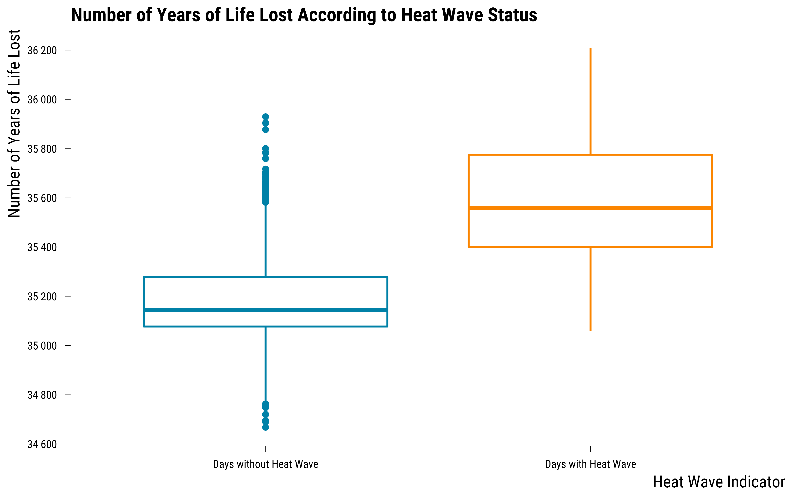

<style>
body {
text-align: justify}
</style>

In this document, we provide all steps and R codes required to analyse the effect of heat waves on the number of years of life lost (YoLL) using an outcome regression approach. This is often the standard procedure followed by researchers in environmental epidemiology: covariates balance is not discussed and confounding variables are adjusted for with a multivariate regression model. **Should you have any questions, need help to reproduce the analysis or find coding errors, please do not hesitate to contact us at leo.zabrocki@psemail.eu**

# Required Packages

To reproduce exactly the `2_script_outcome_regression_analysis.html` document, we first need to have installed:

* the [R](https://www.r-project.org/) programming language 
* [RStudio](https://rstudio.com/), an integrated development environment for R, which will allow you to knit the `2_script_outcome_regression_analysis.Rmd` file and interact with the R code chunks
* the [R Markdown](https://rmarkdown.rstudio.com/) package
* and the [Distill](https://rstudio.github.io/distill/) package which provides the template for this document. 

Once everything is set up, we load the following packages:

<div class="layout-chunk" data-layout="l-body-outset">
<div class="sourceCode"><pre class="sourceCode r"><code class="sourceCode r"><span class='co'># load required packages</span>
<span class='kw'><a href='https://rdrr.io/r/base/library.html'>library</a></span><span class='op'>(</span><span class='va'><a href='https://yihui.org/knitr/'>knitr</a></span><span class='op'>)</span> <span class='co'># for creating the R Markdown document</span>
<span class='kw'><a href='https://rdrr.io/r/base/library.html'>library</a></span><span class='op'>(</span><span class='va'><a href='https://here.r-lib.org/'>here</a></span><span class='op'>)</span> <span class='co'># for files paths organization</span>
<span class='kw'><a href='https://rdrr.io/r/base/library.html'>library</a></span><span class='op'>(</span><span class='va'><a href='https://tidyverse.tidyverse.org'>tidyverse</a></span><span class='op'>)</span> <span class='co'># for data manipulation and visualization</span>
<span class='kw'><a href='https://rdrr.io/r/base/library.html'>library</a></span><span class='op'>(</span><span class='va'><a href='https://broom.tidymodels.org/'>broom</a></span><span class='op'>)</span> <span class='co'># for cleaning regression outputs</span>
<span class='kw'><a href='https://rdrr.io/r/base/library.html'>library</a></span><span class='op'>(</span><span class='va'><a href='http://www.rforge.net/Cairo/'>Cairo</a></span><span class='op'>)</span> <span class='co'># for printing custom police of graphs</span>
<span class='kw'><a href='https://rdrr.io/r/base/library.html'>library</a></span><span class='op'>(</span><span class='va'><a href='https://github.com/rstudio/DT'>DT</a></span><span class='op'>)</span> <span class='co'># for displaying the data as tables</span>
</code></pre></div>

</div>


We finally load our custom `ggplot2` theme for graphs:

<div class="layout-chunk" data-layout="l-body-outset">
<div class="sourceCode"><pre class="sourceCode r"><code class="sourceCode r"><span class='co'># load ggplot custom theme</span>
<span class='kw'><a href='https://rdrr.io/r/base/source.html'>source</a></span><span class='op'>(</span><span class='fu'>here</span><span class='fu'>::</span><span class='fu'><a href='https://here.r-lib.org//reference/here.html'>here</a></span><span class='op'>(</span><span class='st'>"2.scripts"</span>,
                  <span class='st'>"functions"</span>,
                  <span class='st'>"script_theme_tufte.R"</span><span class='op'>)</span><span class='op'>)</span>
<span class='co'># define nice colors</span>
<span class='va'>my_blue</span> <span class='op'>&lt;-</span> <span class='st'>"#0081a7"</span>
<span class='va'>my_orange</span> <span class='op'>&lt;-</span> <span class='st'>"#fb8500"</span>
</code></pre></div>

</div>


# Regression Analysis

We load the simulated environmental data:

<div class="layout-chunk" data-layout="l-body-outset">
<div class="sourceCode"><pre class="sourceCode r"><code class="sourceCode r"><span class='co'># load the data</span>
<span class='va'>data</span> <span class='op'>&lt;-</span>
  <span class='fu'><a href='https://rdrr.io/r/base/readRDS.html'>readRDS</a></span><span class='op'>(</span><span class='fu'>here</span><span class='fu'>::</span><span class='fu'><a href='https://here.r-lib.org//reference/here.html'>here</a></span><span class='op'>(</span><span class='st'>"1.data"</span>, <span class='st'>"simulated_environmental_data.rds"</span><span class='op'>)</span><span class='op'>)</span>
</code></pre></div>

</div>


### Graphical Difference in Yoll

To explore whether heat waves lead to an increase in YoLL, we could first compare the distribution of the outcome between days with heat waves and days without heat waves:

<div class="layout-chunk" data-layout="l-body-outset">
<details>
<summary>Please show me the code!</summary>
<div class="sourceCode"><pre class="sourceCode r"><code class="sourceCode r"><span class='co'># make graph</span>
<span class='va'>graph_boxplot_yoll</span> <span class='op'>&lt;-</span> <span class='va'>data</span> <span class='op'>%&gt;%</span>
  <span class='co'># recode heat_wave variable</span>
  <span class='fu'>mutate</span><span class='op'>(</span>heat_wave <span class='op'>=</span> <span class='fu'><a href='https://rdrr.io/r/base/ifelse.html'>ifelse</a></span><span class='op'>(</span><span class='va'>heat_wave</span> <span class='op'>==</span> <span class='fl'>1</span>, <span class='st'>"Days with Heat Wave"</span>, <span class='st'>"Days without Heat Wave"</span><span class='op'>)</span><span class='op'>)</span> <span class='op'>%&gt;%</span>
  <span class='co'># make a boxplots graph</span>
  <span class='fu'>ggplot</span><span class='op'>(</span><span class='va'>.</span>, <span class='fu'>aes</span><span class='op'>(</span>
    x <span class='op'>=</span> <span class='fu'>fct_rev</span><span class='op'>(</span><span class='va'>heat_wave</span><span class='op'>)</span>,
    y <span class='op'>=</span> <span class='va'>y_obs</span>,
    color <span class='op'>=</span> <span class='fu'>fct_rev</span><span class='op'>(</span><span class='va'>heat_wave</span><span class='op'>)</span>
  <span class='op'>)</span><span class='op'>)</span> <span class='op'>+</span>
  <span class='fu'>geom_boxplot</span><span class='op'>(</span><span class='op'>)</span> <span class='op'>+</span>
  <span class='fu'>scale_color_manual</span><span class='op'>(</span>values <span class='op'>=</span> <span class='fu'><a href='https://rdrr.io/r/base/c.html'>c</a></span><span class='op'>(</span><span class='va'>my_blue</span>, <span class='va'>my_orange</span><span class='op'>)</span><span class='op'>)</span> <span class='op'>+</span>
  <span class='fu'>scale_y_continuous</span><span class='op'>(</span>
    breaks <span class='op'>=</span> <span class='fu'>scales</span><span class='fu'>::</span><span class='fu'><a href='https://scales.r-lib.org/reference/breaks_pretty.html'>pretty_breaks</a></span><span class='op'>(</span>n <span class='op'>=</span> <span class='fl'>8</span><span class='op'>)</span>,
    labels <span class='op'>=</span> <span class='kw'>function</span><span class='op'>(</span><span class='va'>x</span><span class='op'>)</span>
      <span class='fu'><a href='https://rdrr.io/r/base/format.html'>format</a></span><span class='op'>(</span><span class='va'>x</span>, big.mark <span class='op'>=</span> <span class='st'>" "</span>, scientific <span class='op'>=</span> <span class='cn'>FALSE</span><span class='op'>)</span>
  <span class='op'>)</span> <span class='op'>+</span>
  <span class='fu'>xlab</span><span class='op'>(</span><span class='st'>"Heat Wave Indicator"</span><span class='op'>)</span> <span class='op'>+</span> <span class='fu'>ylab</span><span class='op'>(</span><span class='st'>"Number of Years of Life Lost"</span><span class='op'>)</span> <span class='op'>+</span>
  <span class='fu'>ggtitle</span><span class='op'>(</span><span class='st'>"Number of Years of Life Lost According to Heat Wave Status"</span><span class='op'>)</span> <span class='op'>+</span>
  <span class='fu'>theme_tufte</span><span class='op'>(</span><span class='op'>)</span> <span class='op'>+</span>
  <span class='fu'>guides</span><span class='op'>(</span>color <span class='op'>=</span> <span class='cn'>FALSE</span><span class='op'>)</span>

<span class='co'># display the graph</span>
<span class='va'>graph_boxplot_yoll</span>
</code></pre></div>

</details><!-- --><details>
<summary>Please show me the code!</summary>
<div class="sourceCode"><pre class="sourceCode r"><code class="sourceCode r"><span class='co'># save the graph</span>
<span class='fu'>ggsave</span><span class='op'>(</span>
  <span class='va'>graph_boxplot_yoll</span> <span class='op'>+</span> <span class='fu'>labs</span><span class='op'>(</span>title <span class='op'>=</span> <span class='cn'>NULL</span><span class='op'>)</span>,
  filename <span class='op'>=</span> <span class='fu'>here</span><span class='fu'>::</span><span class='fu'><a href='https://here.r-lib.org//reference/here.html'>here</a></span><span class='op'>(</span><span class='st'>"3.outputs"</span>, <span class='st'>"2.graphs"</span>, <span class='st'>"graph_boxplot_yoll.pdf"</span><span class='op'>)</span>,
  width <span class='op'>=</span> <span class='fl'>10</span>,
  height <span class='op'>=</span> <span class='fl'>10</span>,
  units <span class='op'>=</span> <span class='st'>"cm"</span>,
  device <span class='op'>=</span> <span class='va'>cairo_pdf</span>
<span class='op'>)</span>
</code></pre></div>

</details>

</div>


On this graph, we can see that the median of the number of years of life lost for days with heat waves is higher by about 400 YoLL than the median of days without heat waves. 

### Crude Regression Analysis

We then regress the observed number of years of life lost (`y_obs`) on the indicator for the occurrence of a heat wave (`heat_wave`) to get a crude estimate of the difference:


$\text{YoLL}_{t} = \alpha + \beta\text{HW}_{t} + \epsilon_{t}$

where $t$ is the time index, $\beta$ is the coefficient of interest and $\epsilon$ the error term. We implement this model in R with the following code:

<div class="layout-chunk" data-layout="l-body-outset">
<div class="sourceCode"><pre class="sourceCode r"><code class="sourceCode r"><span class='co'># run the model and clean ouput</span>
<span class='va'>output_crude_regression</span> <span class='op'>&lt;-</span> <span class='va'>data</span> <span class='op'>%&gt;%</span>
  <span class='fu'><a href='https://rdrr.io/r/stats/lm.html'>lm</a></span><span class='op'>(</span><span class='va'>y_obs</span> <span class='op'>~</span> <span class='va'>heat_wave</span>, data <span class='op'>=</span> <span class='va'>.</span><span class='op'>)</span> <span class='op'>%&gt;%</span>
  <span class='fu'><a href='https://generics.r-lib.org/reference/tidy.html'>tidy</a></span><span class='op'>(</span><span class='va'>.</span>, conf.int <span class='op'>=</span> <span class='cn'>TRUE</span><span class='op'>)</span> <span class='op'>%&gt;%</span>
  <span class='fu'><a href='https://rdrr.io/r/stats/filter.html'>filter</a></span><span class='op'>(</span><span class='va'>term</span> <span class='op'>==</span> <span class='st'>"heat_wave"</span><span class='op'>)</span> <span class='op'>%&gt;%</span>
  <span class='fu'>select</span><span class='op'>(</span><span class='va'>term</span>, <span class='va'>estimate</span>, <span class='va'>conf.low</span>, <span class='va'>conf.high</span><span class='op'>)</span> <span class='op'>%&gt;%</span>
  <span class='fu'>mutate_at</span><span class='op'>(</span><span class='fu'>vars</span><span class='op'>(</span><span class='va'>estimate</span><span class='op'>:</span><span class='va'>conf.high</span><span class='op'>)</span>, <span class='op'>~</span> <span class='fu'><a href='https://rdrr.io/r/base/Round.html'>round</a></span><span class='op'>(</span><span class='va'>.</span>, <span class='fl'>0</span><span class='op'>)</span><span class='op'>)</span>

<span class='co'># display output</span>
<span class='va'>output_crude_regression</span> <span class='op'>%&gt;%</span>
  <span class='fu'>rename</span><span class='op'>(</span>
    <span class='st'>"Term"</span> <span class='op'>=</span> <span class='va'>term</span>,
    <span class='st'>"Estimate"</span> <span class='op'>=</span> <span class='va'>estimate</span>,
    <span class='st'>"95% CI Lower Bound"</span> <span class='op'>=</span> <span class='va'>conf.low</span>,
    <span class='st'>"95% CI Upper Bound"</span> <span class='op'>=</span> <span class='va'>conf.high</span>
  <span class='op'>)</span> <span class='op'>%&gt;%</span>
  <span class='fu'><a href='https://rdrr.io/pkg/knitr/man/kable.html'>kable</a></span><span class='op'>(</span><span class='va'>.</span>, align <span class='op'>=</span> <span class='fu'><a href='https://rdrr.io/r/base/c.html'>c</a></span><span class='op'>(</span><span class='st'>"l"</span>, <span class='st'>"c"</span>, <span class='st'>"c"</span>, <span class='st'>"c"</span><span class='op'>)</span><span class='op'>)</span>
</code></pre></div>


|Term      | Estimate | 95% CI Lower Bound | 95% CI Upper Bound |
|:---------|:--------:|:------------------:|:------------------:|
|heat_wave |   416    |        378         |        454         |

</div>


The estimate for the effect of heat waves on Yoll is equal to + NA and the 95% confidence interval is consistent with effects ranging from NA up to NA. However, the estimate is far from the true effect of +230 Yoll and is likely biased by confounders.


### Regression Analysis with Adjustment for Confounders

We finally run a regression where we adjust for potential confounders such as calendar variables (i.e., the year and the month), weather parameters (i.e., the relative humidity) and air pollutants (i.e., NO$_{2}$ and O$_{3}$). We also include variables such as the day of the week if we believe it is predictive of the outcome. This regression model can be written such that:

$\text{YoLL}_{t} = \alpha + \beta\text{HW}_{t} + \textbf{WP}_{t}\phi + \textbf{C}_{t}\gamma + \epsilon_{t}$

where $WP$ is the vector of weather and air pollutants variables and $C_{t}$ the vector of calendar indicators. We implement this model in R with the following code:

<div class="layout-chunk" data-layout="l-body-outset">
<div class="sourceCode"><pre class="sourceCode r"><code class="sourceCode r"><span class='co'># run the model and clean ouput</span>
<span class='va'>output_adjusted_regression</span> <span class='op'>&lt;-</span> <span class='va'>data</span> <span class='op'>%&gt;%</span>
  <span class='fu'><a href='https://rdrr.io/r/stats/lm.html'>lm</a></span><span class='op'>(</span><span class='va'>y_obs</span> <span class='op'>~</span> <span class='va'>heat_wave</span> <span class='op'>+</span> <span class='va'>humidity_relative</span> <span class='op'>+</span> <span class='va'>o3</span> <span class='op'>+</span> <span class='va'>no2</span> <span class='op'>+</span> <span class='va'>weekday</span> <span class='op'>+</span> <span class='va'>month</span> <span class='op'>+</span> <span class='fu'><a href='https://rdrr.io/r/base/factor.html'>as.factor</a></span><span class='op'>(</span><span class='va'>year</span><span class='op'>)</span>,
     data <span class='op'>=</span> <span class='va'>.</span><span class='op'>)</span> <span class='op'>%&gt;%</span>
  <span class='fu'><a href='https://generics.r-lib.org/reference/tidy.html'>tidy</a></span><span class='op'>(</span><span class='va'>.</span>, conf.int <span class='op'>=</span> <span class='cn'>TRUE</span><span class='op'>)</span> <span class='op'>%&gt;%</span>
  <span class='fu'><a href='https://rdrr.io/r/stats/filter.html'>filter</a></span><span class='op'>(</span><span class='va'>term</span> <span class='op'>==</span> <span class='st'>"heat_wave"</span><span class='op'>)</span> <span class='op'>%&gt;%</span>
  <span class='fu'>select</span><span class='op'>(</span><span class='va'>term</span>, <span class='va'>estimate</span>, <span class='va'>conf.low</span>, <span class='va'>conf.high</span><span class='op'>)</span> <span class='op'>%&gt;%</span>
  <span class='fu'>mutate_at</span><span class='op'>(</span><span class='fu'>vars</span><span class='op'>(</span><span class='va'>estimate</span><span class='op'>:</span><span class='va'>conf.high</span><span class='op'>)</span>, <span class='op'>~</span> <span class='fu'><a href='https://rdrr.io/r/base/Round.html'>round</a></span><span class='op'>(</span><span class='va'>.</span>, <span class='fl'>0</span><span class='op'>)</span><span class='op'>)</span> 

<span class='co'># display output</span>
<span class='va'>output_adjusted_regression</span> <span class='op'>%&gt;%</span>
  <span class='fu'>rename</span><span class='op'>(</span>
    <span class='st'>"Term"</span> <span class='op'>=</span> <span class='va'>term</span>,
    <span class='st'>"Estimate"</span> <span class='op'>=</span> <span class='va'>estimate</span>,
    <span class='st'>"95% CI Lower Bound"</span> <span class='op'>=</span> <span class='va'>conf.low</span>,
    <span class='st'>"95% CI Upper Bound"</span> <span class='op'>=</span> <span class='va'>conf.high</span>
  <span class='op'>)</span> <span class='op'>%&gt;%</span>
  <span class='fu'><a href='https://rdrr.io/pkg/knitr/man/kable.html'>kable</a></span><span class='op'>(</span><span class='va'>.</span>, align <span class='op'>=</span> <span class='fu'><a href='https://rdrr.io/r/base/c.html'>c</a></span><span class='op'>(</span><span class='st'>"l"</span>, <span class='st'>"c"</span>, <span class='st'>"c"</span>, <span class='st'>"c"</span><span class='op'>)</span><span class='op'>)</span>
</code></pre></div>


|Term      | Estimate | 95% CI Lower Bound | 95% CI Upper Bound |
|:---------|:--------:|:------------------:|:------------------:|
|heat_wave |   293    |        279         |        307         |

</div>


The estimate for the effect of heat waves on Yoll is equal to + NA and the 95% confidence interval is consistent with effects ranging from NA up to NA. The estimated effect is closer to the true effect of +230 Yoll but is still biased. This regression model may be too simple---we could also include lags of the variables and use different functional forms if we think they could reduce omitted variable bias.

We finally save the results from the two outcome regression models in the `3.outputs/1.data/analysis_results` folder:


<div class="layout-chunk" data-layout="l-body-outset">
<div class="sourceCode"><pre class="sourceCode r"><code class="sourceCode r"><span class='fu'>bind_rows</span><span class='op'>(</span><span class='va'>output_crude_regression</span>,
  <span class='va'>output_adjusted_regression</span><span class='op'>)</span> <span class='op'>%&gt;%</span>
  <span class='fu'>mutate</span><span class='op'>(</span>
    procedure <span class='op'>=</span> <span class='fu'><a href='https://rdrr.io/r/base/c.html'>c</a></span><span class='op'>(</span>
      <span class='st'>"Outcome Regression Model without Covariates"</span>,
      <span class='st'>"Outcome Regression Model with Covariates"</span>
    <span class='op'>)</span>,
    sample_size <span class='op'>=</span> <span class='fu'><a href='https://rdrr.io/r/base/nrow.html'>nrow</a></span><span class='op'>(</span><span class='va'>data</span><span class='op'>)</span>,
    true_effect <span class='op'>=</span> <span class='fl'>230</span>,
  <span class='op'>)</span> <span class='op'>%&gt;%</span>
  <span class='fu'><a href='https://rdrr.io/r/base/readRDS.html'>saveRDS</a></span><span class='op'>(</span>
    <span class='va'>.</span>,
    <span class='fu'>here</span><span class='fu'>::</span><span class='fu'><a href='https://here.r-lib.org//reference/here.html'>here</a></span><span class='op'>(</span>
      <span class='st'>"3.outputs"</span>,
      <span class='st'>"1.data"</span>,
      <span class='st'>"analysis_results"</span>,
      <span class='st'>"data_analysis_regression.RDS"</span>
    <span class='op'>)</span>
  <span class='op'>)</span>
</code></pre></div>

</div>


```{.r .distill-force-highlighting-css}
```
