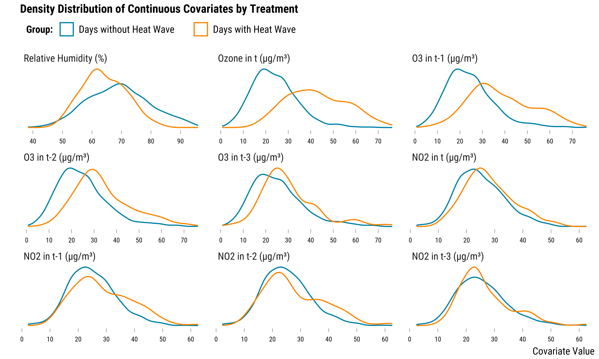
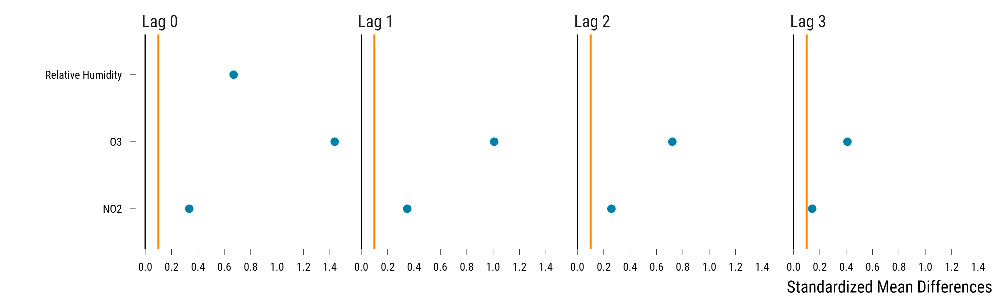
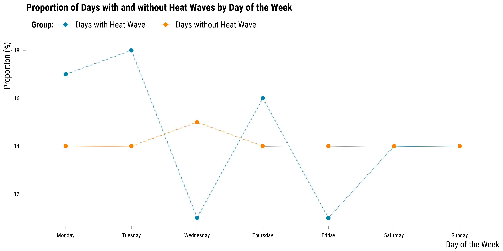
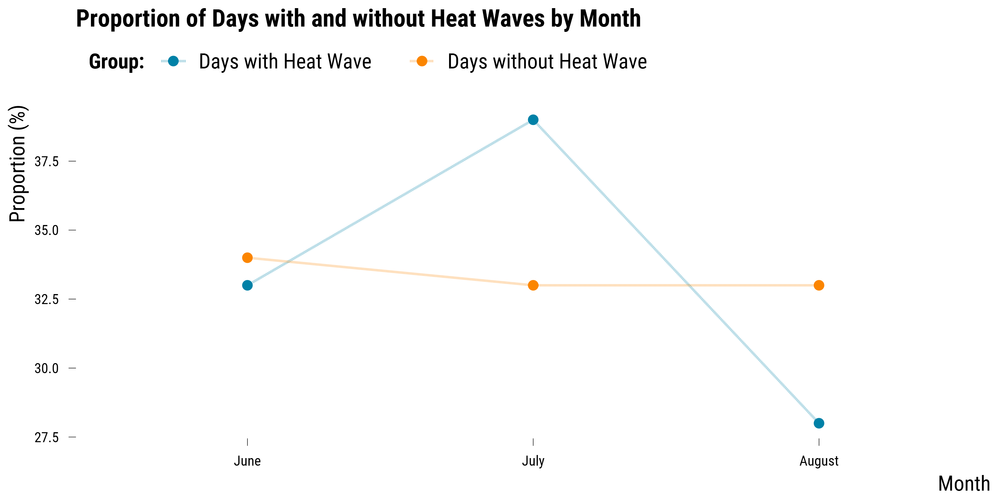
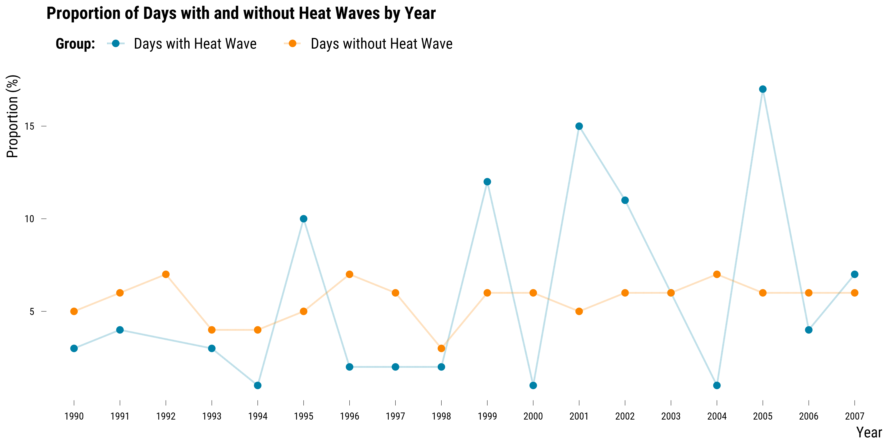
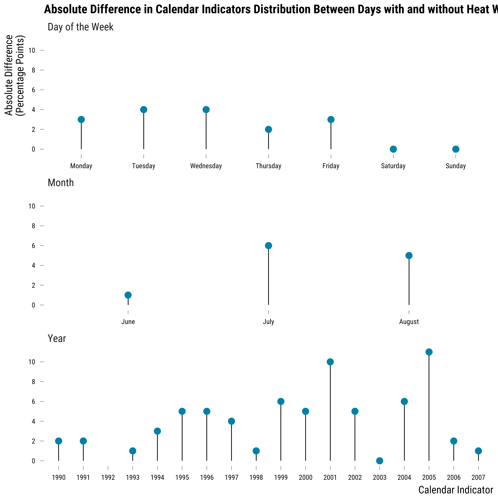

<style>
body {
text-align: justify}
</style>

In this document, we provide all steps and R codes required to evaluate if days with heat wave are similar to days without heat wave. [add description]. **Should you have any questions, need help to reproduce the analysis or find coding errors, please do not hesitate to contact us at leo.zabrocki@psemail.eu**

# Required Packages

To reproduce exactly the `3_script_eda_covariates_balance.html` document, we first need to have installed:

* the [R](https://www.r-project.org/) programming language 
* [RStudio](https://rstudio.com/), an integrated development environment for R, which will allow you to knit the `3_script_eda_covariates_balance.Rmd` file and interact with the R code chunks
* the [R Markdown](https://rmarkdown.rstudio.com/) package
* and the [Distill](https://rstudio.github.io/distill/) package which provides the template for this document. 

Once everything is set up, we load the following packages:

<div class="layout-chunk" data-layout="l-body-outset">
<div class="sourceCode"><pre class="sourceCode r"><code class="sourceCode r"><span class='co'># load required packages</span>
<span class='kw'><a href='https://rdrr.io/r/base/library.html'>library</a></span><span class='op'>(</span><span class='va'><a href='https://yihui.org/knitr/'>knitr</a></span><span class='op'>)</span> <span class='co'># for creating the R Markdown document</span>
<span class='kw'><a href='https://rdrr.io/r/base/library.html'>library</a></span><span class='op'>(</span><span class='va'><a href='https://here.r-lib.org/'>here</a></span><span class='op'>)</span> <span class='co'># for files paths organization</span>
<span class='kw'><a href='https://rdrr.io/r/base/library.html'>library</a></span><span class='op'>(</span><span class='va'><a href='https://tidyverse.tidyverse.org'>tidyverse</a></span><span class='op'>)</span> <span class='co'># for data manipulation and visualization</span>
<span class='kw'><a href='https://rdrr.io/r/base/library.html'>library</a></span><span class='op'>(</span><span class='va'><a href='https://broom.tidymodels.org/'>broom</a></span><span class='op'>)</span> <span class='co'># for cleaning regression outputs</span>
<span class='kw'><a href='https://rdrr.io/r/base/library.html'>library</a></span><span class='op'>(</span><span class='va'><a href='http://www.rforge.net/Cairo/'>Cairo</a></span><span class='op'>)</span> <span class='co'># for printing custom police of graphs</span>
<span class='kw'><a href='https://rdrr.io/r/base/library.html'>library</a></span><span class='op'>(</span><span class='va'><a href='https://github.com/rstudio/DT'>DT</a></span><span class='op'>)</span> <span class='co'># for displaying the data as tables</span>
</code></pre></div>

</div>


We finally load our custom `ggplot2` theme for graphs:

<div class="layout-chunk" data-layout="l-body-outset">
<div class="sourceCode"><pre class="sourceCode r"><code class="sourceCode r"><span class='co'># load ggplot custom theme</span>
<span class='kw'><a href='https://rdrr.io/r/base/source.html'>source</a></span><span class='op'>(</span><span class='fu'>here</span><span class='fu'>::</span><span class='fu'><a href='https://here.r-lib.org//reference/here.html'>here</a></span><span class='op'>(</span><span class='st'>"2.scripts"</span>,
                  <span class='st'>"functions"</span>,
                  <span class='st'>"script_theme_tufte.R"</span><span class='op'>)</span><span class='op'>)</span>
<span class='co'># define nice colors</span>
<span class='va'>my_blue</span> <span class='op'>&lt;-</span> <span class='st'>"#0081a7"</span>
<span class='va'>my_orange</span> <span class='op'>&lt;-</span> <span class='st'>"#fb8500"</span>
</code></pre></div>

</div>


# Checking Covariates Balance

We load the simulated environmental data:

<div class="layout-chunk" data-layout="l-body-outset">
<div class="sourceCode"><pre class="sourceCode r"><code class="sourceCode r"><span class='co'># load the data</span>
<span class='va'>data</span> <span class='op'>&lt;-</span>
  <span class='fu'><a href='https://rdrr.io/r/base/readRDS.html'>readRDS</a></span><span class='op'>(</span><span class='fu'>here</span><span class='fu'>::</span><span class='fu'><a href='https://here.r-lib.org//reference/here.html'>here</a></span><span class='op'>(</span><span class='st'>"1.data"</span>, <span class='st'>"simulated_environmental_data.rds"</span><span class='op'>)</span><span class='op'>)</span> <span class='op'>%&gt;%</span>
  <span class='co'># we recode the heat_wave variable</span>
  <span class='fu'>mutate</span><span class='op'>(</span>heat_wave <span class='op'>=</span> <span class='fu'><a href='https://rdrr.io/r/base/ifelse.html'>ifelse</a></span><span class='op'>(</span><span class='va'>heat_wave</span> <span class='op'>==</span> <span class='fl'>1</span>, <span class='st'>"Days with Heat Wave"</span>, <span class='st'>"Days without Heat Wave"</span><span class='op'>)</span><span class='op'>)</span>
</code></pre></div>

</div>


### Continuous Covariates

We first explore whether continuous covariates (i.e., the relative humidity, O$_{3}$ and NO$_{2}$ concentrations) and their lags (up to the third previous day) are balanced. We plot below the density distribution of each covariate by treatment group:

<div class="layout-chunk" data-layout="l-body-outset">
<details>
<summary>Please show me the code!</summary>
<div class="sourceCode"><pre class="sourceCode r"><code class="sourceCode r"><span class='co'># make the graph</span>
<span class='va'>graph_continuous_cov_densities</span> <span class='op'>&lt;-</span> <span class='va'>data</span> <span class='op'>%&gt;%</span>
  <span class='co'># pivot covariates to long format</span>
  <span class='fu'>pivot_longer</span><span class='op'>(</span>
    cols <span class='op'>=</span> <span class='fu'><a href='https://rdrr.io/r/base/c.html'>c</a></span><span class='op'>(</span><span class='va'>humidity_relative</span>, <span class='va'>o3</span><span class='op'>:</span><span class='va'>no2_lag_3</span><span class='op'>)</span>,
    names_to <span class='op'>=</span> <span class='st'>"covariate"</span>,
    values_to <span class='op'>=</span> <span class='st'>"value"</span>
  <span class='op'>)</span> <span class='op'>%&gt;%</span>
  <span class='co'># change covariate names</span>
  <span class='fu'>mutate</span><span class='op'>(</span>
    covariate <span class='op'>=</span> <span class='fu'>case_when</span><span class='op'>(</span>
      <span class='va'>covariate</span> <span class='op'>==</span> <span class='st'>"humidity_relative"</span> <span class='op'>~</span> <span class='st'>"Relative Humidity (%)"</span>,
      <span class='va'>covariate</span> <span class='op'>==</span> <span class='st'>"o3"</span> <span class='op'>~</span> <span class='st'>"Ozone in t (µg/m³)"</span>,
      <span class='va'>covariate</span> <span class='op'>==</span> <span class='st'>"o3_lag_1"</span> <span class='op'>~</span> <span class='st'>"O3 in t-1 (µg/m³)"</span>,
      <span class='va'>covariate</span> <span class='op'>==</span> <span class='st'>"o3_lag_2"</span> <span class='op'>~</span> <span class='st'>"O3 in t-2 (µg/m³)"</span>,
      <span class='va'>covariate</span> <span class='op'>==</span> <span class='st'>"o3_lag_3"</span> <span class='op'>~</span> <span class='st'>"O3 in t-3 (µg/m³)"</span>,
      <span class='va'>covariate</span> <span class='op'>==</span> <span class='st'>"no2"</span> <span class='op'>~</span> <span class='st'>"NO2 in t (µg/m³)"</span>,
      <span class='va'>covariate</span> <span class='op'>==</span> <span class='st'>"no2_lag_1"</span> <span class='op'>~</span> <span class='st'>"NO2 in t-1 (µg/m³)"</span>,
      <span class='va'>covariate</span> <span class='op'>==</span> <span class='st'>"no2_lag_2"</span> <span class='op'>~</span> <span class='st'>"NO2 in t-2 (µg/m³)"</span>,
      <span class='va'>covariate</span> <span class='op'>==</span> <span class='st'>"no2_lag_3"</span> <span class='op'>~</span> <span class='st'>"NO2 in t-3 (µg/m³)"</span>
    <span class='op'>)</span>
  <span class='op'>)</span> <span class='op'>%&gt;%</span>
  <span class='co'># reorder covariates</span>
  <span class='fu'>mutate</span><span class='op'>(</span>
    covariate <span class='op'>=</span> <span class='fu'>fct_relevel</span><span class='op'>(</span>
      <span class='va'>covariate</span>,
      <span class='st'>"Relative Humidity (%)"</span>,
      <span class='st'>"Ozone in t (µg/m³)"</span>,
      <span class='st'>"O3 in t-1 (µg/m³)"</span>,
      <span class='st'>"O3 in t-2 (µg/m³)"</span>,
      <span class='st'>"O3 in t-3 (µg/m³)"</span>,
      <span class='st'>"NO2 in t (µg/m³)"</span>,
      <span class='st'>"NO2 in t-1 (µg/m³)"</span>,
      <span class='st'>"NO2 in t-2 (µg/m³)"</span>,
      <span class='st'>"NO2 in t-3 (µg/m³)"</span>
    <span class='op'>)</span>
  <span class='op'>)</span> <span class='op'>%&gt;%</span>
  <span class='co'># make density graph</span>
  <span class='fu'>ggplot</span><span class='op'>(</span><span class='va'>.</span>, <span class='fu'>aes</span><span class='op'>(</span>x <span class='op'>=</span> <span class='va'>value</span>,
                color <span class='op'>=</span> <span class='fu'>fct_rev</span><span class='op'>(</span><span class='va'>heat_wave</span><span class='op'>)</span><span class='op'>)</span><span class='op'>)</span> <span class='op'>+</span>
  <span class='fu'>geom_density</span><span class='op'>(</span><span class='op'>)</span> <span class='op'>+</span>
  <span class='fu'>scale_color_manual</span><span class='op'>(</span>name <span class='op'>=</span> <span class='st'>"Group:"</span>, values <span class='op'>=</span> <span class='fu'><a href='https://rdrr.io/r/base/c.html'>c</a></span><span class='op'>(</span><span class='va'>my_blue</span>, <span class='va'>my_orange</span><span class='op'>)</span><span class='op'>)</span> <span class='op'>+</span>
  <span class='fu'>scale_x_continuous</span><span class='op'>(</span>breaks <span class='op'>=</span> <span class='fu'>scales</span><span class='fu'>::</span><span class='fu'><a href='https://scales.r-lib.org/reference/breaks_pretty.html'>pretty_breaks</a></span><span class='op'>(</span>n <span class='op'>=</span> <span class='fl'>8</span><span class='op'>)</span><span class='op'>)</span> <span class='op'>+</span>
  <span class='fu'>facet_wrap</span><span class='op'>(</span><span class='op'>~</span> <span class='va'>covariate</span>, scales <span class='op'>=</span> <span class='st'>"free"</span><span class='op'>)</span> <span class='op'>+</span>
  <span class='fu'>xlab</span><span class='op'>(</span><span class='st'>"Covariate Value"</span><span class='op'>)</span> <span class='op'>+</span> <span class='fu'>ylab</span><span class='op'>(</span><span class='st'>""</span><span class='op'>)</span> <span class='op'>+</span>
  <span class='fu'>ggtitle</span><span class='op'>(</span><span class='st'>"Density Distribution of Continuous Covariates by Treatment"</span><span class='op'>)</span> <span class='op'>+</span>
  <span class='fu'>theme_tufte</span><span class='op'>(</span><span class='op'>)</span> <span class='op'>+</span>
  <span class='fu'>theme</span><span class='op'>(</span>axis.ticks.y <span class='op'>=</span> <span class='fu'>element_blank</span><span class='op'>(</span><span class='op'>)</span>,
        axis.text.y <span class='op'>=</span> <span class='fu'>element_blank</span><span class='op'>(</span><span class='op'>)</span><span class='op'>)</span>

<span class='co'># display the graph</span>
<span class='va'>graph_continuous_cov_densities</span>
</code></pre></div>

</details><!-- --><details>
<summary>Please show me the code!</summary>
<div class="sourceCode"><pre class="sourceCode r"><code class="sourceCode r"><span class='co'># save the graph</span>
<span class='fu'>ggsave</span><span class='op'>(</span>
  <span class='va'>graph_continuous_cov_densities</span> <span class='op'>+</span> <span class='fu'>labs</span><span class='op'>(</span>title <span class='op'>=</span> <span class='cn'>NULL</span><span class='op'>)</span>,
  filename <span class='op'>=</span> <span class='fu'>here</span><span class='fu'>::</span><span class='fu'><a href='https://here.r-lib.org//reference/here.html'>here</a></span><span class='op'>(</span><span class='st'>"3.outputs"</span>, <span class='st'>"2.graphs"</span>, <span class='st'>"graph_continuous_cov_densities.pdf"</span><span class='op'>)</span>,
  width <span class='op'>=</span> <span class='fl'>20</span>,
  height <span class='op'>=</span> <span class='fl'>15</span>,
  units <span class='op'>=</span> <span class='st'>"cm"</span>,
  device <span class='op'>=</span> <span class='va'>cairo_pdf</span>
<span class='op'>)</span>
</code></pre></div>

</details>

</div>


On this graph, we can see that the relative humidity and O$_{3}$ and its lags are imbalanced across the treatment and control groups. As an alternative to density distributions, we can summarize the imbalance by computing, for each covariate, the absolute standardized mean difference between treatment and control groups. The absolute standardized mean difference of a covariate is just the absolute value of the difference in means between treated and control units divided by the standard deviation of the treatment group. We can simply compute and plot this metric using the following code:

<div class="layout-chunk" data-layout="l-body-outset">
<details>
<summary>Please show me the code!</summary>
<div class="sourceCode"><pre class="sourceCode r"><code class="sourceCode r"><span class='co'># reshape the data into long</span>
<span class='va'>data_continuous_cov</span> <span class='op'>&lt;-</span> <span class='va'>data</span> <span class='op'>%&gt;%</span>
  <span class='fu'>select</span><span class='op'>(</span><span class='va'>heat_wave</span>, <span class='va'>humidity_relative</span>, <span class='va'>o3</span><span class='op'>:</span><span class='va'>no2_lag_3</span><span class='op'>)</span> <span class='op'>%&gt;%</span>
  <span class='fu'>pivot_longer</span><span class='op'>(</span>cols <span class='op'>=</span> <span class='op'>-</span><span class='fu'><a href='https://rdrr.io/r/base/c.html'>c</a></span><span class='op'>(</span><span class='va'>heat_wave</span><span class='op'>)</span>,
               names_to <span class='op'>=</span> <span class='st'>"variable"</span>,
               values_to <span class='op'>=</span> <span class='st'>"value"</span><span class='op'>)</span> <span class='op'>%&gt;%</span>
  <span class='fu'>mutate</span><span class='op'>(</span>
    covariate_name <span class='op'>=</span> <span class='cn'>NA</span> <span class='op'>%&gt;%</span>
      <span class='fu'><a href='https://rdrr.io/r/base/ifelse.html'>ifelse</a></span><span class='op'>(</span><span class='fu'>str_detect</span><span class='op'>(</span><span class='va'>variable</span>, <span class='st'>"o3"</span><span class='op'>)</span>, <span class='st'>"O3"</span>, <span class='va'>.</span><span class='op'>)</span> <span class='op'>%&gt;%</span>
      <span class='fu'><a href='https://rdrr.io/r/base/ifelse.html'>ifelse</a></span><span class='op'>(</span>
        <span class='fu'>str_detect</span><span class='op'>(</span><span class='va'>variable</span>, <span class='st'>"humidity_relative"</span><span class='op'>)</span>,
        <span class='st'>"Relative Humidity"</span>,
        <span class='va'>.</span>
      <span class='op'>)</span> <span class='op'>%&gt;%</span>
      <span class='fu'><a href='https://rdrr.io/r/base/ifelse.html'>ifelse</a></span><span class='op'>(</span><span class='fu'>str_detect</span><span class='op'>(</span><span class='va'>variable</span>, <span class='st'>"no2"</span><span class='op'>)</span>, <span class='st'>"NO2"</span>, <span class='va'>.</span><span class='op'>)</span>
  <span class='op'>)</span> <span class='op'>%&gt;%</span>
  <span class='fu'>mutate</span><span class='op'>(</span>
    time <span class='op'>=</span> <span class='st'>"Lag 0"</span> <span class='op'>%&gt;%</span>
      <span class='fu'><a href='https://rdrr.io/r/base/ifelse.html'>ifelse</a></span><span class='op'>(</span><span class='fu'>str_detect</span><span class='op'>(</span><span class='va'>variable</span>, <span class='st'>"lag_1"</span><span class='op'>)</span>, <span class='st'>"Lag 1"</span>, <span class='va'>.</span><span class='op'>)</span> <span class='op'>%&gt;%</span>
      <span class='fu'><a href='https://rdrr.io/r/base/ifelse.html'>ifelse</a></span><span class='op'>(</span><span class='fu'>str_detect</span><span class='op'>(</span><span class='va'>variable</span>, <span class='st'>"lag_2"</span><span class='op'>)</span>, <span class='st'>"Lag 2"</span>, <span class='va'>.</span><span class='op'>)</span> <span class='op'>%&gt;%</span>
      <span class='fu'><a href='https://rdrr.io/r/base/ifelse.html'>ifelse</a></span><span class='op'>(</span><span class='fu'>str_detect</span><span class='op'>(</span><span class='va'>variable</span>, <span class='st'>"lag_3"</span><span class='op'>)</span>, <span class='st'>"Lag 3"</span>, <span class='va'>.</span><span class='op'>)</span>
  <span class='op'>)</span> <span class='op'>%&gt;%</span>
  <span class='fu'>mutate</span><span class='op'>(</span>time <span class='op'>=</span> <span class='fu'>fct_relevel</span><span class='op'>(</span><span class='va'>time</span>, <span class='st'>"Lag 3"</span>, <span class='st'>"Lag 2"</span>, <span class='st'>"Lag 1"</span>, <span class='st'>"Lag 0"</span><span class='op'>)</span><span class='op'>)</span> <span class='op'>%&gt;%</span>
  <span class='fu'>select</span><span class='op'>(</span><span class='va'>heat_wave</span>, <span class='va'>covariate_name</span>, <span class='va'>time</span>, <span class='va'>value</span><span class='op'>)</span>

<span class='co'># compute absolute difference in  means</span>
<span class='va'>data_abs_difference</span> <span class='op'>&lt;-</span> <span class='va'>data_continuous_cov</span> <span class='op'>%&gt;%</span>
  <span class='fu'>group_by</span><span class='op'>(</span><span class='va'>covariate_name</span>, <span class='va'>time</span>, <span class='va'>heat_wave</span><span class='op'>)</span> <span class='op'>%&gt;%</span>
  <span class='fu'>summarise</span><span class='op'>(</span>mean_value <span class='op'>=</span> <span class='fu'><a href='https://rdrr.io/r/base/mean.html'>mean</a></span><span class='op'>(</span><span class='va'>value</span>, na.rm <span class='op'>=</span> <span class='cn'>TRUE</span><span class='op'>)</span><span class='op'>)</span> <span class='op'>%&gt;%</span>
  <span class='fu'>summarise</span><span class='op'>(</span>abs_difference <span class='op'>=</span> <span class='fu'><a href='https://rdrr.io/r/base/MathFun.html'>abs</a></span><span class='op'>(</span><span class='va'>mean_value</span><span class='op'>[</span><span class='fl'>2</span><span class='op'>]</span> <span class='op'>-</span> <span class='va'>mean_value</span><span class='op'>[</span><span class='fl'>1</span><span class='op'>]</span><span class='op'>)</span><span class='op'>)</span>

<span class='co'># compute treatment covariates standard deviation</span>
<span class='va'>data_sd</span> <span class='op'>&lt;-</span>  <span class='va'>data_continuous_cov</span> <span class='op'>%&gt;%</span>
  <span class='fu'><a href='https://rdrr.io/r/stats/filter.html'>filter</a></span><span class='op'>(</span><span class='va'>heat_wave</span> <span class='op'>==</span> <span class='st'>"Days with Heat Wave"</span><span class='op'>)</span> <span class='op'>%&gt;%</span>
  <span class='fu'>group_by</span><span class='op'>(</span><span class='va'>covariate_name</span>, <span class='va'>time</span>, <span class='va'>heat_wave</span><span class='op'>)</span> <span class='op'>%&gt;%</span>
  <span class='fu'>summarise</span><span class='op'>(</span>sd_treatment <span class='op'>=</span> <span class='fu'><a href='https://rdrr.io/r/stats/sd.html'>sd</a></span><span class='op'>(</span><span class='va'>value</span>, na.rm <span class='op'>=</span> <span class='cn'>TRUE</span><span class='op'>)</span><span class='op'>)</span> <span class='op'>%&gt;%</span>
  <span class='fu'>ungroup</span><span class='op'>(</span><span class='op'>)</span> <span class='op'>%&gt;%</span>
  <span class='fu'>select</span><span class='op'>(</span><span class='va'>covariate_name</span>, <span class='va'>time</span>, <span class='va'>sd_treatment</span><span class='op'>)</span>

<span class='co'># compute standardized differences</span>
<span class='va'>data_standardized_difference</span> <span class='op'>&lt;-</span>
  <span class='fu'>left_join</span><span class='op'>(</span><span class='va'>data_abs_difference</span>, <span class='va'>data_sd</span>, by <span class='op'>=</span> <span class='fu'><a href='https://rdrr.io/r/base/c.html'>c</a></span><span class='op'>(</span><span class='st'>"covariate_name"</span>, <span class='st'>"time"</span><span class='op'>)</span><span class='op'>)</span> <span class='op'>%&gt;%</span>
  <span class='fu'>mutate</span><span class='op'>(</span>standardized_difference <span class='op'>=</span> <span class='va'>abs_difference</span> <span class='op'>/</span> <span class='va'>sd_treatment</span><span class='op'>)</span> <span class='op'>%&gt;%</span>
  <span class='fu'>select</span><span class='op'>(</span><span class='op'>-</span><span class='fu'><a href='https://rdrr.io/r/base/c.html'>c</a></span><span class='op'>(</span><span class='va'>abs_difference</span>, <span class='va'>sd_treatment</span><span class='op'>)</span><span class='op'>)</span>

<span class='co'># make the graph</span>
<span class='va'>graph_std_diff_continuous_cov</span> <span class='op'>&lt;-</span> <span class='fu'>ggplot</span><span class='op'>(</span><span class='va'>data_standardized_difference</span>, <span class='fu'>aes</span><span class='op'>(</span>y <span class='op'>=</span> <span class='va'>covariate_name</span>, x <span class='op'>=</span> <span class='va'>standardized_difference</span><span class='op'>)</span><span class='op'>)</span> <span class='op'>+</span>
  <span class='fu'>geom_vline</span><span class='op'>(</span>xintercept <span class='op'>=</span> <span class='fl'>0</span>, size <span class='op'>=</span> <span class='fl'>0.3</span><span class='op'>)</span> <span class='op'>+</span>
  <span class='fu'>geom_vline</span><span class='op'>(</span>xintercept <span class='op'>=</span> <span class='fl'>0.1</span>, color <span class='op'>=</span> <span class='va'>my_orange</span><span class='op'>)</span> <span class='op'>+</span>
  <span class='fu'>geom_point</span><span class='op'>(</span>size <span class='op'>=</span> <span class='fl'>2</span>, color <span class='op'>=</span> <span class='va'>my_blue</span><span class='op'>)</span> <span class='op'>+</span>
  <span class='fu'>scale_x_continuous</span><span class='op'>(</span>breaks <span class='op'>=</span> <span class='fu'>scales</span><span class='fu'>::</span><span class='fu'><a href='https://scales.r-lib.org/reference/breaks_pretty.html'>pretty_breaks</a></span><span class='op'>(</span>n <span class='op'>=</span> <span class='fl'>8</span><span class='op'>)</span><span class='op'>)</span> <span class='op'>+</span>
  <span class='fu'>facet_wrap</span><span class='op'>(</span><span class='op'>~</span> <span class='fu'>fct_rev</span><span class='op'>(</span><span class='va'>time</span><span class='op'>)</span>, nrow <span class='op'>=</span> <span class='fl'>1</span><span class='op'>)</span> <span class='op'>+</span>
  <span class='fu'>xlab</span><span class='op'>(</span><span class='st'>"Standardized Mean Differences"</span><span class='op'>)</span> <span class='op'>+</span>
  <span class='fu'>ylab</span><span class='op'>(</span><span class='st'>""</span><span class='op'>)</span> <span class='op'>+</span> 
  <span class='fu'>theme_tufte</span><span class='op'>(</span><span class='op'>)</span>

<span class='co'># display the graph</span>
<span class='va'>graph_std_diff_continuous_cov</span>
</code></pre></div>

</details><!-- --><details>
<summary>Please show me the code!</summary>
<div class="sourceCode"><pre class="sourceCode r"><code class="sourceCode r"><span class='co'># save the graph</span>
<span class='fu'>ggsave</span><span class='op'>(</span>
  <span class='va'>graph_std_diff_continuous_cov</span> <span class='op'>+</span> <span class='fu'>labs</span><span class='op'>(</span>title <span class='op'>=</span> <span class='cn'>NULL</span><span class='op'>)</span>,
  filename <span class='op'>=</span> <span class='fu'>here</span><span class='fu'>::</span><span class='fu'><a href='https://here.r-lib.org//reference/here.html'>here</a></span><span class='op'>(</span><span class='st'>"3.outputs"</span>, <span class='st'>"2.graphs"</span>, <span class='st'>"graph_std_diff_continuous_cov.pdf"</span><span class='op'>)</span>,
  width <span class='op'>=</span> <span class='fl'>20</span>,
  height <span class='op'>=</span> <span class='fl'>6</span>,
  units <span class='op'>=</span> <span class='st'>"cm"</span>,
  device <span class='op'>=</span> <span class='va'>cairo_pdf</span>
<span class='op'>)</span>
</code></pre></div>

</details>

</div>


On this graph, the black line represents standardized mean differences equal to 0 and the orange line is the 0.1 threshold often used in the matching literature to assess balance. Standardized mean differences below this threshold would indicate good balance. Here, for all covariates and lags, the treatment and control groups are imbalanced.

### Categorical Covariates

For calendar variables such as the day of the week, the month and the year, we evaluate balance by plotting the proportions of days with and without heat wave. If heat wave were randomly distributed, there should not be difference in the distribution of the proportions for the two groups. We first plot the distribution of proportions for the day of the week:

<div class="layout-chunk" data-layout="l-body-outset">
<details>
<summary>Please show me the code!</summary>
<div class="sourceCode"><pre class="sourceCode r"><code class="sourceCode r"><span class='co'># compute the proportions of observations belonging to each wday by treatment status</span>
<span class='va'>data_weekday</span> <span class='op'>&lt;-</span> <span class='va'>data</span> <span class='op'>%&gt;%</span>
  <span class='fu'>select</span><span class='op'>(</span><span class='va'>weekday</span>, <span class='va'>heat_wave</span><span class='op'>)</span> <span class='op'>%&gt;%</span>
  <span class='fu'>mutate</span><span class='op'>(</span>weekday <span class='op'>=</span> <span class='fu'>str_to_title</span><span class='op'>(</span><span class='va'>weekday</span><span class='op'>)</span><span class='op'>)</span> <span class='op'>%&gt;%</span>
  <span class='fu'>pivot_longer</span><span class='op'>(</span><span class='va'>.</span>,<span class='op'>-</span><span class='va'>heat_wave</span><span class='op'>)</span> <span class='op'>%&gt;%</span>
  <span class='fu'>group_by</span><span class='op'>(</span><span class='va'>name</span>, <span class='va'>heat_wave</span>, <span class='va'>value</span><span class='op'>)</span> <span class='op'>%&gt;%</span>
  <span class='fu'>summarise</span><span class='op'>(</span>n <span class='op'>=</span> <span class='fu'>n</span><span class='op'>(</span><span class='op'>)</span><span class='op'>)</span> <span class='op'>%&gt;%</span>
  <span class='fu'>mutate</span><span class='op'>(</span>proportion <span class='op'>=</span> <span class='fu'><a href='https://rdrr.io/r/base/Round.html'>round</a></span><span class='op'>(</span><span class='va'>n</span> <span class='op'>/</span> <span class='fu'><a href='https://rdrr.io/r/base/sum.html'>sum</a></span><span class='op'>(</span><span class='va'>n</span><span class='op'>)</span> <span class='op'>*</span> <span class='fl'>100</span>, <span class='fl'>0</span><span class='op'>)</span><span class='op'>)</span> <span class='op'>%&gt;%</span>
  <span class='fu'>ungroup</span><span class='op'>(</span><span class='op'>)</span> <span class='op'>%&gt;%</span>
  <span class='fu'>mutate</span><span class='op'>(</span>
    value <span class='op'>=</span> <span class='fu'>fct_relevel</span><span class='op'>(</span>
      <span class='va'>value</span>,
      <span class='st'>"Monday"</span>,
      <span class='st'>"Tuesday"</span>,
      <span class='st'>"Wednesday"</span>,
      <span class='st'>"Thursday"</span>,
      <span class='st'>"Friday"</span>,
      <span class='st'>"Saturday"</span>,
      <span class='st'>"Sunday"</span>
    <span class='op'>)</span>
  <span class='op'>)</span>

<span class='co'># make a dots graph</span>
<span class='va'>graph_weekday_balance</span> <span class='op'>&lt;-</span> <span class='fu'>ggplot</span><span class='op'>(</span><span class='va'>data_weekday</span>,
                                <span class='fu'>aes</span><span class='op'>(</span>
                                  x <span class='op'>=</span> <span class='fu'><a href='https://rdrr.io/r/base/factor.html'>as.factor</a></span><span class='op'>(</span><span class='va'>value</span><span class='op'>)</span>,
                                  y <span class='op'>=</span> <span class='va'>proportion</span>,
                                  colour <span class='op'>=</span> <span class='va'>heat_wave</span>,
                                  group <span class='op'>=</span> <span class='va'>heat_wave</span>
                                <span class='op'>)</span><span class='op'>)</span> <span class='op'>+</span>
  <span class='fu'>geom_line</span><span class='op'>(</span>size <span class='op'>=</span> <span class='fl'>0.5</span>, linetype <span class='op'>=</span> <span class='st'>"dotted"</span><span class='op'>)</span> <span class='op'>+</span>
  <span class='fu'>geom_point</span><span class='op'>(</span>size <span class='op'>=</span> <span class='fl'>2</span><span class='op'>)</span> <span class='op'>+</span>
  <span class='fu'>scale_colour_manual</span><span class='op'>(</span>values <span class='op'>=</span> <span class='fu'><a href='https://rdrr.io/r/base/c.html'>c</a></span><span class='op'>(</span><span class='va'>my_blue</span>, <span class='va'>my_orange</span><span class='op'>)</span>,
                      guide <span class='op'>=</span> <span class='fu'>guide_legend</span><span class='op'>(</span>reverse <span class='op'>=</span> <span class='cn'>FALSE</span><span class='op'>)</span><span class='op'>)</span> <span class='op'>+</span>
  <span class='fu'>ggtitle</span><span class='op'>(</span><span class='st'>"Proportion of Days with and without Heat Waves by Day of the Week"</span><span class='op'>)</span> <span class='op'>+</span>
  <span class='fu'>ylab</span><span class='op'>(</span><span class='st'>"Proportion (%)"</span><span class='op'>)</span> <span class='op'>+</span>
  <span class='fu'>xlab</span><span class='op'>(</span><span class='st'>"Day of the Week"</span><span class='op'>)</span> <span class='op'>+</span>
  <span class='fu'>labs</span><span class='op'>(</span>colour <span class='op'>=</span> <span class='st'>"Group:"</span><span class='op'>)</span> <span class='op'>+</span>
  <span class='fu'>theme_tufte</span><span class='op'>(</span><span class='op'>)</span> <span class='op'>+</span>
  <span class='fu'>theme</span><span class='op'>(</span>
    legend.position <span class='op'>=</span> <span class='st'>"top"</span>,
    legend.justification <span class='op'>=</span> <span class='st'>"left"</span>,
    legend.direction <span class='op'>=</span> <span class='st'>"horizontal"</span>
  <span class='op'>)</span>

<span class='co'># display the graph</span>
<span class='va'>graph_weekday_balance</span>
</code></pre></div>

</details><!-- --><details>
<summary>Please show me the code!</summary>
<div class="sourceCode"><pre class="sourceCode r"><code class="sourceCode r"><span class='co'># save the graph</span>
<span class='fu'>ggsave</span><span class='op'>(</span>
  <span class='va'>graph_weekday_balance</span> <span class='op'>+</span> <span class='fu'>labs</span><span class='op'>(</span>title <span class='op'>=</span> <span class='cn'>NULL</span><span class='op'>)</span>,
  filename <span class='op'>=</span> <span class='fu'>here</span><span class='fu'>::</span><span class='fu'><a href='https://here.r-lib.org//reference/here.html'>here</a></span><span class='op'>(</span><span class='st'>"3.outputs"</span>, <span class='st'>"2.graphs"</span>, <span class='st'>"graph_weekday_balance.pdf"</span><span class='op'>)</span>,
  width <span class='op'>=</span> <span class='fl'>16</span>,
  height <span class='op'>=</span> <span class='fl'>9</span>,
  units <span class='op'>=</span> <span class='st'>"cm"</span>,
  device <span class='op'>=</span> <span class='va'>cairo_pdf</span>
<span class='op'>)</span>
</code></pre></div>

</details>

</div>


On this graph, we can see that there are some differences (in percentage points) in the distribution of units between the two groups across days of the week. The differences are however small---at most 4 percentages points. We then plot the same graph but for the month indicator:

<div class="layout-chunk" data-layout="l-body-outset">
<details>
<summary>Please show me the code!</summary>
<div class="sourceCode"><pre class="sourceCode r"><code class="sourceCode r"><span class='co'># compute the proportions of observations belonging to each month by treatment status</span>
<span class='va'>data_month</span> <span class='op'>&lt;-</span> <span class='va'>data</span> <span class='op'>%&gt;%</span>
  <span class='fu'>select</span><span class='op'>(</span><span class='va'>month</span>, <span class='va'>heat_wave</span><span class='op'>)</span> <span class='op'>%&gt;%</span>
  <span class='fu'>mutate</span><span class='op'>(</span>month <span class='op'>=</span> <span class='fu'>str_to_title</span><span class='op'>(</span><span class='va'>month</span><span class='op'>)</span><span class='op'>)</span> <span class='op'>%&gt;%</span>
  <span class='fu'>mutate</span><span class='op'>(</span>month <span class='op'>=</span> <span class='fu'>fct_relevel</span><span class='op'>(</span><span class='va'>month</span>,
                             <span class='st'>"June"</span>,
                             <span class='st'>"July"</span>,
                             <span class='st'>"August"</span><span class='op'>)</span><span class='op'>)</span> <span class='op'>%&gt;%</span>
  <span class='fu'>pivot_longer</span><span class='op'>(</span><span class='va'>.</span>, <span class='op'>-</span><span class='va'>heat_wave</span><span class='op'>)</span> <span class='op'>%&gt;%</span>
  <span class='fu'>group_by</span><span class='op'>(</span><span class='va'>name</span>, <span class='va'>heat_wave</span>, <span class='va'>value</span><span class='op'>)</span> <span class='op'>%&gt;%</span>
  <span class='fu'>summarise</span><span class='op'>(</span>n <span class='op'>=</span> <span class='fu'>n</span><span class='op'>(</span><span class='op'>)</span><span class='op'>)</span> <span class='op'>%&gt;%</span>
  <span class='fu'>mutate</span><span class='op'>(</span>proportion <span class='op'>=</span> <span class='fu'><a href='https://rdrr.io/r/base/Round.html'>round</a></span><span class='op'>(</span><span class='va'>n</span> <span class='op'>/</span> <span class='fu'><a href='https://rdrr.io/r/base/sum.html'>sum</a></span><span class='op'>(</span><span class='va'>n</span><span class='op'>)</span> <span class='op'>*</span> <span class='fl'>100</span>, <span class='fl'>0</span><span class='op'>)</span><span class='op'>)</span> <span class='op'>%&gt;%</span>
  <span class='fu'>ungroup</span><span class='op'>(</span><span class='op'>)</span>

<span class='co'># make a dots graph</span>
<span class='va'>graph_month_balance</span> <span class='op'>&lt;-</span> <span class='fu'>ggplot</span><span class='op'>(</span><span class='va'>data_month</span>,
                              <span class='fu'>aes</span><span class='op'>(</span>
                                x <span class='op'>=</span> <span class='fu'><a href='https://rdrr.io/r/base/factor.html'>as.factor</a></span><span class='op'>(</span><span class='va'>value</span><span class='op'>)</span>,
                                y <span class='op'>=</span> <span class='va'>proportion</span>,
                                colour <span class='op'>=</span> <span class='va'>heat_wave</span>,
                                group <span class='op'>=</span> <span class='va'>heat_wave</span>
                              <span class='op'>)</span><span class='op'>)</span> <span class='op'>+</span>
  <span class='fu'>geom_line</span><span class='op'>(</span>size <span class='op'>=</span> <span class='fl'>0.5</span>, linetype <span class='op'>=</span> <span class='st'>"dotted"</span><span class='op'>)</span> <span class='op'>+</span>
  <span class='fu'>geom_point</span><span class='op'>(</span>size <span class='op'>=</span> <span class='fl'>2</span><span class='op'>)</span> <span class='op'>+</span>
  <span class='fu'>scale_colour_manual</span><span class='op'>(</span>values <span class='op'>=</span> <span class='fu'><a href='https://rdrr.io/r/base/c.html'>c</a></span><span class='op'>(</span><span class='va'>my_blue</span>, <span class='va'>my_orange</span><span class='op'>)</span>,
                      guide <span class='op'>=</span> <span class='fu'>guide_legend</span><span class='op'>(</span>reverse <span class='op'>=</span> <span class='cn'>FALSE</span><span class='op'>)</span><span class='op'>)</span> <span class='op'>+</span>
  <span class='fu'>ggtitle</span><span class='op'>(</span><span class='st'>"Proportion of Days with and without Heat Waves by Month"</span><span class='op'>)</span> <span class='op'>+</span>
  <span class='fu'>ylab</span><span class='op'>(</span><span class='st'>"Proportion (%)"</span><span class='op'>)</span> <span class='op'>+</span>
  <span class='fu'>xlab</span><span class='op'>(</span><span class='st'>"Month"</span><span class='op'>)</span> <span class='op'>+</span>
  <span class='fu'>labs</span><span class='op'>(</span>colour <span class='op'>=</span> <span class='st'>"Group:"</span><span class='op'>)</span> <span class='op'>+</span>
  <span class='fu'>theme_tufte</span><span class='op'>(</span><span class='op'>)</span>

<span class='co'># display the graph</span>
<span class='va'>graph_month_balance</span>
</code></pre></div>

</details><!-- --><details>
<summary>Please show me the code!</summary>
<div class="sourceCode"><pre class="sourceCode r"><code class="sourceCode r"><span class='co'># save the graph</span>
<span class='fu'>ggsave</span><span class='op'>(</span>
  <span class='va'>graph_month_balance</span> <span class='op'>+</span> <span class='fu'>labs</span><span class='op'>(</span>title <span class='op'>=</span> <span class='cn'>NULL</span><span class='op'>)</span>,
  filename <span class='op'>=</span> <span class='fu'>here</span><span class='fu'>::</span><span class='fu'><a href='https://here.r-lib.org//reference/here.html'>here</a></span><span class='op'>(</span><span class='st'>"3.outputs"</span>, <span class='st'>"2.graphs"</span>, <span class='st'>"graph_month_balance.pdf"</span><span class='op'>)</span>,
  width <span class='op'>=</span> <span class='fl'>15</span>,
  height <span class='op'>=</span> <span class='fl'>8</span>,
  units <span class='op'>=</span> <span class='st'>"cm"</span>,
  device <span class='op'>=</span> <span class='va'>cairo_pdf</span>
<span class='op'>)</span>
</code></pre></div>

</details>

</div>


We also plot the same graph but for the year variable:

<div class="layout-chunk" data-layout="l-body-outset">
<details>
<summary>Please show me the code!</summary>
<div class="sourceCode"><pre class="sourceCode r"><code class="sourceCode r"><span class='co'># compute the proportions of observations belonging to each year by treatment status</span>
<span class='va'>data_year</span> <span class='op'>&lt;-</span> <span class='va'>data</span> <span class='op'>%&gt;%</span>
  <span class='fu'>select</span><span class='op'>(</span><span class='va'>year</span>, <span class='va'>heat_wave</span><span class='op'>)</span> <span class='op'>%&gt;%</span>
  <span class='fu'>pivot_longer</span><span class='op'>(</span><span class='va'>.</span>,<span class='op'>-</span><span class='va'>heat_wave</span><span class='op'>)</span> <span class='op'>%&gt;%</span>
  <span class='fu'>group_by</span><span class='op'>(</span><span class='va'>name</span>, <span class='va'>heat_wave</span>, <span class='va'>value</span><span class='op'>)</span> <span class='op'>%&gt;%</span>
  <span class='fu'>summarise</span><span class='op'>(</span>n <span class='op'>=</span> <span class='fu'>n</span><span class='op'>(</span><span class='op'>)</span><span class='op'>)</span> <span class='op'>%&gt;%</span>
  <span class='fu'>mutate</span><span class='op'>(</span>proportion <span class='op'>=</span> <span class='fu'><a href='https://rdrr.io/r/base/Round.html'>round</a></span><span class='op'>(</span><span class='va'>n</span> <span class='op'>/</span> <span class='fu'><a href='https://rdrr.io/r/base/sum.html'>sum</a></span><span class='op'>(</span><span class='va'>n</span><span class='op'>)</span> <span class='op'>*</span> <span class='fl'>100</span>, <span class='fl'>0</span><span class='op'>)</span><span class='op'>)</span> <span class='op'>%&gt;%</span>
  <span class='fu'>ungroup</span><span class='op'>(</span><span class='op'>)</span>

<span class='co'># make dots plot</span>
<span class='va'>graph_year_balance</span> <span class='op'>&lt;-</span> <span class='fu'>ggplot</span><span class='op'>(</span><span class='va'>data_year</span>,
         <span class='fu'>aes</span><span class='op'>(</span>
           x <span class='op'>=</span> <span class='fu'><a href='https://rdrr.io/r/base/factor.html'>as.factor</a></span><span class='op'>(</span><span class='va'>value</span><span class='op'>)</span>,
           y <span class='op'>=</span> <span class='va'>proportion</span>,
           colour <span class='op'>=</span> <span class='va'>heat_wave</span>,
           group <span class='op'>=</span> <span class='va'>heat_wave</span>
         <span class='op'>)</span><span class='op'>)</span> <span class='op'>+</span>
  <span class='fu'>geom_line</span><span class='op'>(</span>size <span class='op'>=</span> <span class='fl'>0.5</span>, linetype <span class='op'>=</span> <span class='st'>"dotted"</span><span class='op'>)</span> <span class='op'>+</span>
  <span class='fu'>geom_point</span><span class='op'>(</span>size <span class='op'>=</span> <span class='fl'>2</span><span class='op'>)</span> <span class='op'>+</span>
  <span class='fu'>scale_colour_manual</span><span class='op'>(</span>values <span class='op'>=</span> <span class='fu'><a href='https://rdrr.io/r/base/c.html'>c</a></span><span class='op'>(</span><span class='va'>my_blue</span>, <span class='va'>my_orange</span><span class='op'>)</span>,
                      guide <span class='op'>=</span> <span class='fu'>guide_legend</span><span class='op'>(</span>reverse <span class='op'>=</span> <span class='cn'>FALSE</span><span class='op'>)</span><span class='op'>)</span> <span class='op'>+</span>
  <span class='fu'>ggtitle</span><span class='op'>(</span><span class='st'>"Proportion of Days with and without Heat Waves by Year"</span><span class='op'>)</span> <span class='op'>+</span>
  <span class='fu'>ylab</span><span class='op'>(</span><span class='st'>"Proportion (%)"</span><span class='op'>)</span> <span class='op'>+</span>
  <span class='fu'>xlab</span><span class='op'>(</span><span class='st'>"Year"</span><span class='op'>)</span> <span class='op'>+</span>
  <span class='fu'>labs</span><span class='op'>(</span>colour <span class='op'>=</span> <span class='st'>"Group:"</span><span class='op'>)</span> <span class='op'>+</span>
  <span class='fu'>theme_tufte</span><span class='op'>(</span><span class='op'>)</span>

<span class='co'># display the graph</span>
<span class='va'>graph_year_balance</span>
</code></pre></div>

</details><!-- --><details>
<summary>Please show me the code!</summary>
<div class="sourceCode"><pre class="sourceCode r"><code class="sourceCode r"><span class='co'># save the graph</span>
<span class='fu'>ggsave</span><span class='op'>(</span>
  <span class='va'>graph_year_balance</span> <span class='op'>+</span> <span class='fu'>labs</span><span class='op'>(</span>title <span class='op'>=</span> <span class='cn'>NULL</span><span class='op'>)</span>,
  filename <span class='op'>=</span> <span class='fu'>here</span><span class='fu'>::</span><span class='fu'><a href='https://here.r-lib.org//reference/here.html'>here</a></span><span class='op'>(</span><span class='st'>"3.outputs"</span>, <span class='st'>"2.graphs"</span>, <span class='st'>"graph_year_balance.pdf"</span><span class='op'>)</span>,
  width <span class='op'>=</span> <span class='fl'>15</span>,
  height <span class='op'>=</span> <span class='fl'>8</span>,
  units <span class='op'>=</span> <span class='st'>"cm"</span>,
  device <span class='op'>=</span> <span class='va'>cairo_pdf</span>
<span class='op'>)</span>
</code></pre></div>

</details>

</div>


Not surprisingly, we can see on this graph that there were more heat waves on specific years.

To summarize the imbalance for calendar variables, we can finally compute the difference of proportion (in percentage points) between days with and without heat waves. We compute these differences with the following code:

<div class="layout-chunk" data-layout="l-body-outset">
<div class="sourceCode"><pre class="sourceCode r"><code class="sourceCode r"><span class='co'># compute differences in proportion</span>
<span class='va'>data_calendar_difference</span> <span class='op'>&lt;-</span> <span class='va'>data</span> <span class='op'>%&gt;%</span>
  <span class='fu'>select</span><span class='op'>(</span><span class='va'>heat_wave</span>, <span class='va'>weekday</span>, <span class='va'>month</span>, <span class='va'>year</span><span class='op'>)</span> <span class='op'>%&gt;%</span>
  <span class='fu'>mutate_all</span><span class='op'>(</span> <span class='op'>~</span> <span class='fu'><a href='https://rdrr.io/r/base/character.html'>as.character</a></span><span class='op'>(</span><span class='va'>.</span><span class='op'>)</span><span class='op'>)</span> <span class='op'>%&gt;%</span>
  <span class='fu'>pivot_longer</span><span class='op'>(</span>cols <span class='op'>=</span> <span class='op'>-</span><span class='fu'><a href='https://rdrr.io/r/base/c.html'>c</a></span><span class='op'>(</span><span class='va'>heat_wave</span><span class='op'>)</span>,
               names_to <span class='op'>=</span> <span class='st'>"variable"</span>,
               values_to <span class='op'>=</span> <span class='st'>"value"</span><span class='op'>)</span> <span class='op'>%&gt;%</span>
  <span class='fu'>mutate</span><span class='op'>(</span>value <span class='op'>=</span> <span class='fu'>str_to_title</span><span class='op'>(</span><span class='va'>value</span><span class='op'>)</span><span class='op'>)</span> <span class='op'>%&gt;%</span>
  <span class='co'># group by is_treated, variable and values</span>
  <span class='fu'>group_by</span><span class='op'>(</span><span class='va'>heat_wave</span>, <span class='va'>variable</span>, <span class='va'>value</span><span class='op'>)</span> <span class='op'>%&gt;%</span>
  <span class='co'># compute the number of observations</span>
  <span class='fu'>summarise</span><span class='op'>(</span>n <span class='op'>=</span> <span class='fu'>n</span><span class='op'>(</span><span class='op'>)</span><span class='op'>)</span> <span class='op'>%&gt;%</span>
  <span class='co'># compute the proportion</span>
  <span class='fu'>mutate</span><span class='op'>(</span>freq <span class='op'>=</span> <span class='fu'><a href='https://rdrr.io/r/base/Round.html'>round</a></span><span class='op'>(</span><span class='va'>n</span> <span class='op'>/</span> <span class='fu'><a href='https://rdrr.io/r/base/sum.html'>sum</a></span><span class='op'>(</span><span class='va'>n</span><span class='op'>)</span> <span class='op'>*</span> <span class='fl'>100</span>, <span class='fl'>0</span><span class='op'>)</span><span class='op'>)</span> <span class='op'>%&gt;%</span>
  <span class='fu'>ungroup</span><span class='op'>(</span><span class='op'>)</span> <span class='op'>%&gt;%</span>
  <span class='fu'>mutate</span><span class='op'>(</span>
    calendar_variable <span class='op'>=</span> <span class='cn'>NA</span> <span class='op'>%&gt;%</span>
      <span class='fu'><a href='https://rdrr.io/r/base/ifelse.html'>ifelse</a></span><span class='op'>(</span><span class='fu'>str_detect</span><span class='op'>(</span><span class='va'>variable</span>, <span class='st'>"weekday"</span><span class='op'>)</span>, <span class='st'>"Day of the Week"</span>, <span class='va'>.</span><span class='op'>)</span> <span class='op'>%&gt;%</span>
      <span class='fu'><a href='https://rdrr.io/r/base/ifelse.html'>ifelse</a></span><span class='op'>(</span><span class='fu'>str_detect</span><span class='op'>(</span><span class='va'>variable</span>, <span class='st'>"month"</span><span class='op'>)</span>, <span class='st'>"Month"</span>, <span class='va'>.</span><span class='op'>)</span> <span class='op'>%&gt;%</span>
      <span class='fu'><a href='https://rdrr.io/r/base/ifelse.html'>ifelse</a></span><span class='op'>(</span><span class='fu'>str_detect</span><span class='op'>(</span><span class='va'>variable</span>, <span class='st'>"year"</span><span class='op'>)</span>, <span class='st'>"Year"</span>, <span class='va'>.</span><span class='op'>)</span>
  <span class='op'>)</span> <span class='op'>%&gt;%</span>
  <span class='fu'>select</span><span class='op'>(</span><span class='va'>heat_wave</span>, <span class='va'>calendar_variable</span>, <span class='va'>value</span>, <span class='va'>freq</span><span class='op'>)</span> <span class='op'>%&gt;%</span>
  <span class='fu'>pivot_wider</span><span class='op'>(</span>names_from <span class='op'>=</span> <span class='va'>heat_wave</span>, values_from <span class='op'>=</span> <span class='va'>freq</span><span class='op'>)</span> <span class='op'>%&gt;%</span>
  <span class='fu'>mutate</span><span class='op'>(</span>abs_difference <span class='op'>=</span> <span class='fu'><a href='https://rdrr.io/r/base/MathFun.html'>abs</a></span><span class='op'>(</span><span class='va'>`Days with Heat Wave`</span> <span class='op'>-</span> <span class='va'>`Days without Heat Wave`</span><span class='op'>)</span><span class='op'>)</span> <span class='op'>%&gt;%</span>
  <span class='co'># reoder the values of variable for the graph</span>
  <span class='fu'>mutate</span><span class='op'>(</span>
    value <span class='op'>=</span> <span class='fu'>fct_relevel</span><span class='op'>(</span>
      <span class='va'>value</span>,
      <span class='st'>"Monday"</span>,
      <span class='st'>"Tuesday"</span>,
      <span class='st'>"Wednesday"</span>,
      <span class='st'>"Thursday"</span>,
      <span class='st'>"Friday"</span>,
      <span class='st'>"Saturday"</span>,
      <span class='st'>"Sunday"</span>,
      <span class='st'>"June"</span>,
      <span class='st'>"July"</span>,
      <span class='st'>"August"</span>
    <span class='op'>)</span>
  <span class='op'>)</span>
</code></pre></div>

</div>


We plot below the differences in proportion for each calendar indicator:

<div class="layout-chunk" data-layout="l-body-outset">
<details>
<summary>Please show me the code!</summary>
<div class="sourceCode"><pre class="sourceCode r"><code class="sourceCode r"><span class='co'># plot the differences in proportion for each calendar indicator</span>
<span class='va'>graph_all_calendar_balance</span> <span class='op'>&lt;-</span>
  <span class='fu'>ggplot</span><span class='op'>(</span><span class='va'>data_calendar_difference</span>, <span class='fu'>aes</span><span class='op'>(</span>x <span class='op'>=</span> <span class='va'>value</span>, y <span class='op'>=</span> <span class='va'>abs_difference</span><span class='op'>)</span><span class='op'>)</span> <span class='op'>+</span>
  <span class='fu'>geom_segment</span><span class='op'>(</span><span class='fu'>aes</span><span class='op'>(</span>
    x <span class='op'>=</span> <span class='va'>value</span>,
    xend <span class='op'>=</span> <span class='va'>value</span>,
    y <span class='op'>=</span> <span class='fl'>0</span>,
    yend <span class='op'>=</span> <span class='va'>abs_difference</span>
  <span class='op'>)</span>, size <span class='op'>=</span> <span class='fl'>0.3</span><span class='op'>)</span> <span class='op'>+</span>
  <span class='fu'>geom_point</span><span class='op'>(</span>colour <span class='op'>=</span> <span class='va'>my_blue</span>, size <span class='op'>=</span> <span class='fl'>3</span><span class='op'>)</span> <span class='op'>+</span>
  <span class='fu'>scale_y_continuous</span><span class='op'>(</span>breaks <span class='op'>=</span> <span class='fu'>scales</span><span class='fu'>::</span><span class='fu'><a href='https://scales.r-lib.org/reference/breaks_pretty.html'>pretty_breaks</a></span><span class='op'>(</span>n <span class='op'>=</span> <span class='fl'>8</span><span class='op'>)</span><span class='op'>)</span> <span class='op'>+</span>
  <span class='fu'>facet_wrap</span><span class='op'>(</span> <span class='op'>~</span> <span class='va'>calendar_variable</span>, scales <span class='op'>=</span> <span class='st'>"free_x"</span>, ncol <span class='op'>=</span> <span class='fl'>1</span><span class='op'>)</span> <span class='op'>+</span>
  <span class='fu'>ggtitle</span><span class='op'>(</span>
    <span class='st'>"Absolute Difference in Calendar Indicators Distribution Between Days with and without Heat Waves"</span>
  <span class='op'>)</span> <span class='op'>+</span>
  <span class='fu'>xlab</span><span class='op'>(</span><span class='st'>"Calendar Indicator"</span><span class='op'>)</span> <span class='op'>+</span> <span class='fu'>ylab</span><span class='op'>(</span><span class='st'>"Absolute Difference\n(Percentage Points)"</span><span class='op'>)</span> <span class='op'>+</span>
  <span class='fu'>theme_tufte</span><span class='op'>(</span><span class='op'>)</span>

<span class='co'># display the graph</span>
<span class='va'>graph_all_calendar_balance</span>
</code></pre></div>

</details><!-- --><details>
<summary>Please show me the code!</summary>
<div class="sourceCode"><pre class="sourceCode r"><code class="sourceCode r"><span class='co'># save the graph</span>
<span class='fu'>ggsave</span><span class='op'>(</span>
  <span class='va'>graph_all_calendar_balance</span> <span class='op'>+</span> <span class='fu'>labs</span><span class='op'>(</span>title <span class='op'>=</span> <span class='cn'>NULL</span><span class='op'>)</span>,
  filename <span class='op'>=</span> <span class='fu'>here</span><span class='fu'>::</span><span class='fu'><a href='https://here.r-lib.org//reference/here.html'>here</a></span><span class='op'>(</span><span class='st'>"3.outputs"</span>, <span class='st'>"2.graphs"</span>, <span class='st'>"graph_all_calendar_balance.pdf"</span><span class='op'>)</span>,
  width <span class='op'>=</span> <span class='fl'>18</span>,
  height <span class='op'>=</span> <span class='fl'>15</span>,
  units <span class='op'>=</span> <span class='st'>"cm"</span>,
  device <span class='op'>=</span> <span class='va'>cairo_pdf</span>
<span class='op'>)</span>
</code></pre></div>

</details>

</div>


```{.r .distill-force-highlighting-css}
```
