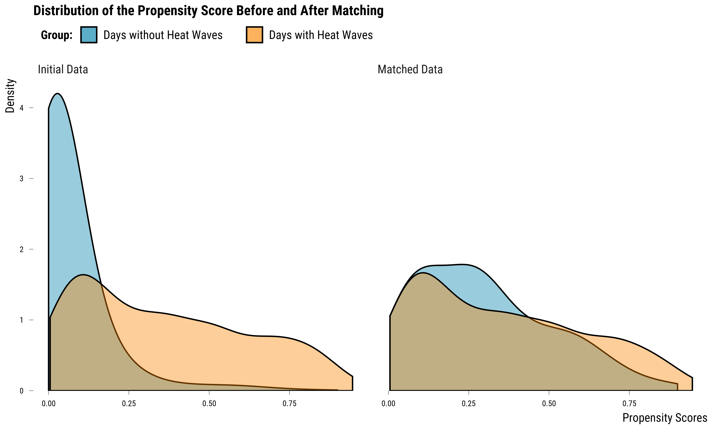
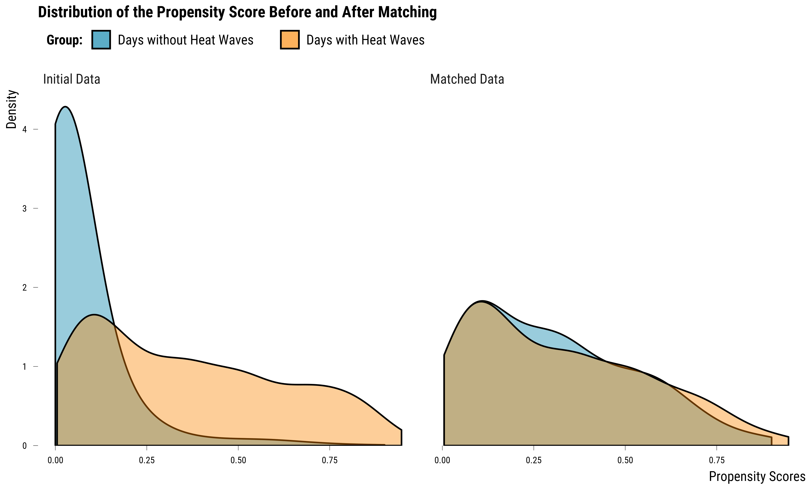
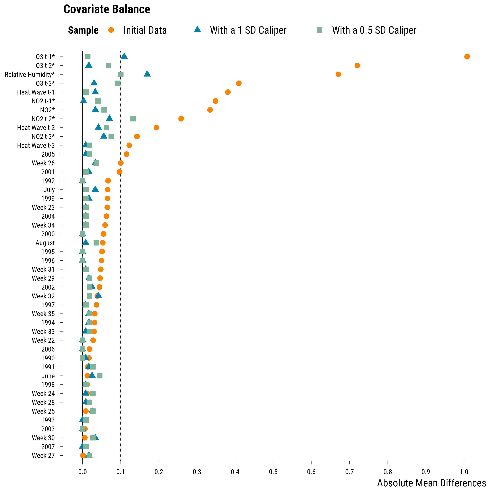

<style>
body {
text-align: justify}
</style>

In this document, we provide all steps and R codes required to estimate the effect of heat waves of the number of years of life lost (YoLL) using propensity score matching. The implementation is done with the fantastic package [MatchIt](https://kosukeimai.github.io/MatchIt/index.html): do not hesitate to explore its very well-made documentation. We also rely on the [cobalt](https://cran.r-project.org/web/packages/cobalt/vignettes/cobalt.html) package for checking covariate balance. **Should you have any questions, need help to reproduce the analysis or find coding errors, please do not hesitate to contact us at leo.zabrocki@psemail.eu**

# Required Packages and Data Loading

To reproduce exactly the `4_propensity_score_matching.html` document, we first need to have installed:

* the [R](https://www.r-project.org/) programming language 
* [RStudio](https://rstudio.com/), an integrated development environment for R, which will allow you to knit the `4_propensity_score_matching.Rmd` file and interact with the R code chunks
* the [R Markdown](https://rmarkdown.rstudio.com/) package
* and the [Distill](https://rstudio.github.io/distill/) package which provides the template for this document. 

Once everything is set up, we load the following packages:

<div class="layout-chunk" data-layout="l-body-outset">
<div class="sourceCode"><pre class="sourceCode r"><code class="sourceCode r"><span class='co'># load required packages</span>
<span class='kw'><a href='https://rdrr.io/r/base/library.html'>library</a></span><span class='op'>(</span><span class='va'><a href='https://yihui.org/knitr/'>knitr</a></span><span class='op'>)</span> <span class='co'># for creating the R Markdown document</span>
<span class='kw'><a href='https://rdrr.io/r/base/library.html'>library</a></span><span class='op'>(</span><span class='va'><a href='https://here.r-lib.org/'>here</a></span><span class='op'>)</span> <span class='co'># for files paths organization</span>
<span class='kw'><a href='https://rdrr.io/r/base/library.html'>library</a></span><span class='op'>(</span><span class='va'><a href='https://tidyverse.tidyverse.org'>tidyverse</a></span><span class='op'>)</span> <span class='co'># for data manipulation and visualization</span>
<span class='kw'><a href='https://rdrr.io/r/base/library.html'>library</a></span><span class='op'>(</span><span class='va'><a href='https://broom.tidymodels.org/'>broom</a></span><span class='op'>)</span> <span class='co'># for cleaning regression outputs</span>
<span class='kw'><a href='https://rdrr.io/r/base/library.html'>library</a></span><span class='op'>(</span><span class='va'><a href='https://kosukeimai.github.io/MatchIt/'>MatchIt</a></span><span class='op'>)</span> <span class='co'># for matching procedures</span>
<span class='kw'><a href='https://rdrr.io/r/base/library.html'>library</a></span><span class='op'>(</span><span class='va'><a href='https://ngreifer.github.io/cobalt/'>cobalt</a></span><span class='op'>)</span> <span class='co'># for assessing covariates balance</span>
<span class='kw'><a href='https://rdrr.io/r/base/library.html'>library</a></span><span class='op'>(</span><span class='va'>lmtest</span><span class='op'>)</span> <span class='co'># for modifying regression standard errors</span>
<span class='kw'><a href='https://rdrr.io/r/base/library.html'>library</a></span><span class='op'>(</span><span class='va'><a href='https://sandwich.R-Forge.R-project.org/'>sandwich</a></span><span class='op'>)</span> <span class='co'># for robust and cluster robust standard errors</span>
<span class='kw'><a href='https://rdrr.io/r/base/library.html'>library</a></span><span class='op'>(</span><span class='va'><a href='http://www.rforge.net/Cairo/'>Cairo</a></span><span class='op'>)</span> <span class='co'># for printing custom police of graphs</span>
<span class='kw'><a href='https://rdrr.io/r/base/library.html'>library</a></span><span class='op'>(</span><span class='va'><a href='https://github.com/rstudio/DT'>DT</a></span><span class='op'>)</span> <span class='co'># for displaying the data as tables</span>
</code></pre></div>

</div>


We load our custom `ggplot2` theme for graphs:

<div class="layout-chunk" data-layout="l-body-outset">
<div class="sourceCode"><pre class="sourceCode r"><code class="sourceCode r"><span class='co'># load ggplot custom theme</span>
<span class='kw'><a href='https://rdrr.io/r/base/source.html'>source</a></span><span class='op'>(</span><span class='fu'>here</span><span class='fu'>::</span><span class='fu'><a href='https://here.r-lib.org//reference/here.html'>here</a></span><span class='op'>(</span><span class='st'>"2.scripts"</span>,
                  <span class='st'>"functions"</span>,
                  <span class='st'>"script_theme_tufte.R"</span><span class='op'>)</span><span class='op'>)</span>
<span class='co'># define nice colors</span>
<span class='va'>my_blue</span> <span class='op'>&lt;-</span> <span class='st'>"#0081a7"</span>
<span class='va'>my_orange</span> <span class='op'>&lt;-</span> <span class='st'>"#fb8500"</span>
</code></pre></div>

</div>


We finally load the data:

<div class="layout-chunk" data-layout="l-body-outset">
<div class="sourceCode"><pre class="sourceCode r"><code class="sourceCode r"><span class='co'># load the data</span>
<span class='va'>data</span> <span class='op'>&lt;-</span>
  <span class='fu'><a href='https://rdrr.io/r/base/readRDS.html'>readRDS</a></span><span class='op'>(</span><span class='fu'>here</span><span class='fu'>::</span><span class='fu'><a href='https://here.r-lib.org//reference/here.html'>here</a></span><span class='op'>(</span><span class='st'>"1.data"</span>, <span class='st'>"simulated_environmental_data.rds"</span><span class='op'>)</span><span class='op'>)</span> <span class='op'>%&gt;%</span>
  <span class='co'># define week and year as factors</span>
  <span class='fu'>mutate_at</span><span class='op'>(</span><span class='fu'>vars</span><span class='op'>(</span><span class='va'>week</span>, <span class='va'>year</span><span class='op'>)</span>, <span class='op'>~</span> <span class='fu'><a href='https://rdrr.io/r/base/factor.html'>as.factor</a></span><span class='op'>(</span><span class='va'>.</span><span class='op'>)</span><span class='op'>)</span>
</code></pre></div>

</div>


As a reminder, there are 122 days where an heat wave occurred and 1254 days without heat waves.

# Propensity Score Matching

We implement below a propensity score matching procedure where:

* each day with an heat wave is matched to the most similar day without heat wave. This is a 1:1 nearest neighbor matching without replacement.
* the distance metric used for the matching is the propensity score which is predicted using a logistic model where we regress the heat wave dummy on its three lags, the three lags of ozone, nitrogen dioxide and its three lags, the relative humidity, the calendar indicators for the day of the week, the week and the year.

We vary the matching distance to see how covariates balance change:

1. We first match each treated unit to its closest control unit using a caliper equal to a 1 standard deviation of the estimated propensity scores.
2. We then set the maximum distance to be inferior to 0.5 propensity score standard deviation. 

Once treated and control units are matched, we assess whether covariates balance has improved. 

We finally estimate the treatment effect.

### Matching Procedure and Covariates Balance Improvement

We first match each treated unit to its closest control unit with a 1 standard deviation caliper using the `matchit()` function:

<div class="layout-chunk" data-layout="l-body-outset">
<div class="sourceCode"><pre class="sourceCode r"><code class="sourceCode r"><span class='co'># match without caliper</span>
<span class='va'>matching_ps_1_caliper</span> <span class='op'>&lt;-</span>
  <span class='fu'><a href='https://kosukeimai.github.io/MatchIt/reference/matchit.html'>matchit</a></span><span class='op'>(</span>
    <span class='va'>heat_wave</span> <span class='op'>~</span> <span class='va'>heat_wave_lag_1</span> <span class='op'>+</span> <span class='va'>heat_wave_lag_2</span> <span class='op'>+</span> <span class='va'>heat_wave_lag_3</span> <span class='op'>+</span>
      <span class='va'>o3_lag_1</span> <span class='op'>+</span> <span class='va'>o3_lag_2</span> <span class='op'>+</span> <span class='va'>o3_lag_3</span> <span class='op'>+</span>
      <span class='va'>no2</span> <span class='op'>+</span> <span class='va'>no2_lag_1</span> <span class='op'>+</span> <span class='va'>no2_lag_2</span> <span class='op'>+</span> <span class='va'>no2_lag_3</span> <span class='op'>+</span>
      <span class='va'>humidity_relative</span> <span class='op'>+</span> <span class='va'>month</span> <span class='op'>+</span> <span class='va'>week</span> <span class='op'>+</span> <span class='va'>year</span>,
    caliper <span class='op'>=</span> <span class='fl'>1</span>,
    data <span class='op'>=</span> <span class='va'>data</span>
  <span class='op'>)</span>

<span class='co'># display summary of the procedure</span>
<span class='va'>matching_ps_1_caliper</span>
</code></pre></div>

```
A matchit object
 - method: 1:1 nearest neighbor matching without replacement
 - distance: Propensity score [caliper]
             - estimated with logistic regression
 - caliper: <distance> (0.157)
 - number of obs.: 1376 (original), 240 (matched)
 - target estimand: ATT
 - covariates: heat_wave_lag_1, heat_wave_lag_2, heat_wave_lag_3, o3_lag_1, o3_lag_2, o3_lag_3, no2, no2_lag_1, no2_lag_2, no2_lag_3, humidity_relative, month, week, year
```

</div>


The output of the matching procedure indicates us the method (1:1 nearest neighbor matching without replacement) and the distance (propensity score) we used. It also tells us how many units were matched: 240 (2 treated units were not matched). We assess how covariates balance has improved by comparing the distribution of propensity scores before and after matching: 

<div class="layout-chunk" data-layout="l-body-outset">
<details>
<summary>Please show me the code!</summary>
<div class="sourceCode"><pre class="sourceCode r"><code class="sourceCode r"><span class='co'># distribution of propensity scores</span>
<span class='va'>graph_propensity_score_distribution_1</span> <span class='op'>&lt;-</span> <span class='fu'><a href='https://ngreifer.github.io/cobalt/reference/bal.plot.html'>bal.plot</a></span><span class='op'>(</span>
  <span class='va'>matching_ps_1_caliper</span>,
  var.name <span class='op'>=</span> <span class='st'>"distance"</span>,
  which <span class='op'>=</span> <span class='st'>"both"</span>,
  sample.names <span class='op'>=</span> <span class='fu'><a href='https://rdrr.io/r/base/c.html'>c</a></span><span class='op'>(</span><span class='st'>"Initial Data"</span>, <span class='st'>"Matched Data"</span><span class='op'>)</span>,
  type <span class='op'>=</span> <span class='st'>"density"</span><span class='op'>)</span> <span class='op'>+</span>
  <span class='fu'>ggtitle</span><span class='op'>(</span><span class='st'>"Distribution of the Propensity Score Before and After Matching"</span><span class='op'>)</span> <span class='op'>+</span>
  <span class='fu'>xlab</span><span class='op'>(</span><span class='st'>"Propensity Scores"</span><span class='op'>)</span> <span class='op'>+</span>
  <span class='fu'>scale_fill_manual</span><span class='op'>(</span>
    name <span class='op'>=</span> <span class='st'>"Group:"</span>,
    values <span class='op'>=</span> <span class='fu'><a href='https://rdrr.io/r/base/c.html'>c</a></span><span class='op'>(</span><span class='va'>my_blue</span>, <span class='va'>my_orange</span><span class='op'>)</span>,
    labels <span class='op'>=</span> <span class='fu'><a href='https://rdrr.io/r/base/c.html'>c</a></span><span class='op'>(</span><span class='st'>"Days without Heat Waves"</span>, <span class='st'>"Days with Heat Waves"</span><span class='op'>)</span>
  <span class='op'>)</span> <span class='op'>+</span>
  <span class='fu'>theme_tufte</span><span class='op'>(</span><span class='op'>)</span>

<span class='co'># display the graph</span>
<span class='va'>graph_propensity_score_distribution_1</span>
</code></pre></div>

</details><!-- --><details>
<summary>Please show me the code!</summary>
<div class="sourceCode"><pre class="sourceCode r"><code class="sourceCode r"><span class='co'># save the graph</span>
<span class='fu'>ggsave</span><span class='op'>(</span>
  <span class='va'>graph_propensity_score_distribution_1</span> <span class='op'>+</span> <span class='fu'>labs</span><span class='op'>(</span>title <span class='op'>=</span> <span class='cn'>NULL</span><span class='op'>)</span>,
  filename <span class='op'>=</span> <span class='fu'>here</span><span class='fu'>::</span><span class='fu'><a href='https://here.r-lib.org//reference/here.html'>here</a></span><span class='op'>(</span>
    <span class='st'>"3.outputs"</span>,
    <span class='st'>"2.graphs"</span>,
    <span class='st'>"graph_propensity_score_distribution_1.pdf"</span>
  <span class='op'>)</span>,
  width <span class='op'>=</span> <span class='fl'>16</span>,
  height <span class='op'>=</span> <span class='fl'>10</span>,
  units <span class='op'>=</span> <span class='st'>"cm"</span>,
  device <span class='op'>=</span> <span class='va'>cairo_pdf</span>
<span class='op'>)</span>
</code></pre></div>

</details>

</div>


We see on this graph that propensity scores distribution for the two groups better overlap after matching. We can also evaluate the covariates balance using the `love.plot()` function from the cobalt package and the absolute mean difference as the summary statistic. For binary variables, the absolute difference in proportion is computed. For continuous covariates, denoted with a star, the absolute standardized mean difference is computed (the difference is divided by the standard deviation of the variable for treated units before matching).

<div class="layout-chunk" data-layout="l-body-outset">
<details>
<summary>Please show me the code!</summary>
<div class="sourceCode"><pre class="sourceCode r"><code class="sourceCode r"><span class='co'># first we nicely label covariates</span>
<span class='va'>cov_labels</span> <span class='op'>&lt;-</span> <span class='fu'><a href='https://rdrr.io/r/base/c.html'>c</a></span><span class='op'>(</span>
  heat_wave_lag_1 <span class='op'>=</span> <span class='st'>"Heat Wave t-1"</span>,
  heat_wave_lag_2 <span class='op'>=</span> <span class='st'>"Heat Wave t-2"</span>,
  heat_wave_lag_3 <span class='op'>=</span> <span class='st'>"Heat Wave t-3"</span>,
  o3_lag_1 <span class='op'>=</span> <span class='st'>"O3 t-1"</span>,
  o3_lag_2 <span class='op'>=</span> <span class='st'>"O3 t-2"</span>,
  o3_lag_3 <span class='op'>=</span> <span class='st'>"O3 t-3"</span>,
  no2 <span class='op'>=</span> <span class='st'>"NO2"</span>,
  no2_lag_1 <span class='op'>=</span> <span class='st'>"NO2 t-1"</span>,
  no2_lag_2 <span class='op'>=</span> <span class='st'>"NO2 t-2"</span>,
  no2_lag_3 <span class='op'>=</span> <span class='st'>"NO2 t-3"</span>,
  humidity_relative <span class='op'>=</span> <span class='st'>"Relative Humidity"</span>,
  month_august <span class='op'>=</span> <span class='st'>"August"</span>,
  month_june <span class='op'>=</span> <span class='st'>"June"</span>,
  month_july <span class='op'>=</span> <span class='st'>"July"</span>,
  week_22 <span class='op'>=</span> <span class='st'>"Week 22"</span>,
  week_23 <span class='op'>=</span> <span class='st'>"Week 23"</span>,
  week_24 <span class='op'>=</span> <span class='st'>"Week 24"</span>,
  week_25 <span class='op'>=</span> <span class='st'>"Week 25"</span>,
  week_26 <span class='op'>=</span> <span class='st'>"Week 26"</span>,
  week_27 <span class='op'>=</span> <span class='st'>"Week 27"</span>,
  week_28 <span class='op'>=</span> <span class='st'>"Week 28"</span>,
  week_29 <span class='op'>=</span> <span class='st'>"Week 29"</span>,
  week_30 <span class='op'>=</span> <span class='st'>"Week 30"</span>,
  week_31 <span class='op'>=</span> <span class='st'>"Week 31"</span>,
  week_32 <span class='op'>=</span> <span class='st'>"Week 32"</span>,
  week_33 <span class='op'>=</span> <span class='st'>"Week 33"</span>,
  week_34 <span class='op'>=</span> <span class='st'>"Week 34"</span>,
  week_35 <span class='op'>=</span> <span class='st'>"Week 35"</span>,
  year_1990 <span class='op'>=</span> <span class='st'>"1990"</span>,
  year_1991 <span class='op'>=</span> <span class='st'>"1991"</span>,
  year_1992 <span class='op'>=</span> <span class='st'>"1992"</span>,
  year_1993 <span class='op'>=</span> <span class='st'>"1993"</span>,
  year_1994 <span class='op'>=</span> <span class='st'>"1994"</span>,
  year_1995 <span class='op'>=</span> <span class='st'>"1995"</span>,
  year_1996 <span class='op'>=</span> <span class='st'>"1996"</span>,
  year_1997 <span class='op'>=</span> <span class='st'>"1997"</span>,
  year_1998 <span class='op'>=</span> <span class='st'>"1998"</span>,
  year_1999 <span class='op'>=</span> <span class='st'>"1999"</span>,
  year_2000 <span class='op'>=</span> <span class='st'>"2000"</span>,
  year_2001 <span class='op'>=</span> <span class='st'>"2001"</span>,
  year_2002 <span class='op'>=</span> <span class='st'>"2002"</span>,
  year_2003 <span class='op'>=</span> <span class='st'>"2003"</span>,
  year_2004 <span class='op'>=</span> <span class='st'>"2004"</span>,
  year_2005 <span class='op'>=</span> <span class='st'>"2005"</span>,
  year_2006 <span class='op'>=</span> <span class='st'>"2006"</span>,
  year_2007 <span class='op'>=</span> <span class='st'>"2007"</span>
<span class='op'>)</span>

<span class='co'># make the love plot</span>
<span class='va'>graph_love_plot_ps_1</span> <span class='op'>&lt;-</span> <span class='fu'><a href='https://ngreifer.github.io/cobalt/reference/love.plot.html'>love.plot</a></span><span class='op'>(</span>
  <span class='va'>matching_ps_1_caliper</span>,
  drop.distance <span class='op'>=</span> <span class='cn'>TRUE</span>,
  abs <span class='op'>=</span> <span class='cn'>TRUE</span>,
  var.order <span class='op'>=</span> <span class='st'>"unadjusted"</span>,
  binary <span class='op'>=</span> <span class='st'>"raw"</span>,
  s.d.denom <span class='op'>=</span> <span class='st'>"treated"</span>,
  thresholds <span class='op'>=</span> <span class='fu'><a href='https://rdrr.io/r/base/c.html'>c</a></span><span class='op'>(</span>m <span class='op'>=</span> <span class='fl'>.1</span><span class='op'>)</span>,
  var.names <span class='op'>=</span> <span class='va'>cov_labels</span>,
  sample.names <span class='op'>=</span> <span class='fu'><a href='https://rdrr.io/r/base/c.html'>c</a></span><span class='op'>(</span><span class='st'>"Initial Data"</span>, <span class='st'>"Matched Data"</span><span class='op'>)</span>,
  shapes <span class='op'>=</span> <span class='fu'><a href='https://rdrr.io/r/base/c.html'>c</a></span><span class='op'>(</span><span class='st'>"circle"</span>, <span class='st'>"triangle"</span><span class='op'>)</span>,
  colors <span class='op'>=</span> <span class='fu'><a href='https://rdrr.io/r/base/c.html'>c</a></span><span class='op'>(</span><span class='va'>my_orange</span>, <span class='va'>my_blue</span><span class='op'>)</span>,
  stars <span class='op'>=</span> <span class='st'>"std"</span>
<span class='op'>)</span> <span class='op'>+</span>
  <span class='fu'>scale_x_continuous</span><span class='op'>(</span>breaks <span class='op'>=</span> <span class='fu'>scales</span><span class='fu'>::</span><span class='fu'><a href='https://scales.r-lib.org/reference/breaks_pretty.html'>pretty_breaks</a></span><span class='op'>(</span>n <span class='op'>=</span> <span class='fl'>10</span><span class='op'>)</span><span class='op'>)</span> <span class='op'>+</span>
  <span class='fu'>xlab</span><span class='op'>(</span><span class='st'>"Absolute Mean Differences"</span><span class='op'>)</span> <span class='op'>+</span>
  <span class='fu'>theme_tufte</span><span class='op'>(</span><span class='op'>)</span>

<span class='co'># display the graph</span>
<span class='va'>graph_love_plot_ps_1</span>
</code></pre></div>

</details><!-- --><details>
<summary>Please show me the code!</summary>
<div class="sourceCode"><pre class="sourceCode r"><code class="sourceCode r"><span class='co'># save the graph</span>
<span class='fu'>ggsave</span><span class='op'>(</span>
  <span class='va'>graph_love_plot_ps_1</span> <span class='op'>+</span> <span class='fu'>labs</span><span class='op'>(</span>title <span class='op'>=</span> <span class='cn'>NULL</span><span class='op'>)</span>,
  filename <span class='op'>=</span> <span class='fu'>here</span><span class='fu'>::</span><span class='fu'><a href='https://here.r-lib.org//reference/here.html'>here</a></span><span class='op'>(</span>
    <span class='st'>"3.outputs"</span>,
    <span class='st'>"2.graphs"</span>,
    <span class='st'>"graph_love_plot_ps_1.pdf"</span>
  <span class='op'>)</span>,
  width <span class='op'>=</span> <span class='fl'>20</span>,
  height <span class='op'>=</span> <span class='fl'>15</span>,
  units <span class='op'>=</span> <span class='st'>"cm"</span>,
  device <span class='op'>=</span> <span class='va'>cairo_pdf</span>
<span class='op'>)</span>
</code></pre></div>

</details>

</div>


On this graph, we can see that, for most covariates, balance has improved after matching---yet, for few covariates, the standardized mean difference has increased. We display below the evolution of the average of standardized mean differences for continuous covariates:

<div class="layout-chunk" data-layout="l-body-outset">
<details>
<summary>Please show me the code!</summary>
<div class="sourceCode"><pre class="sourceCode r"><code class="sourceCode r"><span class='va'>graph_love_plot_ps_1</span><span class='op'>[[</span><span class='st'>"data"</span><span class='op'>]</span><span class='op'>]</span> <span class='op'>%&gt;%</span>
  <span class='fu'><a href='https://rdrr.io/r/stats/filter.html'>filter</a></span><span class='op'>(</span><span class='va'>type</span> <span class='op'>==</span> <span class='st'>"Contin."</span><span class='op'>)</span> <span class='op'>%&gt;%</span>
  <span class='fu'>group_by</span><span class='op'>(</span><span class='va'>Sample</span><span class='op'>)</span> <span class='op'>%&gt;%</span>
  <span class='fu'>summarise</span><span class='op'>(</span><span class='st'>"Average of Standardized Mean Differences"</span> <span class='op'>=</span> <span class='fu'><a href='https://rdrr.io/r/base/Round.html'>round</a></span><span class='op'>(</span><span class='fu'><a href='https://rdrr.io/r/base/mean.html'>mean</a></span><span class='op'>(</span><span class='va'>stat</span><span class='op'>)</span>, <span class='fl'>2</span><span class='op'>)</span>,
            <span class='st'>"Std. Deviation of Standardized Mean Differences"</span> <span class='op'>=</span> <span class='fu'><a href='https://rdrr.io/r/base/Round.html'>round</a></span><span class='op'>(</span><span class='fu'><a href='https://rdrr.io/r/stats/sd.html'>sd</a></span><span class='op'>(</span><span class='va'>stat</span><span class='op'>)</span>, <span class='fl'>2</span><span class='op'>)</span><span class='op'>)</span> <span class='op'>%&gt;%</span>
  <span class='fu'><a href='https://rdrr.io/pkg/knitr/man/kable.html'>kable</a></span><span class='op'>(</span>align <span class='op'>=</span> <span class='fu'><a href='https://rdrr.io/r/base/c.html'>c</a></span><span class='op'>(</span><span class='st'>"l"</span>, <span class='st'>"c"</span><span class='op'>)</span><span class='op'>)</span>
</code></pre></div>

</details>

|Sample       | Average of Standardized Mean Differences |Std. Deviation of Standardized Mean Differences |
|:------------|:----------------------------------------:|:-----------------------------------------------|
|Initial Data |                   0.49                   |0.29                                            |
|Matched Data |                   0.06                   |0.06                                            |

</div>


We also display below the evolution of the difference in proportions for binary covariates:

<div class="layout-chunk" data-layout="l-body-outset">
<details>
<summary>Please show me the code!</summary>
<div class="sourceCode"><pre class="sourceCode r"><code class="sourceCode r"><span class='va'>graph_love_plot_ps_1</span><span class='op'>[[</span><span class='st'>"data"</span><span class='op'>]</span><span class='op'>]</span> <span class='op'>%&gt;%</span>
  <span class='fu'><a href='https://rdrr.io/r/stats/filter.html'>filter</a></span><span class='op'>(</span><span class='va'>type</span> <span class='op'>==</span> <span class='st'>"Binary"</span><span class='op'>)</span> <span class='op'>%&gt;%</span>
  <span class='fu'>group_by</span><span class='op'>(</span><span class='va'>Sample</span><span class='op'>)</span> <span class='op'>%&gt;%</span>
  <span class='fu'>summarise</span><span class='op'>(</span><span class='st'>"Average of Standardized Mean Differences"</span> <span class='op'>=</span> <span class='fu'><a href='https://rdrr.io/r/base/Round.html'>round</a></span><span class='op'>(</span><span class='fu'><a href='https://rdrr.io/r/base/mean.html'>mean</a></span><span class='op'>(</span><span class='va'>stat</span><span class='op'>)</span>, <span class='fl'>2</span><span class='op'>)</span>,
            <span class='st'>"Std. Deviation of Standardized Mean Differences"</span> <span class='op'>=</span> <span class='fu'><a href='https://rdrr.io/r/base/Round.html'>round</a></span><span class='op'>(</span><span class='fu'><a href='https://rdrr.io/r/stats/sd.html'>sd</a></span><span class='op'>(</span><span class='va'>stat</span><span class='op'>)</span>, <span class='fl'>2</span><span class='op'>)</span><span class='op'>)</span> <span class='op'>%&gt;%</span>
  <span class='fu'><a href='https://rdrr.io/pkg/knitr/man/kable.html'>kable</a></span><span class='op'>(</span>align <span class='op'>=</span> <span class='fu'><a href='https://rdrr.io/r/base/c.html'>c</a></span><span class='op'>(</span><span class='st'>"l"</span>, <span class='st'>"c"</span><span class='op'>)</span><span class='op'>)</span>
</code></pre></div>

</details>

|Sample       | Average of Standardized Mean Differences |Std. Deviation of Standardized Mean Differences |
|:------------|:----------------------------------------:|:-----------------------------------------------|
|Initial Data |                   0.05                   |0.07                                            |
|Matched Data |                   0.01                   |0.01                                            |

</div>


Overall, for both types of covariates, the balance has clearly improved after matching.

Until now, we matched each treated unit to its closest control unit according to 1 standard deviation caliper: we could however make sure that a treated unit is not matched to a control unit which is too much different. We do so by setting a caliper of 0.5 standard deviation:

<div class="layout-chunk" data-layout="l-body-outset">
<div class="sourceCode"><pre class="sourceCode r"><code class="sourceCode r"><span class='co'># match without caliper</span>
<span class='va'>matching_ps_0.5_caliper</span> <span class='op'>&lt;-</span>
  <span class='fu'><a href='https://kosukeimai.github.io/MatchIt/reference/matchit.html'>matchit</a></span><span class='op'>(</span>
    <span class='va'>heat_wave</span> <span class='op'>~</span> <span class='va'>heat_wave_lag_1</span> <span class='op'>+</span> <span class='va'>heat_wave_lag_2</span> <span class='op'>+</span> <span class='va'>heat_wave_lag_3</span> <span class='op'>+</span>
      <span class='va'>o3_lag_1</span> <span class='op'>+</span> <span class='va'>o3_lag_2</span> <span class='op'>+</span> <span class='va'>o3_lag_3</span> <span class='op'>+</span>
      <span class='va'>no2</span> <span class='op'>+</span> <span class='va'>no2_lag_1</span> <span class='op'>+</span> <span class='va'>no2_lag_2</span> <span class='op'>+</span> <span class='va'>no2_lag_3</span> <span class='op'>+</span>
      <span class='va'>humidity_relative</span> <span class='op'>+</span> <span class='va'>month</span> <span class='op'>+</span> <span class='va'>week</span> <span class='op'>+</span> <span class='va'>year</span>,
    caliper <span class='op'>=</span> <span class='fl'>0.5</span>,
    data <span class='op'>=</span> <span class='va'>data</span>
  <span class='op'>)</span>

<span class='co'># display summary of the procedure</span>
<span class='va'>matching_ps_0.5_caliper</span>
</code></pre></div>

```
A matchit object
 - method: 1:1 nearest neighbor matching without replacement
 - distance: Propensity score [caliper]
             - estimated with logistic regression
 - caliper: <distance> (0.078)
 - number of obs.: 1376 (original), 222 (matched)
 - target estimand: ATT
 - covariates: heat_wave_lag_1, heat_wave_lag_2, heat_wave_lag_3, o3_lag_1, o3_lag_2, o3_lag_3, no2, no2_lag_1, no2_lag_2, no2_lag_3, humidity_relative, month, week, year
```

</div>


Compared to the matching with a 1 standard deivation caliper, there are now 222 matched units. We can check whether the propensity score distributions overlap better:

<div class="layout-chunk" data-layout="l-body-outset">
<details>
<summary>Please show me the code!</summary>
<div class="sourceCode"><pre class="sourceCode r"><code class="sourceCode r"><span class='co'># distribution of propensity scores</span>
<span class='va'>graph_propensity_score_distribution_2</span> <span class='op'>&lt;-</span> <span class='fu'><a href='https://ngreifer.github.io/cobalt/reference/bal.plot.html'>bal.plot</a></span><span class='op'>(</span>
  <span class='va'>matching_ps_0.5_caliper</span>,
  var.name <span class='op'>=</span> <span class='st'>"distance"</span>,
  which <span class='op'>=</span> <span class='st'>"both"</span>,
  sample.names <span class='op'>=</span> <span class='fu'><a href='https://rdrr.io/r/base/c.html'>c</a></span><span class='op'>(</span><span class='st'>"Initial Data"</span>, <span class='st'>"Matched Data"</span><span class='op'>)</span>,
  type <span class='op'>=</span> <span class='st'>"density"</span>
<span class='op'>)</span> <span class='op'>+</span>
  <span class='fu'>ggtitle</span><span class='op'>(</span><span class='st'>"Distribution of the Propensity Score Before and After Matching"</span><span class='op'>)</span> <span class='op'>+</span>
  <span class='fu'>xlab</span><span class='op'>(</span><span class='st'>"Propensity Scores"</span><span class='op'>)</span> <span class='op'>+</span>
  <span class='fu'>scale_fill_manual</span><span class='op'>(</span>
    name <span class='op'>=</span> <span class='st'>"Group:"</span>,
    values <span class='op'>=</span> <span class='fu'><a href='https://rdrr.io/r/base/c.html'>c</a></span><span class='op'>(</span><span class='va'>my_blue</span>, <span class='va'>my_orange</span><span class='op'>)</span>,
    labels <span class='op'>=</span> <span class='fu'><a href='https://rdrr.io/r/base/c.html'>c</a></span><span class='op'>(</span><span class='st'>"Days without Heat Waves"</span>, <span class='st'>"Days with Heat Waves"</span><span class='op'>)</span>
  <span class='op'>)</span> <span class='op'>+</span>
  <span class='fu'>theme_tufte</span><span class='op'>(</span><span class='op'>)</span>

<span class='co'># display the graph</span>
<span class='va'>graph_propensity_score_distribution_2</span>
</code></pre></div>

</details><!-- --><details>
<summary>Please show me the code!</summary>
<div class="sourceCode"><pre class="sourceCode r"><code class="sourceCode r"><span class='co'># save the graph</span>
<span class='fu'>ggsave</span><span class='op'>(</span>
  <span class='va'>graph_propensity_score_distribution_2</span> <span class='op'>+</span> <span class='fu'>labs</span><span class='op'>(</span>title <span class='op'>=</span> <span class='cn'>NULL</span><span class='op'>)</span>,
  filename <span class='op'>=</span> <span class='fu'>here</span><span class='fu'>::</span><span class='fu'><a href='https://here.r-lib.org//reference/here.html'>here</a></span><span class='op'>(</span>
    <span class='st'>"3.outputs"</span>,
    <span class='st'>"2.graphs"</span>,
    <span class='st'>"graph_propensity_score_distribution_2.pdf"</span>
  <span class='op'>)</span>,
  width <span class='op'>=</span> <span class='fl'>16</span>,
  height <span class='op'>=</span> <span class='fl'>10</span>,
  units <span class='op'>=</span> <span class='st'>"cm"</span>,
  device <span class='op'>=</span> <span class='va'>cairo_pdf</span>
<span class='op'>)</span>
</code></pre></div>

</details>

</div>


The overlap seems to be better than the matching with a 1 standard deviation caliper. We can also evaluate how each covariate balance has improved with a love plot:

<div class="layout-chunk" data-layout="l-body-outset">
<details>
<summary>Please show me the code!</summary>
<div class="sourceCode"><pre class="sourceCode r"><code class="sourceCode r"><span class='co'># make the love plot</span>
<span class='va'>graph_love_plot_ps_2</span> <span class='op'>&lt;-</span> <span class='fu'><a href='https://ngreifer.github.io/cobalt/reference/love.plot.html'>love.plot</a></span><span class='op'>(</span>
  <span class='va'>heat_wave</span> <span class='op'>~</span> <span class='va'>heat_wave_lag_1</span> <span class='op'>+</span> <span class='va'>heat_wave_lag_2</span> <span class='op'>+</span> <span class='va'>heat_wave_lag_3</span> <span class='op'>+</span> <span class='va'>o3_lag_1</span> <span class='op'>+</span> <span class='va'>o3_lag_2</span> <span class='op'>+</span> <span class='va'>o3_lag_3</span> <span class='op'>+</span> <span class='va'>no2</span> <span class='op'>+</span> <span class='va'>no2_lag_1</span> <span class='op'>+</span> <span class='va'>no2_lag_2</span> <span class='op'>+</span> <span class='va'>no2_lag_3</span> <span class='op'>+</span> <span class='va'>humidity_relative</span> <span class='op'>+</span> <span class='va'>month</span> <span class='op'>+</span> <span class='va'>week</span> <span class='op'>+</span> <span class='va'>year</span>,
  data <span class='op'>=</span> <span class='va'>data</span>,
  estimand <span class='op'>=</span> <span class='st'>"ATT"</span>,
  weights <span class='op'>=</span> <span class='fu'><a href='https://rdrr.io/r/base/list.html'>list</a></span><span class='op'>(</span><span class='st'>"With a 1 SD Caliper"</span> <span class='op'>=</span> <span class='va'>matching_ps_1_caliper</span>,
                 <span class='st'>"With a 0.5 SD Caliper"</span> <span class='op'>=</span> <span class='va'>matching_ps_0.5_caliper</span><span class='op'>)</span>,
  drop.distance <span class='op'>=</span> <span class='cn'>TRUE</span>,
  abs <span class='op'>=</span> <span class='cn'>TRUE</span>,
  var.order <span class='op'>=</span> <span class='st'>"unadjusted"</span>,
  binary <span class='op'>=</span> <span class='st'>"raw"</span>,
  s.d.denom <span class='op'>=</span> <span class='st'>"treated"</span>,
  thresholds <span class='op'>=</span> <span class='fu'><a href='https://rdrr.io/r/base/c.html'>c</a></span><span class='op'>(</span>m <span class='op'>=</span> <span class='fl'>.1</span><span class='op'>)</span>,
  var.names <span class='op'>=</span> <span class='va'>cov_labels</span>,
  sample.names <span class='op'>=</span> <span class='fu'><a href='https://rdrr.io/r/base/c.html'>c</a></span><span class='op'>(</span><span class='st'>"Initial Data"</span>, <span class='st'>"With a 1 SD Caliper"</span>, <span class='st'>"With a 0.5 SD Caliper"</span><span class='op'>)</span>,
  shapes <span class='op'>=</span> <span class='fu'><a href='https://rdrr.io/r/base/c.html'>c</a></span><span class='op'>(</span><span class='st'>"circle"</span>, <span class='st'>"triangle"</span>, <span class='st'>"square"</span><span class='op'>)</span>,
  colors <span class='op'>=</span> <span class='fu'><a href='https://rdrr.io/r/base/c.html'>c</a></span><span class='op'>(</span><span class='va'>my_orange</span>, <span class='va'>my_blue</span>, <span class='st'>"#81b29a"</span><span class='op'>)</span>,
  stars <span class='op'>=</span> <span class='st'>"std"</span>
<span class='op'>)</span> <span class='op'>+</span>
  <span class='fu'>scale_x_continuous</span><span class='op'>(</span>breaks <span class='op'>=</span> <span class='fu'>scales</span><span class='fu'>::</span><span class='fu'><a href='https://scales.r-lib.org/reference/breaks_pretty.html'>pretty_breaks</a></span><span class='op'>(</span>n <span class='op'>=</span> <span class='fl'>10</span><span class='op'>)</span><span class='op'>)</span> <span class='op'>+</span>
  <span class='fu'>xlab</span><span class='op'>(</span><span class='st'>"Absolute Mean Differences"</span><span class='op'>)</span> <span class='op'>+</span>
  <span class='fu'>theme_tufte</span><span class='op'>(</span><span class='op'>)</span>

<span class='co'># display the graph</span>
<span class='va'>graph_love_plot_ps_2</span>
</code></pre></div>

</details><!-- --><details>
<summary>Please show me the code!</summary>
<div class="sourceCode"><pre class="sourceCode r"><code class="sourceCode r"><span class='co'># save the graph</span>
<span class='fu'>ggsave</span><span class='op'>(</span>
  <span class='va'>graph_love_plot_ps_2</span>,
  filename <span class='op'>=</span> <span class='fu'>here</span><span class='fu'>::</span><span class='fu'><a href='https://here.r-lib.org//reference/here.html'>here</a></span><span class='op'>(</span>
    <span class='st'>"3.outputs"</span>,
    <span class='st'>"2.graphs"</span>,
    <span class='st'>"graph_love_plot_ps_2.pdf"</span>
  <span class='op'>)</span>,
  width <span class='op'>=</span> <span class='fl'>20</span>,
  height <span class='op'>=</span> <span class='fl'>15</span>,
  units <span class='op'>=</span> <span class='st'>"cm"</span>,
  device <span class='op'>=</span> <span class='va'>cairo_pdf</span>
<span class='op'>)</span>
</code></pre></div>

</details>

</div>


On this graph, it is not clear to see whether covariates balance has really increased. We display below, for continuous covariates, the average of standardized mean differences for the three datasets:

<div class="layout-chunk" data-layout="l-body-outset">
<details>
<summary>Please show me the code!</summary>
<div class="sourceCode"><pre class="sourceCode r"><code class="sourceCode r"><span class='va'>graph_love_plot_ps_2</span><span class='op'>[[</span><span class='st'>"data"</span><span class='op'>]</span><span class='op'>]</span> <span class='op'>%&gt;%</span>
  <span class='fu'><a href='https://rdrr.io/r/stats/filter.html'>filter</a></span><span class='op'>(</span><span class='va'>type</span> <span class='op'>==</span> <span class='st'>"Contin."</span><span class='op'>)</span> <span class='op'>%&gt;%</span>
  <span class='fu'>group_by</span><span class='op'>(</span><span class='va'>Sample</span><span class='op'>)</span> <span class='op'>%&gt;%</span>
  <span class='fu'>summarise</span><span class='op'>(</span><span class='st'>"Average of Standardized Mean Differences"</span> <span class='op'>=</span> <span class='fu'><a href='https://rdrr.io/r/base/Round.html'>round</a></span><span class='op'>(</span><span class='fu'><a href='https://rdrr.io/r/base/mean.html'>mean</a></span><span class='op'>(</span><span class='va'>stat</span><span class='op'>)</span>, <span class='fl'>2</span><span class='op'>)</span>,
            <span class='st'>"Std. Deviation of Standardized Mean Differences"</span> <span class='op'>=</span> <span class='fu'><a href='https://rdrr.io/r/base/Round.html'>round</a></span><span class='op'>(</span><span class='fu'><a href='https://rdrr.io/r/stats/sd.html'>sd</a></span><span class='op'>(</span><span class='va'>stat</span><span class='op'>)</span>, <span class='fl'>2</span><span class='op'>)</span><span class='op'>)</span> <span class='op'>%&gt;%</span>
  <span class='fu'><a href='https://rdrr.io/pkg/knitr/man/kable.html'>kable</a></span><span class='op'>(</span>align <span class='op'>=</span> <span class='fu'><a href='https://rdrr.io/r/base/c.html'>c</a></span><span class='op'>(</span><span class='st'>"l"</span>, <span class='st'>"c"</span><span class='op'>)</span><span class='op'>)</span>
</code></pre></div>

</details>

|Sample                | Average of Standardized Mean Differences |Std. Deviation of Standardized Mean Differences |
|:---------------------|:----------------------------------------:|:-----------------------------------------------|
|Initial Data          |                   0.49                   |0.29                                            |
|With a 1 SD Caliper   |                   0.06                   |0.06                                            |
|With a 0.5 SD Caliper |                   0.07                   |0.04                                            |

</div>


We can see that the average of standardized mean differences is 0.01 higher when using a 0.5 SD caliper than with a 1 SD caliper. We also display below the evolution of the difference in proportions for binary covariates:

<div class="layout-chunk" data-layout="l-body-outset">
<details>
<summary>Please show me the code!</summary>
<div class="sourceCode"><pre class="sourceCode r"><code class="sourceCode r"><span class='va'>graph_love_plot_ps_2</span><span class='op'>[[</span><span class='st'>"data"</span><span class='op'>]</span><span class='op'>]</span> <span class='op'>%&gt;%</span>
  <span class='fu'><a href='https://rdrr.io/r/stats/filter.html'>filter</a></span><span class='op'>(</span><span class='va'>type</span> <span class='op'>==</span> <span class='st'>"Binary"</span><span class='op'>)</span> <span class='op'>%&gt;%</span>
  <span class='fu'>group_by</span><span class='op'>(</span><span class='va'>Sample</span><span class='op'>)</span> <span class='op'>%&gt;%</span>
  <span class='fu'>summarise</span><span class='op'>(</span><span class='st'>"Average of Standardized Mean Differences"</span> <span class='op'>=</span> <span class='fu'><a href='https://rdrr.io/r/base/Round.html'>round</a></span><span class='op'>(</span><span class='fu'><a href='https://rdrr.io/r/base/mean.html'>mean</a></span><span class='op'>(</span><span class='va'>stat</span><span class='op'>)</span>, <span class='fl'>2</span><span class='op'>)</span>,
            <span class='st'>"Std. Deviation of Standardized Mean Differences"</span> <span class='op'>=</span> <span class='fu'><a href='https://rdrr.io/r/base/Round.html'>round</a></span><span class='op'>(</span><span class='fu'><a href='https://rdrr.io/r/stats/sd.html'>sd</a></span><span class='op'>(</span><span class='va'>stat</span><span class='op'>)</span>, <span class='fl'>2</span><span class='op'>)</span><span class='op'>)</span> <span class='op'>%&gt;%</span>
  <span class='fu'><a href='https://rdrr.io/pkg/knitr/man/kable.html'>kable</a></span><span class='op'>(</span>align <span class='op'>=</span> <span class='fu'><a href='https://rdrr.io/r/base/c.html'>c</a></span><span class='op'>(</span><span class='st'>"l"</span>, <span class='st'>"c"</span><span class='op'>)</span><span class='op'>)</span>
</code></pre></div>

</details>

|Sample                | Average of Standardized Mean Differences |Std. Deviation of Standardized Mean Differences |
|:---------------------|:----------------------------------------:|:-----------------------------------------------|
|Initial Data          |                   0.05                   |0.07                                            |
|With a 1 SD Caliper   |                   0.01                   |0.01                                            |
|With a 0.5 SD Caliper |                   0.02                   |0.01                                            |

</div>


Again, the stricter matching procedure did not help improve the balance of binary covariates.

We finally save the data on covariates balance in the `3.outputs/1.data/covariates_balance` folder.

<div class="layout-chunk" data-layout="l-body-outset">
<details>
<summary>Please show me the code!</summary>
<div class="sourceCode"><pre class="sourceCode r"><code class="sourceCode r"><span class='fu'><a href='https://rdrr.io/r/base/readRDS.html'>saveRDS</a></span><span class='op'>(</span>
  <span class='va'>graph_love_plot_ps_2</span><span class='op'>[[</span><span class='st'>"data"</span><span class='op'>]</span><span class='op'>]</span>,
  <span class='fu'>here</span><span class='fu'>::</span><span class='fu'><a href='https://here.r-lib.org//reference/here.html'>here</a></span><span class='op'>(</span>
    <span class='st'>"3.outputs"</span>,
    <span class='st'>"1.data"</span>,
    <span class='st'>"covariates_balance"</span>,
    <span class='st'>"data_cov_balance_ps.RDS"</span>
  <span class='op'>)</span>
<span class='op'>)</span>
</code></pre></div>

</details>

</div>


### Analysis of Matched Data

We now move to the analysis of the matched datasets using a simple regression model where we first regress the YoLL on the treatment indicator. We start with the matched data resulting from the propensity score with a 1 SD caliper. It is very important to note that the target causal estimand is not anymore the the average treatment on the treated as not all treated units could be matched to similar control units (2 treated units could not be matched). To know the true causal effect for the match data, we compute the mean difference in potential outcomes:

<div class="layout-chunk" data-layout="l-body-outset">
<div class="sourceCode"><pre class="sourceCode r"><code class="sourceCode r"><span class='co'># we retrieve the matched data</span>
<span class='va'>data_ps_1_caliper</span> <span class='op'>&lt;-</span> <span class='fu'><a href='https://kosukeimai.github.io/MatchIt/reference/match.data.html'>match.data</a></span><span class='op'>(</span><span class='va'>matching_ps_1_caliper</span><span class='op'>)</span>

<span class='co'># compute the true effect for the data</span>
<span class='va'>true_att_ps_1_caliper</span> <span class='op'>&lt;-</span>
  <span class='fu'><a href='https://rdrr.io/r/base/Round.html'>round</a></span><span class='op'>(</span><span class='fu'><a href='https://rdrr.io/r/base/mean.html'>mean</a></span><span class='op'>(</span><span class='va'>data_ps_1_caliper</span><span class='op'>$</span><span class='va'>y_1</span><span class='op'>[</span><span class='va'>data_ps_1_caliper</span><span class='op'>$</span><span class='va'>heat_wave</span> <span class='op'>==</span> <span class='fl'>1</span><span class='op'>]</span> <span class='op'>-</span> <span class='va'>data_ps_1_caliper</span><span class='op'>$</span><span class='va'>y_0</span><span class='op'>[</span><span class='va'>data_ps_1_caliper</span><span class='op'>$</span><span class='va'>heat_wave</span> <span class='op'>==</span> <span class='fl'>0</span><span class='op'>]</span><span class='op'>)</span>, <span class='fl'>0</span><span class='op'>)</span>
</code></pre></div>

</div>


The true effect for this match data is equal to +275 YoLL, which is different for the true effect of 230 YoLL on **all** treated units. If we estimate this effect with a simple linear regression model, we get:

<div class="layout-chunk" data-layout="l-body-outset">
<div class="sourceCode"><pre class="sourceCode r"><code class="sourceCode r"><span class='co'># we fit the regression model</span>
<span class='va'>model_ps_1_caliper</span> <span class='op'>&lt;-</span> <span class='fu'><a href='https://rdrr.io/r/stats/lm.html'>lm</a></span><span class='op'>(</span><span class='va'>y_obs</span> <span class='op'>~</span> <span class='va'>heat_wave</span>,
                           data <span class='op'>=</span> <span class='va'>data_ps_1_caliper</span>,
                           weights <span class='op'>=</span> <span class='va'>weights</span><span class='op'>)</span>

<span class='co'># retrieve the estimate and 95% ci</span>
<span class='va'>results_ps_1_caliper</span> <span class='op'>&lt;-</span> <span class='fu'><a href='https://generics.r-lib.org/reference/tidy.html'>tidy</a></span><span class='op'>(</span><span class='fu'><a href='https://rdrr.io/pkg/lmtest/man/coeftest.html'>coeftest</a></span><span class='op'>(</span>
  <span class='va'>model_ps_1_caliper</span>,
  vcov. <span class='op'>=</span> <span class='va'>vcovCL</span>,
  cluster <span class='op'>=</span> <span class='op'>~</span> <span class='va'>subclass</span>
<span class='op'>)</span>,
conf.int <span class='op'>=</span> <span class='cn'>TRUE</span><span class='op'>)</span> <span class='op'>%&gt;%</span>
  <span class='fu'><a href='https://rdrr.io/r/stats/filter.html'>filter</a></span><span class='op'>(</span><span class='va'>term</span> <span class='op'>==</span> <span class='st'>"heat_wave"</span><span class='op'>)</span> <span class='op'>%&gt;%</span>
  <span class='fu'>select</span><span class='op'>(</span><span class='va'>term</span>, <span class='va'>estimate</span>, <span class='va'>conf.low</span>, <span class='va'>conf.high</span><span class='op'>)</span> <span class='op'>%&gt;%</span>
  <span class='fu'>mutate_at</span><span class='op'>(</span><span class='fu'>vars</span><span class='op'>(</span><span class='va'>estimate</span><span class='op'>:</span><span class='va'>conf.high</span><span class='op'>)</span>, <span class='op'>~</span> <span class='fu'><a href='https://rdrr.io/r/base/Round.html'>round</a></span><span class='op'>(</span><span class='va'>.</span>, <span class='fl'>0</span><span class='op'>)</span><span class='op'>)</span>

<span class='co'># display results</span>
<span class='va'>results_ps_1_caliper</span> <span class='op'>%&gt;%</span>
  <span class='fu'>rename</span><span class='op'>(</span>
    <span class='st'>"Term"</span> <span class='op'>=</span> <span class='va'>term</span>,
    <span class='st'>"Estimate"</span> <span class='op'>=</span> <span class='va'>estimate</span>,
    <span class='st'>"95% CI Lower Bound"</span> <span class='op'>=</span> <span class='va'>conf.low</span>,
    <span class='st'>"95% CI Upper Bound"</span> <span class='op'>=</span> <span class='va'>conf.high</span>
  <span class='op'>)</span> <span class='op'>%&gt;%</span>
  <span class='fu'><a href='https://rdrr.io/pkg/knitr/man/kable.html'>kable</a></span><span class='op'>(</span><span class='va'>.</span>, align <span class='op'>=</span> <span class='fu'><a href='https://rdrr.io/r/base/c.html'>c</a></span><span class='op'>(</span><span class='st'>"l"</span>, <span class='st'>"c"</span>, <span class='st'>"c"</span>, <span class='st'>"c"</span><span class='op'>)</span><span class='op'>)</span>
</code></pre></div>


|Term      | Estimate | 95% CI Lower Bound | 95% CI Upper Bound |
|:---------|:--------:|:------------------:|:------------------:|
|heat_wave |   275    |        219         |        331         |

</div>


We find that the average effect on the treated is equal to +275 years of life lost, which is the true causal effect. The 95% confidence interval is consistent with effects ranging from +219 up to +331. If we want to increase the precision of our estimate and remove any remaining imbalance in covariates, we can also run a multivariate regression. We adjust below for the same variables used in the estimation of propensity scores:

<div class="layout-chunk" data-layout="l-body-outset">
<div class="sourceCode"><pre class="sourceCode r"><code class="sourceCode r"><span class='co'># we fit the regression model</span>
<span class='va'>model_ps_1_caliper_w_cov</span> <span class='op'>&lt;-</span>
  <span class='fu'><a href='https://rdrr.io/r/stats/lm.html'>lm</a></span><span class='op'>(</span>
    <span class='va'>y_obs</span> <span class='op'>~</span> <span class='va'>heat_wave</span> <span class='op'>+</span> <span class='va'>heat_wave_lag_1</span> <span class='op'>+</span> <span class='va'>heat_wave_lag_2</span> <span class='op'>+</span> <span class='va'>heat_wave_lag_3</span> <span class='op'>+</span> <span class='va'>o3_lag_1</span> <span class='op'>+</span> <span class='va'>o3_lag_2</span> <span class='op'>+</span> <span class='va'>o3_lag_3</span> <span class='op'>+</span> <span class='va'>no2</span> <span class='op'>+</span> <span class='va'>no2_lag_1</span> <span class='op'>+</span> <span class='va'>no2_lag_2</span> <span class='op'>+</span> <span class='va'>no2_lag_3</span> <span class='op'>+</span> <span class='va'>humidity_relative</span> <span class='op'>+</span> <span class='va'>month</span> <span class='op'>+</span> <span class='va'>week</span> <span class='op'>+</span> <span class='va'>year</span>,
    data <span class='op'>=</span> <span class='va'>data_ps_1_caliper</span>,
    weights <span class='op'>=</span> <span class='va'>weights</span>
  <span class='op'>)</span>

<span class='co'># retrieve the estimate and 95% ci</span>
<span class='va'>results_ps_1_caliper_w_cov</span> <span class='op'>&lt;-</span> <span class='fu'><a href='https://generics.r-lib.org/reference/tidy.html'>tidy</a></span><span class='op'>(</span><span class='fu'><a href='https://rdrr.io/pkg/lmtest/man/coeftest.html'>coeftest</a></span><span class='op'>(</span>
  <span class='va'>model_ps_1_caliper_w_cov</span>,
  vcov. <span class='op'>=</span> <span class='va'>vcovCL</span>,
  cluster <span class='op'>=</span> <span class='op'>~</span> <span class='va'>subclass</span>
<span class='op'>)</span>,
conf.int <span class='op'>=</span> <span class='cn'>TRUE</span><span class='op'>)</span> <span class='op'>%&gt;%</span>
  <span class='fu'><a href='https://rdrr.io/r/stats/filter.html'>filter</a></span><span class='op'>(</span><span class='va'>term</span> <span class='op'>==</span> <span class='st'>"heat_wave"</span><span class='op'>)</span> <span class='op'>%&gt;%</span>
  <span class='fu'>select</span><span class='op'>(</span><span class='va'>term</span>, <span class='va'>estimate</span>, <span class='va'>conf.low</span>, <span class='va'>conf.high</span><span class='op'>)</span> <span class='op'>%&gt;%</span>
  <span class='fu'>mutate_at</span><span class='op'>(</span><span class='fu'>vars</span><span class='op'>(</span><span class='va'>estimate</span><span class='op'>:</span><span class='va'>conf.high</span><span class='op'>)</span>, <span class='op'>~</span> <span class='fu'><a href='https://rdrr.io/r/base/Round.html'>round</a></span><span class='op'>(</span><span class='va'>.</span>, <span class='fl'>0</span><span class='op'>)</span><span class='op'>)</span>

<span class='co'># display results</span>
<span class='va'>results_ps_1_caliper_w_cov</span> <span class='op'>%&gt;%</span>
  <span class='fu'>rename</span><span class='op'>(</span>
    <span class='st'>"Term"</span> <span class='op'>=</span> <span class='va'>term</span>,
    <span class='st'>"Estimate"</span> <span class='op'>=</span> <span class='va'>estimate</span>,
    <span class='st'>"95% CI Lower Bound"</span> <span class='op'>=</span> <span class='va'>conf.low</span>,
    <span class='st'>"95% CI Upper Bound"</span> <span class='op'>=</span> <span class='va'>conf.high</span>
  <span class='op'>)</span> <span class='op'>%&gt;%</span>
  <span class='fu'><a href='https://rdrr.io/pkg/knitr/man/kable.html'>kable</a></span><span class='op'>(</span><span class='va'>.</span>, align <span class='op'>=</span> <span class='fu'><a href='https://rdrr.io/r/base/c.html'>c</a></span><span class='op'>(</span><span class='st'>"l"</span>, <span class='st'>"c"</span>, <span class='st'>"c"</span>, <span class='st'>"c"</span><span class='op'>)</span><span class='op'>)</span>
</code></pre></div>


|Term      | Estimate | 95% CI Lower Bound | 95% CI Upper Bound |
|:---------|:--------:|:------------------:|:------------------:|
|heat_wave |   250    |        223         |        277         |

</div>


We find that the average effect on the treated is equal to +250 years of life lost: the estimate is now further away from the true effect. The 95% confidence interval is consistent with effects ranging from +223 up to +277. The width of confidence interval is now equal to 54, which is about half smaller than the previous interval of 112.

We also estimate the treatment effect for the matched dataset resulting from the matching procedure with a 0.5 caliper. Again, it is very important to note that the target causal estimand is not anymore the the average treatment on the treated as not all treated units could be matched to similar control units: only 111 treated units were matched. To know the true causal effect for the match data, we compute the mean difference in potential outcomes:

<div class="layout-chunk" data-layout="l-body-outset">
<div class="sourceCode"><pre class="sourceCode r"><code class="sourceCode r"><span class='co'># we retrieve the matched data</span>
<span class='va'>data_ps_0.5_caliper</span> <span class='op'>&lt;-</span> <span class='fu'><a href='https://kosukeimai.github.io/MatchIt/reference/match.data.html'>match.data</a></span><span class='op'>(</span><span class='va'>matching_ps_0.5_caliper</span><span class='op'>)</span>

<span class='co'># compute the true effect for the data</span>
<span class='va'>true_att_ps_0.5_caliper</span> <span class='op'>&lt;-</span>
  <span class='fu'><a href='https://rdrr.io/r/base/Round.html'>round</a></span><span class='op'>(</span><span class='fu'><a href='https://rdrr.io/r/base/mean.html'>mean</a></span><span class='op'>(</span><span class='va'>data_ps_0.5_caliper</span><span class='op'>$</span><span class='va'>y_1</span><span class='op'>[</span><span class='va'>data_ps_0.5_caliper</span><span class='op'>$</span><span class='va'>heat_wave</span> <span class='op'>==</span> <span class='fl'>1</span><span class='op'>]</span> <span class='op'>-</span> <span class='va'>data_ps_0.5_caliper</span><span class='op'>$</span><span class='va'>y_0</span><span class='op'>[</span><span class='va'>data_ps_0.5_caliper</span><span class='op'>$</span><span class='va'>heat_wave</span> <span class='op'>==</span> <span class='fl'>0</span><span class='op'>]</span><span class='op'>)</span>, <span class='fl'>0</span><span class='op'>)</span>
</code></pre></div>

</div>


The true effect for this match data is equal to +255 YoLL, which is different for the true effect on **all** treated units and of the matched dataset for a 1 SD caliper. If we estimate this effect with a simple linear regression model, we get:

<div class="layout-chunk" data-layout="l-body-outset">
<div class="sourceCode"><pre class="sourceCode r"><code class="sourceCode r"><span class='co'># we fit the regression model</span>
<span class='va'>model_ps_0.5_caliper</span> <span class='op'>&lt;-</span> <span class='fu'><a href='https://rdrr.io/r/stats/lm.html'>lm</a></span><span class='op'>(</span><span class='va'>y_obs</span> <span class='op'>~</span> <span class='va'>heat_wave</span>,
                          data <span class='op'>=</span> <span class='va'>data_ps_0.5_caliper</span>,
                          weights <span class='op'>=</span> <span class='va'>weights</span><span class='op'>)</span>

<span class='co'># retrieve the estimate and 95% ci</span>
<span class='va'>results_ps_0.5_caliper</span> <span class='op'>&lt;-</span> <span class='fu'><a href='https://generics.r-lib.org/reference/tidy.html'>tidy</a></span><span class='op'>(</span><span class='fu'><a href='https://rdrr.io/pkg/lmtest/man/coeftest.html'>coeftest</a></span><span class='op'>(</span>
  <span class='va'>model_ps_0.5_caliper</span>,
  vcov. <span class='op'>=</span> <span class='va'>vcovCL</span>,
  cluster <span class='op'>=</span> <span class='op'>~</span> <span class='va'>subclass</span>
<span class='op'>)</span>,
conf.int <span class='op'>=</span> <span class='cn'>TRUE</span><span class='op'>)</span> <span class='op'>%&gt;%</span>
  <span class='fu'><a href='https://rdrr.io/r/stats/filter.html'>filter</a></span><span class='op'>(</span><span class='va'>term</span> <span class='op'>==</span> <span class='st'>"heat_wave"</span><span class='op'>)</span> <span class='op'>%&gt;%</span>
  <span class='fu'>select</span><span class='op'>(</span><span class='va'>term</span>, <span class='va'>estimate</span>, <span class='va'>conf.low</span>, <span class='va'>conf.high</span><span class='op'>)</span> <span class='op'>%&gt;%</span>
  <span class='fu'>mutate_at</span><span class='op'>(</span><span class='fu'>vars</span><span class='op'>(</span><span class='va'>estimate</span><span class='op'>:</span><span class='va'>conf.high</span><span class='op'>)</span>, <span class='op'>~</span> <span class='fu'><a href='https://rdrr.io/r/base/Round.html'>round</a></span><span class='op'>(</span><span class='va'>.</span>, <span class='fl'>0</span><span class='op'>)</span><span class='op'>)</span>

<span class='co'># display results</span>
<span class='va'>results_ps_0.5_caliper</span> <span class='op'>%&gt;%</span>
  <span class='fu'>rename</span><span class='op'>(</span>
    <span class='st'>"Term"</span> <span class='op'>=</span> <span class='va'>term</span>,
    <span class='st'>"Estimate"</span> <span class='op'>=</span> <span class='va'>estimate</span>,
    <span class='st'>"95% CI Lower Bound"</span> <span class='op'>=</span> <span class='va'>conf.low</span>,
    <span class='st'>"95% CI Upper Bound"</span> <span class='op'>=</span> <span class='va'>conf.high</span>
  <span class='op'>)</span> <span class='op'>%&gt;%</span>
  <span class='fu'><a href='https://rdrr.io/pkg/knitr/man/kable.html'>kable</a></span><span class='op'>(</span><span class='va'>.</span>, align <span class='op'>=</span> <span class='fu'><a href='https://rdrr.io/r/base/c.html'>c</a></span><span class='op'>(</span><span class='st'>"l"</span>, <span class='st'>"c"</span>, <span class='st'>"c"</span>, <span class='st'>"c"</span><span class='op'>)</span><span class='op'>)</span>
</code></pre></div>


|Term      | Estimate | 95% CI Lower Bound | 95% CI Upper Bound |
|:---------|:--------:|:------------------:|:------------------:|
|heat_wave |   255    |        195         |        315         |

</div>


The estimated is exactly equal to the true effect of +255. The 95% confidence interval is consistent with effects ranging from +195 up to +315. We finally run the regression model where we adjust for covariates:

<div class="layout-chunk" data-layout="l-body-outset">
<div class="sourceCode"><pre class="sourceCode r"><code class="sourceCode r"><span class='co'># we fit the regression model</span>
<span class='va'>model_ps_0.5_caliper_w_cov</span> <span class='op'>&lt;-</span>
  <span class='fu'><a href='https://rdrr.io/r/stats/lm.html'>lm</a></span><span class='op'>(</span>
    <span class='va'>y_obs</span> <span class='op'>~</span> <span class='va'>heat_wave</span> <span class='op'>+</span> <span class='va'>heat_wave_lag_1</span> <span class='op'>+</span> <span class='va'>heat_wave_lag_2</span> <span class='op'>+</span> <span class='va'>heat_wave_lag_3</span> <span class='op'>+</span> <span class='va'>o3_lag_1</span> <span class='op'>+</span> <span class='va'>o3_lag_2</span> <span class='op'>+</span> <span class='va'>o3_lag_3</span> <span class='op'>+</span> <span class='va'>no2</span> <span class='op'>+</span> <span class='va'>no2_lag_1</span> <span class='op'>+</span> <span class='va'>no2_lag_2</span> <span class='op'>+</span> <span class='va'>no2_lag_3</span> <span class='op'>+</span> <span class='va'>humidity_relative</span> <span class='op'>+</span> <span class='va'>month</span> <span class='op'>+</span> <span class='va'>week</span> <span class='op'>+</span> <span class='va'>year</span>,
    data <span class='op'>=</span> <span class='va'>data_ps_0.5_caliper</span>,
    weights <span class='op'>=</span> <span class='va'>weights</span>
  <span class='op'>)</span>

<span class='co'># retrieve the estimate and 95% ci</span>
<span class='va'>results_ps_0.5_caliper_w_cov</span> <span class='op'>&lt;-</span> <span class='fu'><a href='https://generics.r-lib.org/reference/tidy.html'>tidy</a></span><span class='op'>(</span><span class='fu'><a href='https://rdrr.io/pkg/lmtest/man/coeftest.html'>coeftest</a></span><span class='op'>(</span>
  <span class='va'>model_ps_0.5_caliper_w_cov</span>,
  vcov. <span class='op'>=</span> <span class='va'>vcovCL</span>,
  cluster <span class='op'>=</span> <span class='op'>~</span> <span class='va'>subclass</span>
<span class='op'>)</span>,
conf.int <span class='op'>=</span> <span class='cn'>TRUE</span><span class='op'>)</span> <span class='op'>%&gt;%</span>
  <span class='fu'><a href='https://rdrr.io/r/stats/filter.html'>filter</a></span><span class='op'>(</span><span class='va'>term</span> <span class='op'>==</span> <span class='st'>"heat_wave"</span><span class='op'>)</span> <span class='op'>%&gt;%</span>
  <span class='fu'>select</span><span class='op'>(</span><span class='va'>term</span>, <span class='va'>estimate</span>, <span class='va'>conf.low</span>, <span class='va'>conf.high</span><span class='op'>)</span> <span class='op'>%&gt;%</span>
  <span class='fu'>mutate_at</span><span class='op'>(</span><span class='fu'>vars</span><span class='op'>(</span><span class='va'>estimate</span><span class='op'>:</span><span class='va'>conf.high</span><span class='op'>)</span>, <span class='op'>~</span> <span class='fu'><a href='https://rdrr.io/r/base/Round.html'>round</a></span><span class='op'>(</span><span class='va'>.</span>, <span class='fl'>0</span><span class='op'>)</span><span class='op'>)</span>

<span class='co'># display results</span>
<span class='va'>results_ps_0.5_caliper_w_cov</span> <span class='op'>%&gt;%</span>
  <span class='fu'>rename</span><span class='op'>(</span>
    <span class='st'>"Term"</span> <span class='op'>=</span> <span class='va'>term</span>,
    <span class='st'>"Estimate"</span> <span class='op'>=</span> <span class='va'>estimate</span>,
    <span class='st'>"95% CI Lower Bound"</span> <span class='op'>=</span> <span class='va'>conf.low</span>,
    <span class='st'>"95% CI Upper Bound"</span> <span class='op'>=</span> <span class='va'>conf.high</span>
  <span class='op'>)</span> <span class='op'>%&gt;%</span>
  <span class='fu'><a href='https://rdrr.io/pkg/knitr/man/kable.html'>kable</a></span><span class='op'>(</span><span class='va'>.</span>, align <span class='op'>=</span> <span class='fu'><a href='https://rdrr.io/r/base/c.html'>c</a></span><span class='op'>(</span><span class='st'>"l"</span>, <span class='st'>"c"</span>, <span class='st'>"c"</span>, <span class='st'>"c"</span><span class='op'>)</span><span class='op'>)</span>
</code></pre></div>


|Term      | Estimate | 95% CI Lower Bound | 95% CI Upper Bound |
|:---------|:--------:|:------------------:|:------------------:|
|heat_wave |   249    |        223         |        276         |

</div>


We find that the average effect on the treated is equal to +249 years of life lost: the estimate is still very close to the true effect. The 95% confidence interval is consistent with effects ranging from +223 up to +276. The width of confidence interval is now equal to 53, which is absout half smaller than the previous interval of 120.


We finally save the data on results from propensity score analyses in the `3.outputs/1.data/analysis_results` folder.

<div class="layout-chunk" data-layout="l-body-outset">
<details>
<summary>Please show me the code!</summary>
<div class="sourceCode"><pre class="sourceCode r"><code class="sourceCode r"><span class='fu'>bind_rows</span><span class='op'>(</span>
  <span class='va'>results_ps_1_caliper</span>,
  <span class='va'>results_ps_1_caliper_w_cov</span>,
  <span class='va'>results_ps_0.5_caliper</span>,
  <span class='va'>results_ps_0.5_caliper_w_cov</span>
<span class='op'>)</span> <span class='op'>%&gt;%</span>
  <span class='fu'>mutate</span><span class='op'>(</span>
    procedure <span class='op'>=</span> <span class='fu'><a href='https://rdrr.io/r/base/c.html'>c</a></span><span class='op'>(</span>
      <span class='st'>"Propensity Score with a 1 SD Caliper"</span>,
      <span class='st'>"Propensity Score with a 1 SD Caliper and with Covariates Adjustment"</span>,
      <span class='st'>"Propensity Score with a 0.5 SD Caliper"</span>,
      <span class='st'>"Propensity Score with a 0.5 SD Caliper and with Covariates Adjustment"</span>
    <span class='op'>)</span>,
    true_effect <span class='op'>=</span> <span class='fu'><a href='https://rdrr.io/r/base/c.html'>c</a></span><span class='op'>(</span>
      <span class='fu'><a href='https://rdrr.io/r/base/rep.html'>rep</a></span><span class='op'>(</span><span class='va'>true_att_ps_1_caliper</span>, <span class='fl'>2</span><span class='op'>)</span>,
      <span class='fu'><a href='https://rdrr.io/r/base/rep.html'>rep</a></span><span class='op'>(</span><span class='va'>true_att_ps_0.5_caliper</span>, <span class='fl'>2</span><span class='op'>)</span>
    <span class='op'>)</span>,
    sample_size <span class='op'>=</span> <span class='fu'><a href='https://rdrr.io/r/base/c.html'>c</a></span><span class='op'>(</span><span class='fu'><a href='https://rdrr.io/r/base/rep.html'>rep</a></span><span class='op'>(</span><span class='fu'><a href='https://rdrr.io/r/base/sum.html'>sum</a></span><span class='op'>(</span>
      <span class='va'>matching_ps_1_caliper</span><span class='op'>[[</span><span class='st'>"weights"</span><span class='op'>]</span><span class='op'>]</span>
    <span class='op'>)</span>, <span class='fl'>2</span><span class='op'>)</span>, <span class='fu'><a href='https://rdrr.io/r/base/rep.html'>rep</a></span><span class='op'>(</span><span class='fu'><a href='https://rdrr.io/r/base/sum.html'>sum</a></span><span class='op'>(</span>
      <span class='va'>matching_ps_0.5_caliper</span><span class='op'>[[</span><span class='st'>"weights"</span><span class='op'>]</span><span class='op'>]</span>
    <span class='op'>)</span>, <span class='fl'>2</span><span class='op'>)</span><span class='op'>)</span>
  <span class='op'>)</span> <span class='op'>%&gt;%</span>
  <span class='fu'><a href='https://rdrr.io/r/base/readRDS.html'>saveRDS</a></span><span class='op'>(</span><span class='va'>.</span>,
          <span class='fu'>here</span><span class='fu'>::</span><span class='fu'><a href='https://here.r-lib.org//reference/here.html'>here</a></span><span class='op'>(</span>
            <span class='st'>"3.outputs"</span>,
            <span class='st'>"1.data"</span>,
            <span class='st'>"analysis_results"</span>,
            <span class='st'>"data_analysis_ps.RDS"</span>
          <span class='op'>)</span><span class='op'>)</span>
</code></pre></div>

</details>

</div>

```{.r .distill-force-highlighting-css}
```
