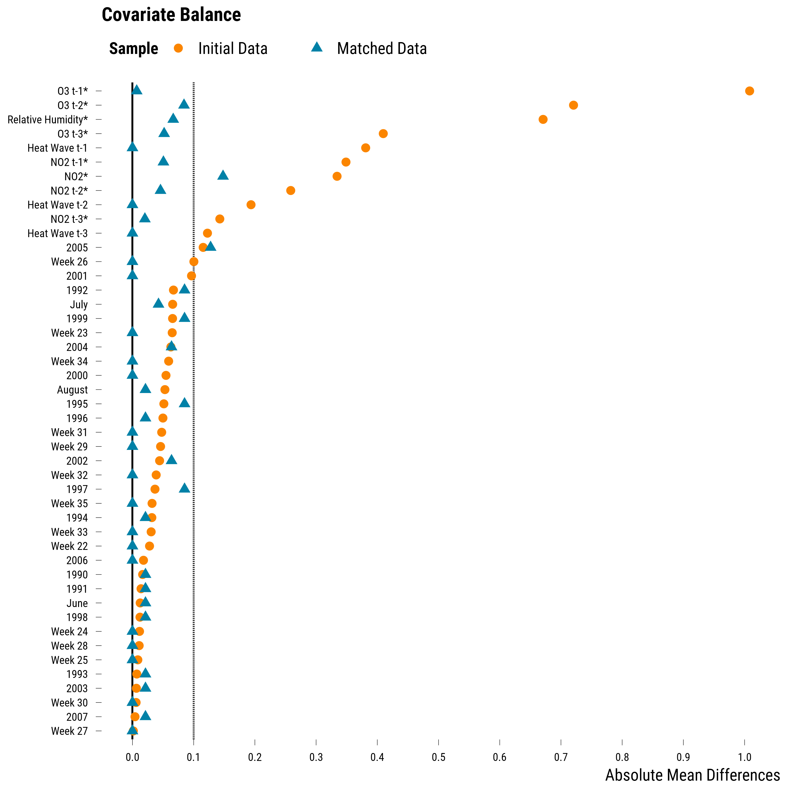

<style>
body {
text-align: justify}
</style>

In this document, we provide all steps and R codes required to estimate the effect of heat waves of the number of years of life lost (YoLL) using coarsened exact matching. The implementation is done with the fantastic package [MatchIt](https://kosukeimai.github.io/MatchIt/index.html): do not hesitate to explore its very well-made documentation. We also rely on the [cobalt](https://cran.r-project.org/web/packages/cobalt/vignettes/cobalt.html) for checking covariate balance. **Should you have any questions, need help to reproduce the analysis or find coding errors, please do not hesitate to contact us at leo.zabrocki@psemail.eu**

# Required Packages and Data Loading

To reproduce exactly the `5_coarsened_exact_matching.html` document, we first need to have installed:

* the [R](https://www.r-project.org/) programming language 
* [RStudio](https://rstudio.com/), an integrated development environment for R, which will allow you to knit the `5_coarsened_exact_matching.Rmd` file and interact with the R code chunks
* the [R Markdown](https://rmarkdown.rstudio.com/) package
* and the [Distill](https://rstudio.github.io/distill/) package which provides the template for this document. 

Once everything is set up, we load the following packages:

<div class="layout-chunk" data-layout="l-body-outset">
<div class="sourceCode"><pre class="sourceCode r"><code class="sourceCode r"><span class='co'># load required packages</span>
<span class='kw'><a href='https://rdrr.io/r/base/library.html'>library</a></span><span class='op'>(</span><span class='va'><a href='https://yihui.org/knitr/'>knitr</a></span><span class='op'>)</span> <span class='co'># for creating the R Markdown document</span>
<span class='kw'><a href='https://rdrr.io/r/base/library.html'>library</a></span><span class='op'>(</span><span class='va'><a href='https://here.r-lib.org/'>here</a></span><span class='op'>)</span> <span class='co'># for files paths organization</span>
<span class='kw'><a href='https://rdrr.io/r/base/library.html'>library</a></span><span class='op'>(</span><span class='va'><a href='https://tidyverse.tidyverse.org'>tidyverse</a></span><span class='op'>)</span> <span class='co'># for data manipulation and visualization</span>
<span class='kw'><a href='https://rdrr.io/r/base/library.html'>library</a></span><span class='op'>(</span><span class='va'><a href='https://broom.tidymodels.org/'>broom</a></span><span class='op'>)</span> <span class='co'># for cleaning regression outputs</span>
<span class='kw'><a href='https://rdrr.io/r/base/library.html'>library</a></span><span class='op'>(</span><span class='va'><a href='https://kosukeimai.github.io/MatchIt/'>MatchIt</a></span><span class='op'>)</span> <span class='co'># for matching procedures</span>
<span class='kw'><a href='https://rdrr.io/r/base/library.html'>library</a></span><span class='op'>(</span><span class='va'><a href='https://ngreifer.github.io/cobalt/'>cobalt</a></span><span class='op'>)</span> <span class='co'># for assessing covariates balance</span>
<span class='kw'><a href='https://rdrr.io/r/base/library.html'>library</a></span><span class='op'>(</span><span class='va'>lmtest</span><span class='op'>)</span> <span class='co'># for modifying regression standard errors</span>
<span class='kw'><a href='https://rdrr.io/r/base/library.html'>library</a></span><span class='op'>(</span><span class='va'><a href='https://sandwich.R-Forge.R-project.org/'>sandwich</a></span><span class='op'>)</span> <span class='co'># for robust and cluster robust standard errors</span>
<span class='kw'><a href='https://rdrr.io/r/base/library.html'>library</a></span><span class='op'>(</span><span class='va'><a href='http://www.rforge.net/Cairo/'>Cairo</a></span><span class='op'>)</span> <span class='co'># for printing custom police of graphs</span>
<span class='kw'><a href='https://rdrr.io/r/base/library.html'>library</a></span><span class='op'>(</span><span class='va'><a href='https://github.com/rstudio/DT'>DT</a></span><span class='op'>)</span> <span class='co'># for displaying the data as tables</span>
</code></pre></div>

</div>


We load our custom `ggplot2` theme for graphs:

<div class="layout-chunk" data-layout="l-body-outset">
<div class="sourceCode"><pre class="sourceCode r"><code class="sourceCode r"><span class='co'># load ggplot custom theme</span>
<span class='kw'><a href='https://rdrr.io/r/base/source.html'>source</a></span><span class='op'>(</span><span class='fu'>here</span><span class='fu'>::</span><span class='fu'><a href='https://here.r-lib.org//reference/here.html'>here</a></span><span class='op'>(</span>
  <span class='st'>"2.scripts"</span>,
  <span class='st'>"functions"</span>,
  <span class='st'>"script_theme_tufte.R"</span>
<span class='op'>)</span><span class='op'>)</span>
<span class='co'># define nice colors</span>
<span class='va'>my_blue</span> <span class='op'>&lt;-</span> <span class='st'>"#0081a7"</span>
<span class='va'>my_orange</span> <span class='op'>&lt;-</span> <span class='st'>"#fb8500"</span>
</code></pre></div>

</div>


We finally load the data:

<div class="layout-chunk" data-layout="l-body-outset">
<div class="sourceCode"><pre class="sourceCode r"><code class="sourceCode r"><span class='co'># load the data</span>
<span class='va'>data</span> <span class='op'>&lt;-</span>
  <span class='fu'><a href='https://rdrr.io/r/base/readRDS.html'>readRDS</a></span><span class='op'>(</span><span class='fu'>here</span><span class='fu'>::</span><span class='fu'><a href='https://here.r-lib.org//reference/here.html'>here</a></span><span class='op'>(</span><span class='st'>"1.data"</span>, <span class='st'>"simulated_environmental_data.rds"</span><span class='op'>)</span><span class='op'>)</span> <span class='op'>%&gt;%</span>
  <span class='co'># define week and year as factors</span>
  <span class='fu'>mutate_at</span><span class='op'>(</span><span class='fu'>vars</span><span class='op'>(</span><span class='va'>week</span>, <span class='va'>year</span><span class='op'>)</span>, <span class='op'>~</span> <span class='fu'><a href='https://rdrr.io/r/base/factor.html'>as.factor</a></span><span class='op'>(</span><span class='va'>.</span><span class='op'>)</span><span class='op'>)</span>
</code></pre></div>

</div>


As a reminder, there are 122 days where an heat wave occurred and 1254 days without heat waves. The true average treatment effect on the treated is equal to +230 YoLL.


# Coarsened Exact Matching

We implement below a coarsened exact matching procedure where:

* each day with an heat wave is matched to the most similar day without heat wave according to coarsened covariates. This is a 1:1 nearest neighbor matching without replacement.
* We match units according the three lags of the heat wave indicator, the first lag of ozone coarsened into terciles, nitrogen dioxide and its first lag coarsened into two bins, the relative humidity coarsened into terciles, the week of the year, and the year splitted into periods ("1990-2000" and "2001-2007"). 

We explored many different types of coarsening and the values we chose seemed to be result in the best sample size-covariates balance trade-off. 
      
Once treated and control units are matched, we assess whether covariates balance has improved. 

We finally estimate the treatment effect.

### Matching Procedure and Covariates Balance Improvement

We implement below the coarsened exact matching procedure:

<div class="layout-chunk" data-layout="l-body-outset">
<div class="sourceCode"><pre class="sourceCode r"><code class="sourceCode r"><span class='co'># first we split the year variable into two periods</span>
<span class='va'>data</span> <span class='op'>&lt;-</span> <span class='va'>data</span> <span class='op'>%&gt;%</span>
  <span class='fu'>mutate</span><span class='op'>(</span>year_binned <span class='op'>=</span> <span class='fu'><a href='https://rdrr.io/r/base/numeric.html'>as.numeric</a></span><span class='op'>(</span><span class='fu'><a href='https://rdrr.io/r/base/character.html'>as.character</a></span><span class='op'>(</span><span class='va'>year</span><span class='op'>)</span><span class='op'>)</span><span class='op'>)</span> <span class='op'>%&gt;%</span>
  <span class='fu'>mutate</span><span class='op'>(</span>year_binned <span class='op'>=</span> <span class='fu'>case_when</span><span class='op'>(</span><span class='va'>year_binned</span> <span class='op'>&lt;=</span> <span class='fl'>2000</span> <span class='op'>~</span> <span class='st'>"1990-2000"</span>,
                          <span class='va'>year_binned</span> <span class='op'>&gt;</span> <span class='fl'>2000</span> <span class='op'>~</span> <span class='st'>"2001-2007"</span><span class='op'>)</span><span class='op'>)</span>

<span class='co'># we set the cut-points for continuous covariates</span>
<span class='va'>cutpoints</span> <span class='op'>=</span>  <span class='fu'><a href='https://rdrr.io/r/base/list.html'>list</a></span><span class='op'>(</span>
  o3_lag_1 <span class='op'>=</span> <span class='st'>"q3"</span>,
  no2 <span class='op'>=</span> <span class='fl'>2</span>,
  no2_lag_1 <span class='op'>=</span> <span class='fl'>2</span>,
  humidity_relative <span class='op'>=</span> <span class='st'>"q3"</span>
<span class='op'>)</span>

<span class='co'># we implement the matching procedure</span>
<span class='va'>matching_coarsened</span> <span class='op'>&lt;-</span>
  <span class='fu'><a href='https://kosukeimai.github.io/MatchIt/reference/matchit.html'>matchit</a></span><span class='op'>(</span>
    <span class='va'>heat_wave</span> <span class='op'>~</span> <span class='va'>heat_wave_lag_1</span> <span class='op'>+</span> <span class='va'>heat_wave_lag_2</span> <span class='op'>+</span> <span class='va'>heat_wave_lag_3</span> <span class='op'>+</span> 
     <span class='va'>o3_lag_1</span> <span class='op'>+</span> <span class='va'>no2</span> <span class='op'>+</span> <span class='va'>no2_lag_1</span> <span class='op'>+</span> <span class='va'>humidity_relative</span> <span class='op'>+</span> 
      <span class='va'>week</span> <span class='op'>+</span> <span class='va'>year_binned</span>,
    data <span class='op'>=</span> <span class='va'>data</span>,
    method <span class='op'>=</span> <span class='st'>"cem"</span>,
    cutpoints <span class='op'>=</span> <span class='va'>cutpoints</span>,
    k2k <span class='op'>=</span> <span class='cn'>TRUE</span>
  <span class='op'>)</span>

<span class='co'># display results</span>
<span class='va'>matching_coarsened</span>
</code></pre></div>

```
A matchit object
 - method: Coarsened exact matching
 - number of obs.: 1376 (original), 94 (matched)
 - target estimand: ATT
 - covariates: heat_wave_lag_1, heat_wave_lag_2, heat_wave_lag_3, o3_lag_1, no2, no2_lag_1, humidity_relative, week, year_binned
```

</div>


The outputtells us that only 47 treated units were matched. We then evaluate the covariates balance using the `love.plot()` function from the cobalt package and the standardized mean difference as the summary statistic:

<div class="layout-chunk" data-layout="l-body-outset">
<details>
<summary>Please show me the code!</summary>
<div class="sourceCode"><pre class="sourceCode r"><code class="sourceCode r"><span class='co'># first we nicely label covariates</span>
<span class='va'>cov_labels</span> <span class='op'>&lt;-</span> <span class='fu'><a href='https://rdrr.io/r/base/c.html'>c</a></span><span class='op'>(</span>
  heat_wave_lag_1 <span class='op'>=</span> <span class='st'>"Heat Wave t-1"</span>,
  heat_wave_lag_2 <span class='op'>=</span> <span class='st'>"Heat Wave t-2"</span>,
  heat_wave_lag_3 <span class='op'>=</span> <span class='st'>"Heat Wave t-3"</span>,
  o3_lag_1 <span class='op'>=</span> <span class='st'>"O3 t-1"</span>,
  o3_lag_2 <span class='op'>=</span> <span class='st'>"O3 t-2"</span>,
  o3_lag_3 <span class='op'>=</span> <span class='st'>"O3 t-3"</span>,
  no2 <span class='op'>=</span> <span class='st'>"NO2"</span>,
  no2_lag_1 <span class='op'>=</span> <span class='st'>"NO2 t-1"</span>,
  no2_lag_2 <span class='op'>=</span> <span class='st'>"NO2 t-2"</span>,
  no2_lag_3 <span class='op'>=</span> <span class='st'>"NO2 t-3"</span>,
  humidity_relative <span class='op'>=</span> <span class='st'>"Relative Humidity"</span>,
  month_august <span class='op'>=</span> <span class='st'>"August"</span>,
  month_june <span class='op'>=</span> <span class='st'>"June"</span>,
  month_july <span class='op'>=</span> <span class='st'>"July"</span>,
  week_22 <span class='op'>=</span> <span class='st'>"Week 22"</span>,
  week_23 <span class='op'>=</span> <span class='st'>"Week 23"</span>,
  week_24 <span class='op'>=</span> <span class='st'>"Week 24"</span>,
  week_25 <span class='op'>=</span> <span class='st'>"Week 25"</span>,
  week_26 <span class='op'>=</span> <span class='st'>"Week 26"</span>,
  week_27 <span class='op'>=</span> <span class='st'>"Week 27"</span>,
  week_28 <span class='op'>=</span> <span class='st'>"Week 28"</span>,
  week_29 <span class='op'>=</span> <span class='st'>"Week 29"</span>,
  week_30 <span class='op'>=</span> <span class='st'>"Week 30"</span>,
  week_31 <span class='op'>=</span> <span class='st'>"Week 31"</span>,
  week_32 <span class='op'>=</span> <span class='st'>"Week 32"</span>,
  week_33 <span class='op'>=</span> <span class='st'>"Week 33"</span>,
  week_34 <span class='op'>=</span> <span class='st'>"Week 34"</span>,
  week_35 <span class='op'>=</span> <span class='st'>"Week 35"</span>,
  year_1990 <span class='op'>=</span> <span class='st'>"1990"</span>,
  year_1991 <span class='op'>=</span> <span class='st'>"1991"</span>,
  year_1992 <span class='op'>=</span> <span class='st'>"1992"</span>,
  year_1993 <span class='op'>=</span> <span class='st'>"1993"</span>,
  year_1994 <span class='op'>=</span> <span class='st'>"1994"</span>,
  year_1995 <span class='op'>=</span> <span class='st'>"1995"</span>,
  year_1996 <span class='op'>=</span> <span class='st'>"1996"</span>,
  year_1997 <span class='op'>=</span> <span class='st'>"1997"</span>,
  year_1998 <span class='op'>=</span> <span class='st'>"1998"</span>,
  year_1999 <span class='op'>=</span> <span class='st'>"1999"</span>,
  year_2000 <span class='op'>=</span> <span class='st'>"2000"</span>,
  year_2001 <span class='op'>=</span> <span class='st'>"2001"</span>,
  year_2002 <span class='op'>=</span> <span class='st'>"2002"</span>,
  year_2003 <span class='op'>=</span> <span class='st'>"2003"</span>,
  year_2004 <span class='op'>=</span> <span class='st'>"2004"</span>,
  year_2005 <span class='op'>=</span> <span class='st'>"2005"</span>,
  year_2006 <span class='op'>=</span> <span class='st'>"2006"</span>,
  year_2007 <span class='op'>=</span> <span class='st'>"2007"</span><span class='op'>)</span>

<span class='co'># make the love plot</span>
<span class='va'>graph_love_plot_cm</span> <span class='op'>&lt;-</span> <span class='fu'><a href='https://ngreifer.github.io/cobalt/reference/love.plot.html'>love.plot</a></span><span class='op'>(</span>
   <span class='va'>heat_wave</span> <span class='op'>~</span> <span class='va'>heat_wave_lag_1</span> <span class='op'>+</span> <span class='va'>heat_wave_lag_2</span> <span class='op'>+</span> <span class='va'>heat_wave_lag_3</span> <span class='op'>+</span> <span class='va'>o3_lag_1</span> <span class='op'>+</span> <span class='va'>o3_lag_2</span> <span class='op'>+</span> <span class='va'>o3_lag_3</span> <span class='op'>+</span> <span class='va'>no2</span> <span class='op'>+</span> <span class='va'>no2_lag_1</span> <span class='op'>+</span> <span class='va'>no2_lag_2</span> <span class='op'>+</span> <span class='va'>no2_lag_3</span> <span class='op'>+</span> <span class='va'>humidity_relative</span> <span class='op'>+</span> <span class='va'>month</span> <span class='op'>+</span> <span class='va'>week</span> <span class='op'>+</span> <span class='va'>year</span>,
  data <span class='op'>=</span> <span class='va'>data</span>,
  estimand <span class='op'>=</span> <span class='st'>"ATT"</span>,
  weights <span class='op'>=</span> <span class='fu'><a href='https://rdrr.io/r/base/list.html'>list</a></span><span class='op'>(</span><span class='st'>"Matched Data"</span> <span class='op'>=</span> <span class='va'>matching_coarsened</span><span class='op'>)</span>,
  drop.distance <span class='op'>=</span> <span class='cn'>TRUE</span>,
  abs <span class='op'>=</span> <span class='cn'>TRUE</span>,
  var.order <span class='op'>=</span> <span class='st'>"unadjusted"</span>,
  binary <span class='op'>=</span> <span class='st'>"raw"</span>,
  s.d.denom <span class='op'>=</span> <span class='st'>"treated"</span>,
  thresholds <span class='op'>=</span> <span class='fu'><a href='https://rdrr.io/r/base/c.html'>c</a></span><span class='op'>(</span>m <span class='op'>=</span> <span class='fl'>.1</span><span class='op'>)</span>,
  var.names <span class='op'>=</span> <span class='va'>cov_labels</span>,
  sample.names <span class='op'>=</span> <span class='fu'><a href='https://rdrr.io/r/base/c.html'>c</a></span><span class='op'>(</span><span class='st'>"Initial Data"</span>, <span class='st'>"Matched Data"</span><span class='op'>)</span>,
  shapes <span class='op'>=</span> <span class='fu'><a href='https://rdrr.io/r/base/c.html'>c</a></span><span class='op'>(</span><span class='st'>"circle"</span>, <span class='st'>"triangle"</span><span class='op'>)</span>,
  colors <span class='op'>=</span> <span class='fu'><a href='https://rdrr.io/r/base/c.html'>c</a></span><span class='op'>(</span><span class='va'>my_orange</span>, <span class='va'>my_blue</span><span class='op'>)</span>,
  stars <span class='op'>=</span> <span class='st'>"std"</span>
<span class='op'>)</span> <span class='op'>+</span>
  <span class='fu'>scale_x_continuous</span><span class='op'>(</span>breaks <span class='op'>=</span> <span class='fu'>scales</span><span class='fu'>::</span><span class='fu'><a href='https://scales.r-lib.org/reference/breaks_pretty.html'>pretty_breaks</a></span><span class='op'>(</span>n <span class='op'>=</span> <span class='fl'>10</span><span class='op'>)</span><span class='op'>)</span> <span class='op'>+</span>
  <span class='fu'>xlab</span><span class='op'>(</span><span class='st'>"Absolute Mean Differences"</span><span class='op'>)</span> <span class='op'>+</span>
  <span class='fu'>theme_tufte</span><span class='op'>(</span><span class='op'>)</span>

<span class='co'># display the graph</span>
<span class='va'>graph_love_plot_cm</span>
</code></pre></div>

</details><!-- --><details>
<summary>Please show me the code!</summary>
<div class="sourceCode"><pre class="sourceCode r"><code class="sourceCode r"><span class='co'># save the graph</span>
<span class='fu'>ggsave</span><span class='op'>(</span>
  <span class='va'>graph_love_plot_cm</span>,
  filename <span class='op'>=</span> <span class='fu'>here</span><span class='fu'>::</span><span class='fu'><a href='https://here.r-lib.org//reference/here.html'>here</a></span><span class='op'>(</span>
    <span class='st'>"3.outputs"</span>,
    <span class='st'>"2.graphs"</span>,
    <span class='st'>"graph_love_plot_cm.pdf"</span>
  <span class='op'>)</span>,
  width <span class='op'>=</span> <span class='fl'>20</span>,
  height <span class='op'>=</span> <span class='fl'>15</span>,
  units <span class='op'>=</span> <span class='st'>"cm"</span>,
  device <span class='op'>=</span> <span class='va'>cairo_pdf</span>
<span class='op'>)</span>
</code></pre></div>

</details>

</div>


On this graph, we see whether covariates balance has increased for most covariates but for the year indicators. We divided the year variable in only two groups to help increase the sample size. If we increase the number of groups, we do not find similar pairs of treated and control units. The imbalance for NO$_{2}$ in $t$ is also a bit high. We display below the average of standardized mean differences:

<div class="layout-chunk" data-layout="l-body-outset">
<div class="sourceCode"><pre class="sourceCode r"><code class="sourceCode r"><span class='va'>graph_love_plot_cm</span><span class='op'>[[</span><span class='st'>"data"</span><span class='op'>]</span><span class='op'>]</span> <span class='op'>%&gt;%</span>
  <span class='fu'>group_by</span><span class='op'>(</span><span class='va'>Sample</span><span class='op'>)</span> <span class='op'>%&gt;%</span>
  <span class='fu'>summarise</span><span class='op'>(</span><span class='st'>"Average of Standardized Mean Differences"</span> <span class='op'>=</span> <span class='fu'><a href='https://rdrr.io/r/base/Round.html'>round</a></span><span class='op'>(</span><span class='fu'><a href='https://rdrr.io/r/base/mean.html'>mean</a></span><span class='op'>(</span><span class='va'>stat</span><span class='op'>)</span>, <span class='fl'>2</span><span class='op'>)</span>,
            <span class='st'>"Std. Deviation of Standardized Mean Differences"</span> <span class='op'>=</span> <span class='fu'><a href='https://rdrr.io/r/base/Round.html'>round</a></span><span class='op'>(</span><span class='fu'><a href='https://rdrr.io/r/stats/sd.html'>sd</a></span><span class='op'>(</span><span class='va'>stat</span><span class='op'>)</span>, <span class='fl'>2</span><span class='op'>)</span><span class='op'>)</span> <span class='op'>%&gt;%</span>
  <span class='fu'><a href='https://rdrr.io/pkg/knitr/man/kable.html'>kable</a></span><span class='op'>(</span>align <span class='op'>=</span> <span class='fu'><a href='https://rdrr.io/r/base/c.html'>c</a></span><span class='op'>(</span><span class='st'>"l"</span>, <span class='st'>"c"</span><span class='op'>)</span><span class='op'>)</span>
</code></pre></div>


|Sample       | Average of Standardized Mean Differences |Std. Deviation of Standardized Mean Differences |
|:------------|:----------------------------------------:|:-----------------------------------------------|
|Initial Data |                   0.13                   |0.21                                            |
|Matched Data |                   0.03                   |0.04                                            |

</div>


The average standardized mean of differences is 0.1, which is about two times larger than the ones found with propensity score procedures. We are also working with a smaller number of matched units.

### Analysis of Matched Data

We now move to the analysis of the matched datasets.  It is very important to note that the target causal estimand is not anymore the the average treatment effect on the treated as not all treated units could be matched to similar control units. To know the true causal effect for the match data, we compute the mean difference in potential outcomes:

<div class="layout-chunk" data-layout="l-body-outset">
<div class="sourceCode"><pre class="sourceCode r"><code class="sourceCode r"><span class='co'># we retrieve the matched data</span>
<span class='va'>data_cm</span> <span class='op'>&lt;-</span> <span class='fu'><a href='https://kosukeimai.github.io/MatchIt/reference/match.data.html'>match.data</a></span><span class='op'>(</span><span class='va'>matching_coarsened</span><span class='op'>)</span>

<span class='co'># compute the true effect for the data</span>
<span class='va'>true_att</span> <span class='op'>&lt;-</span>
  <span class='fu'><a href='https://rdrr.io/r/base/Round.html'>round</a></span><span class='op'>(</span><span class='fu'><a href='https://rdrr.io/r/base/mean.html'>mean</a></span><span class='op'>(</span><span class='va'>data_cm</span><span class='op'>$</span><span class='va'>y_1</span><span class='op'>[</span><span class='va'>data_cm</span><span class='op'>$</span><span class='va'>heat_wave</span> <span class='op'>==</span> <span class='fl'>1</span><span class='op'>]</span> <span class='op'>-</span> <span class='va'>data_cm</span><span class='op'>$</span><span class='va'>y_0</span><span class='op'>[</span><span class='va'>data_cm</span><span class='op'>$</span><span class='va'>heat_wave</span> <span class='op'>==</span> <span class='fl'>0</span><span class='op'>]</span><span class='op'>)</span>, <span class='fl'>0</span><span class='op'>)</span>
</code></pre></div>

</div>


The true treatment effect for the matched data is equal to +271 YoLL. To estimate this effect, we first use a simple regression model where we regress the YoLL on the treatment indicator.

<div class="layout-chunk" data-layout="l-body-outset">
<div class="sourceCode"><pre class="sourceCode r"><code class="sourceCode r"><span class='co'># we fit the regression model</span>
<span class='va'>model_cm_wo_cov</span> <span class='op'>&lt;-</span> <span class='fu'><a href='https://rdrr.io/r/stats/lm.html'>lm</a></span><span class='op'>(</span><span class='va'>y_obs</span> <span class='op'>~</span> <span class='va'>heat_wave</span>,
                           data <span class='op'>=</span> <span class='va'>data_cm</span>,
                           weights <span class='op'>=</span> <span class='va'>weights</span><span class='op'>)</span>

<span class='co'># retrieve the estimate and 95% ci</span>
<span class='va'>results_cm_wo_cov</span> <span class='op'>&lt;-</span> <span class='fu'><a href='https://generics.r-lib.org/reference/tidy.html'>tidy</a></span><span class='op'>(</span><span class='fu'><a href='https://rdrr.io/pkg/lmtest/man/coeftest.html'>coeftest</a></span><span class='op'>(</span>
  <span class='va'>model_cm_wo_cov</span>,
  vcov. <span class='op'>=</span> <span class='va'>vcovCL</span>,
  cluster <span class='op'>=</span> <span class='op'>~</span> <span class='va'>subclass</span>
<span class='op'>)</span>,
conf.int <span class='op'>=</span> <span class='cn'>TRUE</span><span class='op'>)</span> <span class='op'>%&gt;%</span>
  <span class='fu'><a href='https://rdrr.io/r/stats/filter.html'>filter</a></span><span class='op'>(</span><span class='va'>term</span> <span class='op'>==</span> <span class='st'>"heat_wave"</span><span class='op'>)</span> <span class='op'>%&gt;%</span>
  <span class='fu'>select</span><span class='op'>(</span><span class='va'>term</span>, <span class='va'>estimate</span>, <span class='va'>conf.low</span>, <span class='va'>conf.high</span><span class='op'>)</span> <span class='op'>%&gt;%</span>
  <span class='fu'>mutate_at</span><span class='op'>(</span><span class='fu'>vars</span><span class='op'>(</span><span class='va'>estimate</span><span class='op'>:</span><span class='va'>conf.high</span><span class='op'>)</span>, <span class='op'>~</span> <span class='fu'><a href='https://rdrr.io/r/base/Round.html'>round</a></span><span class='op'>(</span><span class='va'>.</span>, <span class='fl'>0</span><span class='op'>)</span><span class='op'>)</span>

<span class='co'># display results</span>
<span class='va'>results_cm_wo_cov</span> <span class='op'>%&gt;%</span>
  <span class='fu'>rename</span><span class='op'>(</span>
    <span class='st'>"Term"</span> <span class='op'>=</span> <span class='va'>term</span>,
    <span class='st'>"Estimate"</span> <span class='op'>=</span> <span class='va'>estimate</span>,
    <span class='st'>"95% CI Lower Bound"</span> <span class='op'>=</span> <span class='va'>conf.low</span>,
    <span class='st'>"95% CI Upper Bound"</span> <span class='op'>=</span> <span class='va'>conf.high</span>
  <span class='op'>)</span> <span class='op'>%&gt;%</span>
  <span class='fu'><a href='https://rdrr.io/pkg/knitr/man/kable.html'>kable</a></span><span class='op'>(</span><span class='va'>.</span>, align <span class='op'>=</span> <span class='fu'><a href='https://rdrr.io/r/base/c.html'>c</a></span><span class='op'>(</span><span class='st'>"l"</span>, <span class='st'>"c"</span>, <span class='st'>"c"</span>, <span class='st'>"c"</span><span class='op'>)</span><span class='op'>)</span>
</code></pre></div>


|Term      | Estimate | 95% CI Lower Bound | 95% CI Upper Bound |
|:---------|:--------:|:------------------:|:------------------:|
|heat_wave |   271    |        183         |        358         |

</div>


We find that the estimate for the average effect on the treated is equal to +271 years of life lost. This is the true effect size. The 95% confidence interval is consistent with effects ranging from +183 up to +358. If we want to increase the precision of our estimate and remove any remaining imbalance in covariates, we can also run a multivariate regression. We adjust below for the same variables used in the propensity score matching procedure:

<div class="layout-chunk" data-layout="l-body-outset">
<div class="sourceCode"><pre class="sourceCode r"><code class="sourceCode r"><span class='co'># we fit the regression model</span>
<span class='va'>model_cm_w_cov</span> <span class='op'>&lt;-</span>
  <span class='fu'><a href='https://rdrr.io/r/stats/lm.html'>lm</a></span><span class='op'>(</span>
    <span class='va'>y_obs</span> <span class='op'>~</span> <span class='va'>heat_wave</span> <span class='op'>+</span> <span class='va'>heat_wave_lag_1</span> <span class='op'>+</span> <span class='va'>heat_wave_lag_2</span> <span class='op'>+</span> <span class='va'>heat_wave_lag_3</span> <span class='op'>+</span> <span class='va'>o3_lag_1</span> <span class='op'>+</span> <span class='va'>o3_lag_2</span> <span class='op'>+</span> <span class='va'>o3_lag_3</span> <span class='op'>+</span> <span class='va'>no2</span> <span class='op'>+</span> <span class='va'>no2_lag_1</span> <span class='op'>+</span> <span class='va'>no2_lag_2</span> <span class='op'>+</span> <span class='va'>no2_lag_3</span> <span class='op'>+</span> <span class='va'>humidity_relative</span> <span class='op'>+</span> <span class='va'>month</span> <span class='op'>+</span> <span class='va'>week</span> <span class='op'>+</span> <span class='va'>year</span>,
    data <span class='op'>=</span> <span class='va'>data_cm</span>,
    weights <span class='op'>=</span> <span class='va'>weights</span>
  <span class='op'>)</span>

<span class='co'># retrieve the estimate and 95% ci</span>
<span class='va'>results_cm_w_cov</span> <span class='op'>&lt;-</span> <span class='fu'><a href='https://generics.r-lib.org/reference/tidy.html'>tidy</a></span><span class='op'>(</span><span class='fu'><a href='https://rdrr.io/pkg/lmtest/man/coeftest.html'>coeftest</a></span><span class='op'>(</span>
  <span class='va'>model_cm_w_cov</span>,
  vcov. <span class='op'>=</span> <span class='va'>vcovCL</span>,
  cluster <span class='op'>=</span> <span class='op'>~</span> <span class='va'>subclass</span>
<span class='op'>)</span>,
conf.int <span class='op'>=</span> <span class='cn'>TRUE</span><span class='op'>)</span> <span class='op'>%&gt;%</span>
  <span class='fu'><a href='https://rdrr.io/r/stats/filter.html'>filter</a></span><span class='op'>(</span><span class='va'>term</span> <span class='op'>==</span> <span class='st'>"heat_wave"</span><span class='op'>)</span> <span class='op'>%&gt;%</span>
  <span class='fu'>select</span><span class='op'>(</span><span class='va'>term</span>, <span class='va'>estimate</span>, <span class='va'>conf.low</span>, <span class='va'>conf.high</span><span class='op'>)</span> <span class='op'>%&gt;%</span>
  <span class='fu'>mutate_at</span><span class='op'>(</span><span class='fu'>vars</span><span class='op'>(</span><span class='va'>estimate</span><span class='op'>:</span><span class='va'>conf.high</span><span class='op'>)</span>, <span class='op'>~</span> <span class='fu'><a href='https://rdrr.io/r/base/Round.html'>round</a></span><span class='op'>(</span><span class='va'>.</span>, <span class='fl'>0</span><span class='op'>)</span><span class='op'>)</span>

<span class='co'># display results</span>
<span class='va'>results_cm_w_cov</span> <span class='op'>%&gt;%</span>
  <span class='fu'>rename</span><span class='op'>(</span>
    <span class='st'>"Term"</span> <span class='op'>=</span> <span class='va'>term</span>,
    <span class='st'>"Estimate"</span> <span class='op'>=</span> <span class='va'>estimate</span>,
    <span class='st'>"95% CI Lower Bound"</span> <span class='op'>=</span> <span class='va'>conf.low</span>,
    <span class='st'>"95% CI Upper Bound"</span> <span class='op'>=</span> <span class='va'>conf.high</span>
  <span class='op'>)</span> <span class='op'>%&gt;%</span>
  <span class='fu'><a href='https://rdrr.io/pkg/knitr/man/kable.html'>kable</a></span><span class='op'>(</span><span class='va'>.</span>, align <span class='op'>=</span> <span class='fu'><a href='https://rdrr.io/r/base/c.html'>c</a></span><span class='op'>(</span><span class='st'>"l"</span>, <span class='st'>"c"</span>, <span class='st'>"c"</span>, <span class='st'>"c"</span><span class='op'>)</span><span class='op'>)</span>
</code></pre></div>


|Term      | Estimate | 95% CI Lower Bound | 95% CI Upper Bound |
|:---------|:--------:|:------------------:|:------------------:|
|heat_wave |   252    |        180         |        323         |

</div>


We find that the average effect on the treated is equal to +252 years of life lost: the estimate is now lower than the true effect. The 95% confidence interval is consistent with effects ranging from +180 up to +323. The width of confidence interval is now equal to 143, which is smaller than the previous interval of 175.

We finally save the data on coarsened results in the `3.outputs/1.data/analysis_results` folder.

<div class="layout-chunk" data-layout="l-body-outset">
<div class="sourceCode"><pre class="sourceCode r"><code class="sourceCode r"><span class='fu'>bind_rows</span><span class='op'>(</span>
  <span class='va'>results_cm_w_cov</span>,
  <span class='va'>results_cm_wo_cov</span><span class='op'>)</span> <span class='op'>%&gt;%</span>
  <span class='fu'>mutate</span><span class='op'>(</span>
    procedure <span class='op'>=</span> <span class='fu'><a href='https://rdrr.io/r/base/c.html'>c</a></span><span class='op'>(</span>
      <span class='st'>"Coarsened Matching without Covariates Adjustment"</span>,
      <span class='st'>"Coarsened Matching with Covariates Adjustment"</span><span class='op'>)</span>,
    true_effect <span class='op'>=</span> <span class='fu'><a href='https://rdrr.io/r/base/rep.html'>rep</a></span><span class='op'>(</span><span class='va'>true_att</span>, <span class='fl'>2</span><span class='op'>)</span>,
    sample_size <span class='op'>=</span> <span class='fu'><a href='https://rdrr.io/r/base/rep.html'>rep</a></span><span class='op'>(</span><span class='va'>matching_coarsened</span><span class='op'>[[</span><span class='st'>"nn"</span><span class='op'>]</span><span class='op'>]</span><span class='op'>[</span><span class='fl'>3</span><span class='op'>]</span>, <span class='fl'>2</span><span class='op'>)</span>
  <span class='op'>)</span> <span class='op'>%&gt;%</span>
  <span class='fu'><a href='https://rdrr.io/r/base/readRDS.html'>saveRDS</a></span><span class='op'>(</span>
    <span class='va'>.</span>,
    <span class='fu'>here</span><span class='fu'>::</span><span class='fu'><a href='https://here.r-lib.org//reference/here.html'>here</a></span><span class='op'>(</span>
      <span class='st'>"3.outputs"</span>,
      <span class='st'>"1.data"</span>,
      <span class='st'>"analysis_results"</span>,
      <span class='st'>"data_analysis_cem.RDS"</span>
    <span class='op'>)</span>
  <span class='op'>)</span>
</code></pre></div>

</div>

```{.r .distill-force-highlighting-css}
```
