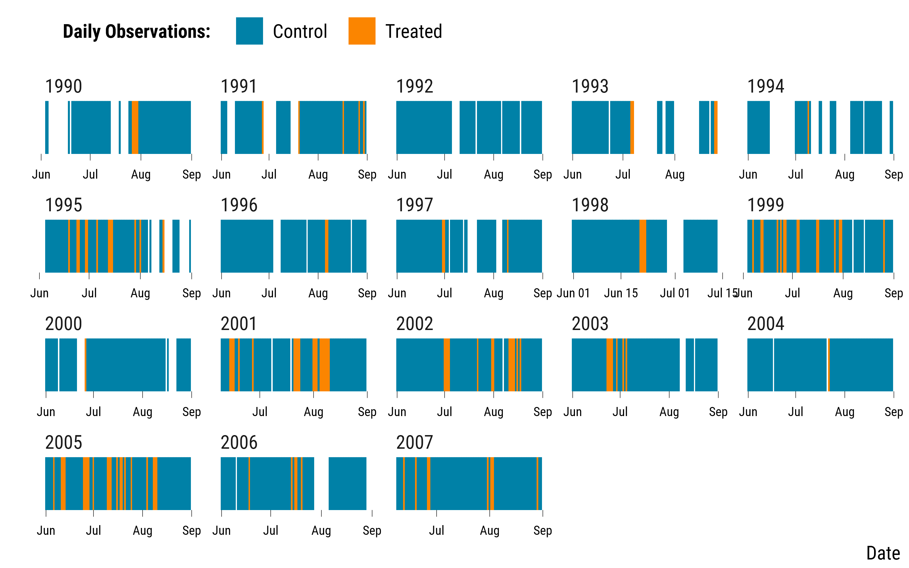

<style>
body {
text-align: justify}
</style>


In this document, we provide all steps and R codes required to estimate the effect of heat waves of the number of years of life lost (YoLL) using a recently developed constrained pair matching algorithm. Compared to propensity score matching, we can choose the maximum distance allowed between treated and control units for each covariate. The coding procedure is a bit more involved as it has not been formatted in an R package yet. **Should you have any questions, need help to reproduce the analysis or find coding errors, please do not hesitate to contact us at leo.zabrocki@psemail.eu**

# Required Packages and Data Loading

To reproduce exactly the `6_constrained_pair_matching.html` document, we first need to have installed:

* the [R](https://www.r-project.org/) programming language 
* [RStudio](https://rstudio.com/), an integrated development environment for R, which will allow you to knit the `6_constrained_pair_matching.Rmd` file and interact with the R code chunks
* the [R Markdown](https://rmarkdown.rstudio.com/) package
* and the [Distill](https://rstudio.github.io/distill/) package which provides the template for this document. 

Once everything is set up, we load the following packages:

<div class="layout-chunk" data-layout="l-body-outset">
<div class="sourceCode"><pre class="sourceCode r"><code class="sourceCode r"><span class='co'># load required packages</span>
<span class='kw'><a href='https://rdrr.io/r/base/library.html'>library</a></span><span class='op'>(</span><span class='va'><a href='https://yihui.org/knitr/'>knitr</a></span><span class='op'>)</span> <span class='co'># for creating the R Markdown document</span>
<span class='kw'><a href='https://rdrr.io/r/base/library.html'>library</a></span><span class='op'>(</span><span class='va'><a href='https://here.r-lib.org/'>here</a></span><span class='op'>)</span> <span class='co'># for files paths organization</span>
<span class='kw'><a href='https://rdrr.io/r/base/library.html'>library</a></span><span class='op'>(</span><span class='va'><a href='https://tidyverse.tidyverse.org'>tidyverse</a></span><span class='op'>)</span> <span class='co'># for data manipulation and visualization</span>
<span class='kw'><a href='https://rdrr.io/r/base/library.html'>library</a></span><span class='op'>(</span><span class='va'><a href='https://broom.tidymodels.org/'>broom</a></span><span class='op'>)</span> <span class='co'># for cleaning regression outputs</span>
<span class='kw'><a href='https://rdrr.io/r/base/library.html'>library</a></span><span class='op'>(</span><span class='va'><a href='http://www.rcpp.org'>Rcpp</a></span><span class='op'>)</span> <span class='co'># for running the matching algorithm</span>
<span class='kw'><a href='https://rdrr.io/r/base/library.html'>library</a></span><span class='op'>(</span><span class='va'><a href='https://github.com/markmfredrickson/optmatch'>optmatch</a></span><span class='op'>)</span> <span class='co'># for matching pairs</span>
<span class='kw'><a href='https://rdrr.io/r/base/library.html'>library</a></span><span class='op'>(</span><span class='va'><a href='https://igraph.org'>igraph</a></span><span class='op'>)</span> <span class='co'># for maximum bipartite matching</span>
<span class='kw'><a href='https://rdrr.io/r/base/library.html'>library</a></span><span class='op'>(</span><span class='va'>lmtest</span><span class='op'>)</span> <span class='co'># for modifying regression standard errors</span>
<span class='kw'><a href='https://rdrr.io/r/base/library.html'>library</a></span><span class='op'>(</span><span class='va'><a href='https://sandwich.R-Forge.R-project.org/'>sandwich</a></span><span class='op'>)</span> <span class='co'># for robust and cluster robust standard errors</span>
<span class='kw'><a href='https://rdrr.io/r/base/library.html'>library</a></span><span class='op'>(</span><span class='va'><a href='http://www.rforge.net/Cairo/'>Cairo</a></span><span class='op'>)</span> <span class='co'># for printing custom police of graphs</span>
<span class='kw'><a href='https://rdrr.io/r/base/library.html'>library</a></span><span class='op'>(</span><span class='va'><a href='https://github.com/rstudio/DT'>DT</a></span><span class='op'>)</span> <span class='co'># for displaying the data as tables</span>
</code></pre></div>

</div>


We also have to load the `script_time_series_matching_function.R` located in the **functions** folder and which provides the functions used for matching time series:

<div class="layout-chunk" data-layout="l-body-outset">
<div class="sourceCode"><pre class="sourceCode r"><code class="sourceCode r"><span class='co'># load matching functions</span>
<span class='kw'><a href='https://rdrr.io/r/base/source.html'>source</a></span><span class='op'>(</span><span class='fu'>here</span><span class='fu'>::</span><span class='fu'><a href='https://here.r-lib.org//reference/here.html'>here</a></span><span class='op'>(</span>
  <span class='st'>"2.scripts"</span>,
  <span class='st'>"functions"</span>,
  <span class='st'>"script_time_series_matching_function.R"</span>
<span class='op'>)</span><span class='op'>)</span>
</code></pre></div>

</div>


We load our custom `ggplot2` theme for graphs:

<div class="layout-chunk" data-layout="l-body-outset">
<div class="sourceCode"><pre class="sourceCode r"><code class="sourceCode r"><span class='co'># load ggplot custom theme</span>
<span class='kw'><a href='https://rdrr.io/r/base/source.html'>source</a></span><span class='op'>(</span><span class='fu'>here</span><span class='fu'>::</span><span class='fu'><a href='https://here.r-lib.org//reference/here.html'>here</a></span><span class='op'>(</span><span class='st'>"2.scripts"</span>,
                  <span class='st'>"functions"</span>,
                  <span class='st'>"script_theme_tufte.R"</span><span class='op'>)</span><span class='op'>)</span>
<span class='co'># define nice colors</span>
<span class='va'>my_blue</span> <span class='op'>&lt;-</span> <span class='st'>"#0081a7"</span>
<span class='va'>my_orange</span> <span class='op'>&lt;-</span> <span class='st'>"#fb8500"</span>
</code></pre></div>

</div>


We finally load the data:

<div class="layout-chunk" data-layout="l-body-outset">
<div class="sourceCode"><pre class="sourceCode r"><code class="sourceCode r"><span class='co'># load the data</span>
<span class='va'>matching_data</span> <span class='op'>&lt;-</span>
  <span class='fu'><a href='https://rdrr.io/r/base/readRDS.html'>readRDS</a></span><span class='op'>(</span><span class='fu'>here</span><span class='fu'>::</span><span class='fu'><a href='https://here.r-lib.org//reference/here.html'>here</a></span><span class='op'>(</span><span class='st'>"1.data"</span>, <span class='st'>"simulated_environmental_data.rds"</span><span class='op'>)</span><span class='op'>)</span> <span class='op'>%&gt;%</span>
  <span class='fu'>mutate_at</span><span class='op'>(</span><span class='fu'>vars</span><span class='op'>(</span><span class='va'>weekday</span>, <span class='va'>month</span><span class='op'>)</span>, <span class='op'>~</span> <span class='fu'><a href='https://rdrr.io/r/base/factor.html'>as.factor</a></span><span class='op'>(</span><span class='va'>.</span><span class='op'>)</span> <span class='op'>%&gt;%</span> <span class='fu'><a href='https://rdrr.io/r/base/numeric.html'>as.numeric</a></span><span class='op'>(</span><span class='va'>.</span><span class='op'>)</span><span class='op'>)</span> <span class='op'>%&gt;%</span>
  <span class='fu'>mutate</span><span class='op'>(</span>d_year <span class='op'>=</span> <span class='fu'>lubridate</span><span class='fu'>::</span><span class='fu'><a href='https://lubridate.tidyverse.org/reference/day.html'>yday</a></span><span class='op'>(</span><span class='va'>date</span><span class='op'>)</span><span class='op'>)</span>
</code></pre></div>

</div>


# Matching Procedure

### Defining the Treatment of Interest

We defined our experiment such that:

* treated units are days where an heat wave occurred in *t*.
* control units are day no heat wave occurred in *t*.

Below are the required steps to define treatment variable (`is_treated`) and select the corresponding treated and control units:

<div class="layout-chunk" data-layout="l-body-outset">
<div class="sourceCode"><pre class="sourceCode r"><code class="sourceCode r"><span class='co'># define treatment variable</span>
<span class='va'>matching_data</span> <span class='op'>&lt;-</span> <span class='va'>matching_data</span> <span class='op'>%&gt;%</span>
  <span class='fu'>mutate</span><span class='op'>(</span>is_treated <span class='op'>=</span> <span class='fu'><a href='https://rdrr.io/r/base/ifelse.html'>ifelse</a></span><span class='op'>(</span><span class='va'>heat_wave</span> <span class='op'>==</span> <span class='fl'>1</span>, <span class='cn'>TRUE</span>, <span class='cn'>FALSE</span><span class='op'>)</span><span class='op'>)</span>

<span class='co'># subSet treated and control units</span>
<span class='va'>treated_units</span> <span class='op'>=</span> <span class='fu'><a href='https://rdrr.io/r/base/subset.html'>subset</a></span><span class='op'>(</span><span class='va'>matching_data</span>, <span class='va'>is_treated</span><span class='op'>)</span>
<span class='va'>control_units</span> <span class='op'>=</span> <span class='fu'><a href='https://rdrr.io/r/base/subset.html'>subset</a></span><span class='op'>(</span><span class='va'>matching_data</span>,<span class='op'>!</span><span class='va'>is_treated</span><span class='op'>)</span>
<span class='va'>N_treated</span> <span class='op'>=</span> <span class='fu'><a href='https://rdrr.io/r/base/nrow.html'>nrow</a></span><span class='op'>(</span><span class='va'>treated_units</span><span class='op'>)</span>
<span class='va'>N_control</span> <span class='op'>=</span> <span class='fu'><a href='https://rdrr.io/r/base/nrow.html'>nrow</a></span><span class='op'>(</span><span class='va'>control_units</span><span class='op'>)</span>
</code></pre></div>

</div>


There are 122 treated units and  1254 control units. We display the distribution of of treated and control units through time:

<div class="layout-chunk" data-layout="l-body-outset">
<details>
<summary>Please show me the code!</summary>
<div class="sourceCode"><pre class="sourceCode r"><code class="sourceCode r"><span class='co'># make stripes graph</span>
<span class='va'>matching_data</span> <span class='op'>%&gt;%</span>
  <span class='fu'>mutate</span><span class='op'>(</span>is_treated <span class='op'>=</span> <span class='fu'><a href='https://rdrr.io/r/base/ifelse.html'>ifelse</a></span><span class='op'>(</span><span class='va'>is_treated</span> <span class='op'>==</span> <span class='st'>"TRUE"</span>, <span class='st'>"Treated"</span>, <span class='st'>"Control"</span><span class='op'>)</span><span class='op'>)</span> <span class='op'>%&gt;%</span>
  <span class='fu'>ggplot</span><span class='op'>(</span><span class='va'>.</span>, <span class='fu'>aes</span><span class='op'>(</span>x <span class='op'>=</span> <span class='va'>date</span>, y <span class='op'>=</span> <span class='fl'>1</span>, fill <span class='op'>=</span> <span class='va'>is_treated</span><span class='op'>)</span><span class='op'>)</span> <span class='op'>+</span>
  <span class='fu'>geom_tile</span><span class='op'>(</span><span class='op'>)</span> <span class='op'>+</span>
  <span class='fu'>scale_y_continuous</span><span class='op'>(</span>expand <span class='op'>=</span> <span class='fu'><a href='https://rdrr.io/r/base/c.html'>c</a></span><span class='op'>(</span><span class='fl'>0</span>, <span class='fl'>0</span><span class='op'>)</span><span class='op'>)</span> <span class='op'>+</span>
  <span class='fu'>facet_wrap</span><span class='op'>(</span><span class='op'>~</span> <span class='va'>year</span>, scales <span class='op'>=</span> <span class='st'>"free"</span><span class='op'>)</span> <span class='op'>+</span>
  <span class='fu'>scale_fill_manual</span><span class='op'>(</span>name <span class='op'>=</span> <span class='st'>"Daily Observations:"</span>, values <span class='op'>=</span> <span class='fu'><a href='https://rdrr.io/r/base/c.html'>c</a></span><span class='op'>(</span><span class='va'>my_blue</span>, <span class='va'>my_orange</span><span class='op'>)</span><span class='op'>)</span> <span class='op'>+</span>
  <span class='fu'>xlab</span><span class='op'>(</span><span class='st'>"Date"</span><span class='op'>)</span> <span class='op'>+</span> <span class='fu'>ylab</span><span class='op'>(</span><span class='st'>""</span><span class='op'>)</span> <span class='op'>+</span>
  <span class='fu'>theme_tufte</span><span class='op'>(</span><span class='op'>)</span> <span class='op'>+</span>
  <span class='fu'>theme</span><span class='op'>(</span>axis.ticks.y <span class='op'>=</span> <span class='fu'>element_blank</span><span class='op'>(</span><span class='op'>)</span>,
        axis.text.y <span class='op'>=</span> <span class='fu'>element_blank</span><span class='op'>(</span><span class='op'>)</span><span class='op'>)</span>
</code></pre></div>

</details><!-- -->

</div>


We save the `matching_data`:

<div class="layout-chunk" data-layout="l-body-outset">
<div class="sourceCode"><pre class="sourceCode r"><code class="sourceCode r"><span class='fu'><a href='https://rdrr.io/r/base/readRDS.html'>saveRDS</a></span><span class='op'>(</span>
  <span class='va'>matching_data</span>,
  <span class='fu'>here</span><span class='fu'>::</span><span class='fu'><a href='https://here.r-lib.org//reference/here.html'>here</a></span><span class='op'>(</span>
    <span class='st'>"3.outputs"</span>,
    <span class='st'>"1.data"</span>,
    <span class='st'>"constrained_pair_matching"</span>,
    <span class='st'>"matching_data.rds"</span>
  <span class='op'>)</span>
<span class='op'>)</span>
</code></pre></div>

</div>


### Defining Thresholds for Matching Covariates

For each relevant covariate, we must define a maximum distance for which a treated unit can be matched to a control unit. We chose the distance to maximize covariates balance but also reach a number of matched treated units large enough to draw our inference upon:

* A treated unit can be matched to a control unit for a maximum distance of 4 years.
* A treated unit must be matched to a control unit for the same day of the week.
* A treated unit can be matched to a control unit for a maximum distance of 30 days of a year.
* A treated unit must be matched to a control unit for the same three lags of the heat wave dummy.
* A treated unit can be matched to a control unit for a maximum distance of 10 percentage points in relative humidity.
* A treated unit can be matched to a control unit for a maximum distance of 12 $\mu g/m^3$ in the three lags of ozone.
* A treated unit can be matched to a control unit for a maximum distance of 0 $\mu g/m^3$ in the current and three lags of nitrogen dioxide.

Below is the code to define the relevant thresholds:

<div class="layout-chunk" data-layout="l-body-outset">
<div class="sourceCode"><pre class="sourceCode r"><code class="sourceCode r"><span class='co'># we create the scaling list as it is needed for running the algorithm</span>
<span class='co'># but we do not use it</span>

<span class='va'>scaling</span> <span class='op'>=</span>  <span class='fu'><a href='https://rdrr.io/r/base/rep.html'>rep</a></span><span class='op'>(</span><span class='fu'><a href='https://rdrr.io/r/base/list.html'>list</a></span><span class='op'>(</span><span class='fl'>1</span><span class='op'>)</span>,<span class='fu'><a href='https://rdrr.io/r/base/nrow.html'>ncol</a></span><span class='op'>(</span><span class='va'>matching_data</span><span class='op'>)</span><span class='op'>)</span>
<span class='fu'><a href='https://rdrr.io/r/base/names.html'>names</a></span><span class='op'>(</span><span class='va'>scaling</span><span class='op'>)</span> <span class='op'>=</span> <span class='fu'><a href='https://rdrr.io/r/base/colnames.html'>colnames</a></span><span class='op'>(</span><span class='va'>matching_data</span><span class='op'>)</span>

<span class='co'># instead, we manually defined the threshold for each covariate</span>
<span class='va'>thresholds</span> <span class='op'>=</span> <span class='fu'><a href='https://rdrr.io/r/base/rep.html'>rep</a></span><span class='op'>(</span><span class='fu'><a href='https://rdrr.io/r/base/list.html'>list</a></span><span class='op'>(</span><span class='cn'>Inf</span><span class='op'>)</span>,<span class='fu'><a href='https://rdrr.io/r/base/nrow.html'>ncol</a></span><span class='op'>(</span><span class='va'>matching_data</span><span class='op'>)</span><span class='op'>)</span>
<span class='fu'><a href='https://rdrr.io/r/base/names.html'>names</a></span><span class='op'>(</span><span class='va'>thresholds</span><span class='op'>)</span> <span class='op'>=</span> <span class='fu'><a href='https://rdrr.io/r/base/colnames.html'>colnames</a></span><span class='op'>(</span><span class='va'>matching_data</span><span class='op'>)</span>

<span class='co'># threshold for year</span>
<span class='va'>thresholds</span><span class='op'>$</span><span class='va'>year</span> <span class='op'>=</span> <span class='fl'>4</span>

<span class='co'># threshold for weekday</span>
<span class='va'>thresholds</span><span class='op'>$</span><span class='va'>weekday</span> <span class='op'>=</span> <span class='fl'>0</span>

<span class='co'># thresholds for season</span>
<span class='va'>thresholds</span><span class='op'>$</span><span class='va'>d_year</span> <span class='op'>=</span> <span class='fl'>30</span>

<span class='co'># threshold for heat_wave lags</span>
<span class='va'>thresholds</span><span class='op'>$</span><span class='va'>heat_wave_lag_1</span> <span class='op'>=</span> <span class='fl'>0</span>
<span class='va'>thresholds</span><span class='op'>$</span><span class='va'>heat_wave_lag_2</span> <span class='op'>=</span> <span class='fl'>0</span>
<span class='va'>thresholds</span><span class='op'>$</span><span class='va'>heat_wave_lag_3</span> <span class='op'>=</span> <span class='fl'>0</span>

<span class='co'># threshold for humidity_relative</span>
<span class='va'>thresholds</span><span class='op'>$</span><span class='va'>humidity_relative</span> <span class='op'>=</span> <span class='fl'>10</span>

<span class='co'># threshold for o3</span>
<span class='va'>thresholds</span><span class='op'>$</span><span class='va'>o3_lag_1</span> <span class='op'>=</span> <span class='fl'>12</span>
<span class='va'>thresholds</span><span class='op'>$</span><span class='va'>o3_lag_2</span> <span class='op'>=</span> <span class='fl'>12</span>
<span class='va'>thresholds</span><span class='op'>$</span><span class='va'>o3_lag_3</span> <span class='op'>=</span> <span class='fl'>12</span>

<span class='co'># thresholds for no2</span>
<span class='va'>thresholds</span><span class='op'>$</span><span class='va'>no2</span> <span class='op'>=</span> <span class='fl'>9</span>
<span class='va'>thresholds</span><span class='op'>$</span><span class='va'>no2_lag_1</span> <span class='op'>=</span> <span class='fl'>9</span>
<span class='va'>thresholds</span><span class='op'>$</span><span class='va'>no2_lag_2</span> <span class='op'>=</span> <span class='fl'>9</span>
<span class='va'>thresholds</span><span class='op'>$</span><span class='va'>no2_lag_3</span> <span class='op'>=</span> <span class='fl'>9</span>
</code></pre></div>

</div>


### Running the Matching Procedure

We compute discrepancy matrix and run the matching algorithm:

<div class="layout-chunk" data-layout="l-body-outset">
<div class="sourceCode"><pre class="sourceCode r"><code class="sourceCode r"><span class='co'># first we compute the discrepancy matrix</span>
<span class='va'>discrepancies</span> <span class='op'>=</span> <span class='fu'>discrepancyMatrix</span><span class='op'>(</span><span class='va'>treated_units</span>, <span class='va'>control_units</span>, <span class='va'>thresholds</span>, <span class='va'>scaling</span><span class='op'>)</span>

<span class='co'># convert matching data to data.frame</span>
<span class='va'>matching_data</span> <span class='op'>&lt;-</span> <span class='fu'><a href='https://rdrr.io/r/base/as.data.frame.html'>as.data.frame</a></span><span class='op'>(</span><span class='va'>matching_data</span><span class='op'>)</span>

<span class='fu'><a href='https://rdrr.io/r/base/colnames.html'>rownames</a></span><span class='op'>(</span><span class='va'>discrepancies</span><span class='op'>)</span> <span class='op'>=</span> <span class='fu'><a href='https://rdrr.io/r/base/format.html'>format</a></span><span class='op'>(</span><span class='va'>matching_data</span><span class='op'>$</span><span class='va'>date</span><span class='op'>[</span><span class='fu'><a href='https://rdrr.io/r/base/which.html'>which</a></span><span class='op'>(</span><span class='va'>matching_data</span><span class='op'>$</span><span class='va'>is_treated</span><span class='op'>)</span><span class='op'>]</span>,<span class='st'>"%Y-%m-%d"</span><span class='op'>)</span>
<span class='fu'><a href='https://rdrr.io/r/base/colnames.html'>colnames</a></span><span class='op'>(</span><span class='va'>discrepancies</span><span class='op'>)</span> <span class='op'>=</span> <span class='fu'><a href='https://rdrr.io/r/base/format.html'>format</a></span><span class='op'>(</span><span class='va'>matching_data</span><span class='op'>$</span><span class='va'>date</span><span class='op'>[</span><span class='fu'><a href='https://rdrr.io/r/base/which.html'>which</a></span><span class='op'>(</span><span class='op'>!</span><span class='va'>matching_data</span><span class='op'>$</span><span class='va'>is_treated</span><span class='op'>)</span><span class='op'>]</span>,<span class='st'>"%Y-%m-%d"</span><span class='op'>)</span>
<span class='fu'><a href='https://rdrr.io/r/base/colnames.html'>rownames</a></span><span class='op'>(</span><span class='va'>matching_data</span><span class='op'>)</span> <span class='op'>=</span> <span class='va'>matching_data</span><span class='op'>$</span><span class='va'>date</span>

<span class='co'># run the fullmatch algorithm</span>
<span class='va'>matched_groups</span> <span class='op'>=</span> <span class='fu'><a href='https://rdrr.io/pkg/optmatch/man/fullmatch.html'>fullmatch</a></span><span class='op'>(</span><span class='va'>discrepancies</span>, data <span class='op'>=</span> <span class='va'>matching_data</span>, remove.unmatchables <span class='op'>=</span> <span class='cn'>TRUE</span>, max.controls <span class='op'>=</span> <span class='fl'>1</span><span class='op'>)</span>

<span class='co'># get list of matched  treated-control groups</span>
<span class='va'>groups_labels</span> <span class='op'>=</span> <span class='fu'><a href='https://rdrr.io/r/base/unique.html'>unique</a></span><span class='op'>(</span><span class='va'>matched_groups</span><span class='op'>[</span><span class='op'>!</span><span class='fu'><a href='https://rdrr.io/r/base/NA.html'>is.na</a></span><span class='op'>(</span><span class='va'>matched_groups</span><span class='op'>)</span><span class='op'>]</span><span class='op'>)</span>
<span class='va'>groups_list</span> <span class='op'>=</span> <span class='fu'><a href='https://rdrr.io/r/base/list.html'>list</a></span><span class='op'>(</span><span class='op'>)</span>
<span class='kw'>for</span> <span class='op'>(</span><span class='va'>i</span> <span class='kw'>in</span> <span class='fl'>1</span><span class='op'>:</span><span class='fu'><a href='https://rdrr.io/r/base/length.html'>length</a></span><span class='op'>(</span><span class='va'>groups_labels</span><span class='op'>)</span><span class='op'>)</span><span class='op'>{</span>
  <span class='va'>IDs</span> <span class='op'>=</span> <span class='fu'><a href='https://rdrr.io/r/base/names.html'>names</a></span><span class='op'>(</span><span class='va'>matched_groups</span><span class='op'>)</span><span class='op'>[</span><span class='op'>(</span><span class='va'>matched_groups</span><span class='op'>==</span><span class='va'>groups_labels</span><span class='op'>[</span><span class='va'>i</span><span class='op'>]</span><span class='op'>)</span><span class='op'>]</span>
  <span class='va'>groups_list</span><span class='op'>[[</span><span class='va'>i</span><span class='op'>]</span><span class='op'>]</span> <span class='op'>=</span> <span class='fu'><a href='https://rdrr.io/r/base/as.Date.html'>as.Date</a></span><span class='op'>(</span><span class='va'>IDs</span><span class='op'>[</span><span class='op'>!</span><span class='fu'><a href='https://rdrr.io/r/base/NA.html'>is.na</a></span><span class='op'>(</span><span class='va'>IDs</span><span class='op'>)</span><span class='op'>]</span><span class='op'>)</span>
<span class='op'>}</span>
</code></pre></div>

</div>


For some cases, several controls units were matched to a treatment unit. We use the `igraph` package to force pair matching via bipartite maximal weighted matching. Below is the required code:

<div class="layout-chunk" data-layout="l-body-outset">
<div class="sourceCode"><pre class="sourceCode r"><code class="sourceCode r"><span class='co'># we build a bipartite graph with one layer of treated nodes, and another layer of control nodes.</span>
<span class='co'># the nodes are labeled by integers from 1 to (N_treated + N_control)</span>
<span class='co'># by convention, the first N_treated nodes correspond to the treated units, and the remaining N_control</span>
<span class='co'># nodes correspond to the control units.</span>

<span class='co'># build pseudo-adjacency matrix: edge if and only if match is admissible</span>
<span class='co'># NB: this matrix is rectangular so it is not per say the adjacendy matrix of the graph</span>
<span class='co'># (for this bipartite graph, the adjacency matrix had four blocks: the upper-left block of size</span>
<span class='co'># N_treated by N_treated filled with 0's, bottom-right block of size N_control by N_control filled with 0's,</span>
<span class='co'># top-right block of size N_treated by N_control corresponding to adj defined below, and bottom-left block</span>
<span class='co'># of size N_control by N_treated corresponding to the transpose of adj)</span>
<span class='va'>adj</span> <span class='op'>=</span> <span class='op'>(</span><span class='va'>discrepancies</span><span class='op'>&lt;</span><span class='cn'>Inf</span><span class='op'>)</span>

<span class='co'># extract endpoints of edges</span>
<span class='va'>edges_mat</span> <span class='op'>=</span> <span class='fu'><a href='https://rdrr.io/r/base/which.html'>which</a></span><span class='op'>(</span><span class='va'>adj</span>,arr.ind <span class='op'>=</span> <span class='cn'>TRUE</span><span class='op'>)</span>

<span class='co'># build weights, listed in the same order as the edges (we use a decreasing function x --&gt; 1/(1+x) to</span>
<span class='co'># have weights inversely proportional to the discrepancies, since maximum.bipartite.matching</span>
<span class='co'># maximizes the total weight and we want to minimize the discrepancy)</span>
<span class='va'>weights</span> <span class='op'>=</span> <span class='fl'>1</span><span class='op'>/</span><span class='op'>(</span><span class='fl'>1</span><span class='op'>+</span><span class='fu'><a href='https://rdrr.io/r/base/lapply.html'>sapply</a></span><span class='op'>(</span><span class='fl'>1</span><span class='op'>:</span><span class='fu'><a href='https://rdrr.io/r/base/nrow.html'>nrow</a></span><span class='op'>(</span><span class='va'>edges_mat</span><span class='op'>)</span>,<span class='kw'>function</span><span class='op'>(</span><span class='va'>i</span><span class='op'>)</span><span class='va'>discrepancies</span><span class='op'>[</span><span class='va'>edges_mat</span><span class='op'>[</span><span class='va'>i</span>,<span class='fl'>1</span><span class='op'>]</span>,<span class='va'>edges_mat</span><span class='op'>[</span><span class='va'>i</span>,<span class='fl'>2</span><span class='op'>]</span><span class='op'>]</span><span class='op'>)</span><span class='op'>)</span>

<span class='co'># format list of edges (encoded as a vector resulting from concatenating the end points of each edge)</span>
<span class='co'># i.e c(edge1_endpoint1, edge1_endpoint2, edge2_endpoint1, edge2_endpoint1, edge3_endpoint1, etc...)</span>
<span class='va'>edges_mat</span><span class='op'>[</span>,<span class='st'>"col"</span><span class='op'>]</span> <span class='op'>=</span> <span class='va'>edges_mat</span><span class='op'>[</span>,<span class='st'>"col"</span><span class='op'>]</span> <span class='op'>+</span> <span class='va'>N_treated</span>
<span class='va'>edges_vector</span> <span class='op'>=</span> <span class='fu'><a href='https://rdrr.io/r/base/c.html'>c</a></span><span class='op'>(</span><span class='fu'><a href='https://rdrr.io/r/base/t.html'>t</a></span><span class='op'>(</span><span class='va'>edges_mat</span><span class='op'>)</span><span class='op'>)</span>

<span class='co'># NB: by convention, the first N_treated nodes correspond to the treated units, and the remaining N_control</span>
<span class='co'># nodes correspond to the control units (hence the "+ N_treated" to shift the labels of the control nodes)</span>

<span class='co'># build the graph from the list of edges</span>
<span class='va'>BG</span> <span class='op'>=</span> <span class='fu'><a href='https://rdrr.io/pkg/igraph/man/make_bipartite_graph.html'>make_bipartite_graph</a></span><span class='op'>(</span><span class='fu'><a href='https://rdrr.io/r/base/c.html'>c</a></span><span class='op'>(</span><span class='fu'><a href='https://rdrr.io/r/base/rep.html'>rep</a></span><span class='op'>(</span><span class='cn'>TRUE</span>,<span class='va'>N_treated</span><span class='op'>)</span>,<span class='fu'><a href='https://rdrr.io/r/base/rep.html'>rep</a></span><span class='op'>(</span><span class='cn'>FALSE</span>,<span class='va'>N_control</span><span class='op'>)</span><span class='op'>)</span>, edges <span class='op'>=</span> <span class='va'>edges_vector</span><span class='op'>)</span>

<span class='co'># find the maximal weighted matching</span>
<span class='va'>MBM</span> <span class='op'>=</span> <span class='fu'><a href='https://rdrr.io/pkg/igraph/man/matching.html'>maximum.bipartite.matching</a></span><span class='op'>(</span><span class='va'>BG</span>, weights <span class='op'>=</span> <span class='va'>weights</span><span class='op'>)</span>

<span class='co'># list the dates of the matched pairs</span>
<span class='va'>pairs_list</span> <span class='op'>=</span> <span class='fu'><a href='https://rdrr.io/r/base/list.html'>list</a></span><span class='op'>(</span><span class='op'>)</span>
<span class='va'>N_matched</span> <span class='op'>=</span> <span class='fl'>0</span>
<span class='kw'>for</span> <span class='op'>(</span><span class='va'>i</span> <span class='kw'>in</span> <span class='fl'>1</span><span class='op'>:</span><span class='va'>N_treated</span><span class='op'>)</span><span class='op'>{</span>
  <span class='kw'>if</span> <span class='op'>(</span><span class='op'>!</span><span class='fu'><a href='https://rdrr.io/r/base/NA.html'>is.na</a></span><span class='op'>(</span><span class='va'>MBM</span><span class='op'>$</span><span class='va'>matching</span><span class='op'>[</span><span class='va'>i</span><span class='op'>]</span><span class='op'>)</span><span class='op'>)</span><span class='op'>{</span>
    <span class='va'>N_matched</span> <span class='op'>=</span> <span class='va'>N_matched</span> <span class='op'>+</span> <span class='fl'>1</span>
    <span class='va'>pairs_list</span><span class='op'>[[</span><span class='va'>N_matched</span><span class='op'>]</span><span class='op'>]</span> <span class='op'>=</span> <span class='fu'><a href='https://rdrr.io/r/base/c.html'>c</a></span><span class='op'>(</span><span class='va'>treated_units</span><span class='op'>$</span><span class='va'>date</span><span class='op'>[</span><span class='va'>i</span><span class='op'>]</span>,<span class='va'>control_units</span><span class='op'>$</span><span class='va'>date</span><span class='op'>[</span><span class='va'>MBM</span><span class='op'>$</span><span class='va'>matching</span><span class='op'>[</span><span class='va'>i</span><span class='op'>]</span><span class='op'>-</span><span class='va'>N_treated</span><span class='op'>]</span><span class='op'>)</span>
  <span class='op'>}</span>
<span class='op'>}</span>

<span class='co'># transform the list of matched pairs to a dataframe</span>
<span class='va'>matched_pairs</span> <span class='op'>&lt;-</span> <span class='fu'>enframe</span><span class='op'>(</span><span class='va'>pairs_list</span><span class='op'>)</span> <span class='op'>%&gt;%</span>
  <span class='fu'>unnest</span><span class='op'>(</span>cols <span class='op'>=</span> <span class='st'>"value"</span><span class='op'>)</span> <span class='op'>%&gt;%</span>
  <span class='fu'>rename</span><span class='op'>(</span>pair_number <span class='op'>=</span> <span class='va'>name</span>,
         date <span class='op'>=</span> <span class='va'>value</span><span class='op'>)</span>
</code></pre></div>

</div>


The hypothetical experiment we set up had 122 treated units and 1254 control units. The matching procedure results in 36 matched treated units.

We finally merge the `matched_pairs` with the `matching_matching_data` to retrieve covariates values for the matched pairs and save the data:

<div class="layout-chunk" data-layout="l-body-outset">
<div class="sourceCode"><pre class="sourceCode r"><code class="sourceCode r"><span class='co'># select the matched data for the analysis</span>
<span class='va'>final_data</span> <span class='op'>&lt;-</span>
  <span class='fu'>left_join</span><span class='op'>(</span><span class='va'>matched_pairs</span>, <span class='va'>matching_data</span>, by <span class='op'>=</span> <span class='st'>"date"</span><span class='op'>)</span> <span class='op'>%&gt;%</span>
  <span class='fu'>mutate</span><span class='op'>(</span>pair_number <span class='op'>=</span> <span class='fu'><a href='https://rdrr.io/r/base/factor.html'>as.factor</a></span><span class='op'>(</span><span class='va'>pair_number</span><span class='op'>)</span><span class='op'>)</span>

<span class='co'># save the matched data</span>
<span class='fu'><a href='https://rdrr.io/r/base/readRDS.html'>saveRDS</a></span><span class='op'>(</span>
  <span class='va'>final_data</span>,
  <span class='fu'>here</span><span class='fu'>::</span><span class='fu'><a href='https://here.r-lib.org//reference/here.html'>here</a></span><span class='op'>(</span>
    <span class='st'>"3.outputs"</span>,
    <span class='st'>"1.data"</span>,
    <span class='st'>"constrained_pair_matching"</span>,
    <span class='st'>"matched_data.Rds"</span>
  <span class='op'>)</span>
<span class='op'>)</span>
</code></pre></div>

</div>


# Checking Covariates Balance Improvement

We first bind the matching and matched data together:

<div class="layout-chunk" data-layout="l-body-outset">
<div class="sourceCode"><pre class="sourceCode r"><code class="sourceCode r"><span class='co'># bind the two datasets</span>
<span class='va'>matching_data</span> <span class='op'>&lt;-</span> <span class='va'>matching_data</span> <span class='op'>%&gt;%</span>
  <span class='fu'>mutate</span><span class='op'>(</span>dataset <span class='op'>=</span> <span class='st'>"Initial Data"</span><span class='op'>)</span>

<span class='va'>final_data</span> <span class='op'>&lt;-</span> <span class='va'>final_data</span> <span class='op'>%&gt;%</span>
    <span class='fu'>mutate</span><span class='op'>(</span>dataset <span class='op'>=</span> <span class='st'>"Matched Data"</span><span class='op'>)</span>

<span class='va'>data</span> <span class='op'>&lt;-</span> <span class='fu'>bind_rows</span><span class='op'>(</span><span class='va'>matching_data</span>, <span class='va'>final_data</span><span class='op'>)</span>
</code></pre></div>

</div>


We change labels of the `is_treated` variable :

<div class="layout-chunk" data-layout="l-body-outset">
<div class="sourceCode"><pre class="sourceCode r"><code class="sourceCode r"><span class='va'>data</span> <span class='op'>&lt;-</span> <span class='va'>data</span> <span class='op'>%&gt;%</span>
  <span class='fu'>mutate</span><span class='op'>(</span>is_treated <span class='op'>=</span> <span class='fu'><a href='https://rdrr.io/r/base/ifelse.html'>ifelse</a></span><span class='op'>(</span><span class='va'>is_treated</span> <span class='op'>==</span> <span class='st'>"TRUE"</span>, <span class='st'>"True"</span>, <span class='st'>"False"</span><span class='op'>)</span><span class='op'>)</span>
</code></pre></div>

</div>


We then assess covariates balance using love plots:

### Continuous Covariates

For continuous covariates, we compute and plot the standardized mean differences:

<div class="layout-chunk" data-layout="l-body-outset">
<details>
<summary>Please show me the code!</summary>
<div class="sourceCode"><pre class="sourceCode r"><code class="sourceCode r"><span class='co'># compute figures for the love plot</span>
<span class='va'>data_cov_continuous</span> <span class='op'>&lt;-</span> <span class='va'>data</span> <span class='op'>%&gt;%</span>
  <span class='fu'>select</span><span class='op'>(</span><span class='va'>dataset</span>, <span class='va'>is_treated</span>, <span class='fu'>contains</span><span class='op'>(</span><span class='st'>"humidity_relative"</span><span class='op'>)</span>, <span class='va'>o3_lag_1</span><span class='op'>:</span><span class='va'>o3_lag_3</span>, <span class='va'>no2</span><span class='op'>:</span><span class='va'>no2_lag_3</span><span class='op'>)</span> <span class='op'>%&gt;%</span>
  <span class='fu'>pivot_longer</span><span class='op'>(</span>cols <span class='op'>=</span> <span class='op'>-</span><span class='fu'><a href='https://rdrr.io/r/base/c.html'>c</a></span><span class='op'>(</span><span class='va'>is_treated</span>, <span class='va'>dataset</span><span class='op'>)</span>, names_to <span class='op'>=</span> <span class='st'>"variable"</span>, values_to <span class='op'>=</span> <span class='st'>"values"</span><span class='op'>)</span> <span class='op'>%&gt;%</span>
  <span class='fu'>mutate</span><span class='op'>(</span>continuous_variable <span class='op'>=</span> <span class='cn'>NA</span> <span class='op'>%&gt;%</span>   
           <span class='fu'><a href='https://rdrr.io/r/base/ifelse.html'>ifelse</a></span><span class='op'>(</span><span class='fu'>str_detect</span><span class='op'>(</span><span class='va'>variable</span>, <span class='st'>"o3"</span><span class='op'>)</span>, <span class='st'>"O3"</span>,<span class='va'>.</span><span class='op'>)</span> <span class='op'>%&gt;%</span>
           <span class='fu'><a href='https://rdrr.io/r/base/ifelse.html'>ifelse</a></span><span class='op'>(</span><span class='fu'>str_detect</span><span class='op'>(</span><span class='va'>variable</span>, <span class='st'>"humidity_relative"</span><span class='op'>)</span>, <span class='st'>"Relative Humidity"</span>,<span class='va'>.</span><span class='op'>)</span> <span class='op'>%&gt;%</span>
           <span class='fu'><a href='https://rdrr.io/r/base/ifelse.html'>ifelse</a></span><span class='op'>(</span><span class='fu'>str_detect</span><span class='op'>(</span><span class='va'>variable</span>, <span class='st'>"no2"</span><span class='op'>)</span>, <span class='st'>"NO2"</span>,<span class='va'>.</span><span class='op'>)</span><span class='op'>)</span> <span class='op'>%&gt;%</span>
    <span class='fu'>mutate</span><span class='op'>(</span>time <span class='op'>=</span> <span class='st'>"0"</span> <span class='op'>%&gt;%</span>
           <span class='fu'><a href='https://rdrr.io/r/base/ifelse.html'>ifelse</a></span><span class='op'>(</span><span class='fu'>str_detect</span><span class='op'>(</span><span class='va'>variable</span>, <span class='st'>"lag_1"</span><span class='op'>)</span>, <span class='st'>"-1"</span>, <span class='va'>.</span><span class='op'>)</span> <span class='op'>%&gt;%</span>
           <span class='fu'><a href='https://rdrr.io/r/base/ifelse.html'>ifelse</a></span><span class='op'>(</span><span class='fu'>str_detect</span><span class='op'>(</span><span class='va'>variable</span>, <span class='st'>"lag_2"</span><span class='op'>)</span>, <span class='st'>"-2"</span>, <span class='va'>.</span><span class='op'>)</span> <span class='op'>%&gt;%</span>
           <span class='fu'><a href='https://rdrr.io/r/base/ifelse.html'>ifelse</a></span><span class='op'>(</span><span class='fu'>str_detect</span><span class='op'>(</span><span class='va'>variable</span>, <span class='st'>"lag_3"</span><span class='op'>)</span>, <span class='st'>"-3"</span>, <span class='va'>.</span><span class='op'>)</span><span class='op'>)</span> <span class='op'>%&gt;%</span>
  <span class='fu'>mutate</span><span class='op'>(</span>time <span class='op'>=</span> <span class='fu'>fct_relevel</span><span class='op'>(</span><span class='va'>time</span>, <span class='st'>"-3"</span>, <span class='st'>"-2"</span>, <span class='st'>"-1"</span>, <span class='st'>"0"</span><span class='op'>)</span><span class='op'>)</span> <span class='op'>%&gt;%</span>
  <span class='fu'>select</span><span class='op'>(</span><span class='va'>dataset</span>, <span class='va'>is_treated</span>, <span class='va'>continuous_variable</span>, <span class='va'>time</span>, <span class='va'>values</span><span class='op'>)</span>

<span class='va'>data_abs_difference_continuous</span> <span class='op'>&lt;-</span> <span class='va'>data_cov_continuous</span> <span class='op'>%&gt;%</span>
  <span class='fu'>group_by</span><span class='op'>(</span><span class='va'>dataset</span>, <span class='va'>continuous_variable</span>, <span class='va'>time</span>, <span class='va'>is_treated</span><span class='op'>)</span> <span class='op'>%&gt;%</span>
  <span class='fu'>summarise</span><span class='op'>(</span>mean_values <span class='op'>=</span> <span class='fu'><a href='https://rdrr.io/r/base/mean.html'>mean</a></span><span class='op'>(</span><span class='va'>values</span>, na.rm <span class='op'>=</span> <span class='cn'>TRUE</span><span class='op'>)</span><span class='op'>)</span> <span class='op'>%&gt;%</span>
  <span class='fu'>summarise</span><span class='op'>(</span>abs_difference <span class='op'>=</span> <span class='fu'><a href='https://rdrr.io/r/base/MathFun.html'>abs</a></span><span class='op'>(</span><span class='va'>mean_values</span><span class='op'>[</span><span class='fl'>2</span><span class='op'>]</span><span class='op'>-</span><span class='va'>mean_values</span><span class='op'>[</span><span class='fl'>1</span><span class='op'>]</span><span class='op'>)</span><span class='op'>)</span>

<span class='va'>data_sd_continuous</span> <span class='op'>&lt;-</span>  <span class='va'>data_cov_continuous</span> <span class='op'>%&gt;%</span>
  <span class='fu'><a href='https://rdrr.io/r/stats/filter.html'>filter</a></span><span class='op'>(</span><span class='va'>is_treated</span> <span class='op'>==</span> <span class='st'>"True"</span><span class='op'>)</span> <span class='op'>%&gt;%</span>
  <span class='fu'>group_by</span><span class='op'>(</span><span class='va'>dataset</span>, <span class='va'>continuous_variable</span>, <span class='va'>time</span>, <span class='va'>is_treated</span><span class='op'>)</span> <span class='op'>%&gt;%</span>
  <span class='fu'>summarise</span><span class='op'>(</span>sd_treatment <span class='op'>=</span> <span class='fu'><a href='https://rdrr.io/r/stats/sd.html'>sd</a></span><span class='op'>(</span><span class='va'>values</span>, na.rm <span class='op'>=</span> <span class='cn'>TRUE</span><span class='op'>)</span><span class='op'>)</span> <span class='op'>%&gt;%</span>
  <span class='fu'>ungroup</span><span class='op'>(</span><span class='op'>)</span> <span class='op'>%&gt;%</span>
  <span class='fu'>select</span><span class='op'>(</span><span class='va'>dataset</span>, <span class='va'>continuous_variable</span>, <span class='va'>time</span>, <span class='va'>sd_treatment</span><span class='op'>)</span>

<span class='va'>data_love_continuous</span> <span class='op'>&lt;-</span> <span class='fu'>left_join</span><span class='op'>(</span><span class='va'>data_abs_difference_continuous</span>, <span class='va'>data_sd_continuous</span>, by <span class='op'>=</span> <span class='fu'><a href='https://rdrr.io/r/base/c.html'>c</a></span><span class='op'>(</span><span class='st'>"dataset"</span>, <span class='st'>"continuous_variable"</span>, <span class='st'>"time"</span><span class='op'>)</span><span class='op'>)</span> <span class='op'>%&gt;%</span>
  <span class='fu'>mutate</span><span class='op'>(</span>standardized_difference <span class='op'>=</span> <span class='va'>abs_difference</span><span class='op'>/</span><span class='va'>sd_treatment</span><span class='op'>)</span> <span class='op'>%&gt;%</span>
  <span class='fu'>select</span><span class='op'>(</span><span class='op'>-</span><span class='fu'><a href='https://rdrr.io/r/base/c.html'>c</a></span><span class='op'>(</span><span class='va'>abs_difference</span>,<span class='va'>sd_treatment</span><span class='op'>)</span><span class='op'>)</span>

<span class='co'># make the graph</span>
<span class='va'>graph_cpm_love_plot_1</span> <span class='op'>&lt;-</span> <span class='fu'>ggplot</span><span class='op'>(</span><span class='va'>data_love_continuous</span>, <span class='fu'>aes</span><span class='op'>(</span>y <span class='op'>=</span> <span class='va'>time</span>, x <span class='op'>=</span> <span class='va'>standardized_difference</span>, colour <span class='op'>=</span> <span class='fu'>fct_rev</span><span class='op'>(</span><span class='va'>dataset</span><span class='op'>)</span>, shape <span class='op'>=</span> <span class='fu'>fct_rev</span><span class='op'>(</span><span class='va'>dataset</span><span class='op'>)</span><span class='op'>)</span><span class='op'>)</span> <span class='op'>+</span>
  <span class='fu'>geom_vline</span><span class='op'>(</span>xintercept <span class='op'>=</span> <span class='fl'>0</span>, size <span class='op'>=</span> <span class='fl'>0.3</span><span class='op'>)</span> <span class='op'>+</span>
  <span class='fu'>geom_vline</span><span class='op'>(</span>xintercept <span class='op'>=</span> <span class='fl'>0.1</span>, color <span class='op'>=</span> <span class='st'>"black"</span>, linetype <span class='op'>=</span> <span class='st'>"dashed"</span><span class='op'>)</span> <span class='op'>+</span>
  <span class='fu'>geom_point</span><span class='op'>(</span>size <span class='op'>=</span> <span class='fl'>4</span>, alpha <span class='op'>=</span> <span class='fl'>0.8</span><span class='op'>)</span> <span class='op'>+</span>
  <span class='fu'>scale_x_continuous</span><span class='op'>(</span>breaks <span class='op'>=</span> <span class='fu'>scales</span><span class='fu'>::</span><span class='fu'><a href='https://scales.r-lib.org/reference/breaks_pretty.html'>pretty_breaks</a></span><span class='op'>(</span>n <span class='op'>=</span> <span class='fl'>5</span><span class='op'>)</span><span class='op'>)</span> <span class='op'>+</span>
  <span class='fu'>scale_colour_manual</span><span class='op'>(</span>name <span class='op'>=</span> <span class='st'>"Dataset:"</span>, values <span class='op'>=</span> <span class='fu'><a href='https://rdrr.io/r/base/c.html'>c</a></span><span class='op'>(</span><span class='va'>my_blue</span>, <span class='va'>my_orange</span><span class='op'>)</span><span class='op'>)</span> <span class='op'>+</span>
  <span class='fu'>scale_shape_manual</span><span class='op'>(</span>name <span class='op'>=</span> <span class='st'>"Dataset:"</span>, values <span class='op'>=</span> <span class='fu'><a href='https://rdrr.io/r/base/c.html'>c</a></span><span class='op'>(</span><span class='fl'>17</span>, <span class='fl'>16</span><span class='op'>)</span><span class='op'>)</span> <span class='op'>+</span>
  <span class='fu'>facet_wrap</span><span class='op'>(</span><span class='op'>~</span> <span class='va'>continuous_variable</span>, scales <span class='op'>=</span> <span class='st'>"free_y"</span><span class='op'>)</span> <span class='op'>+</span>
  <span class='fu'>xlab</span><span class='op'>(</span><span class='st'>"Standardized Mean Differences"</span><span class='op'>)</span> <span class='op'>+</span>
  <span class='fu'>ylab</span><span class='op'>(</span><span class='st'>"Day"</span><span class='op'>)</span> <span class='op'>+</span> 
  <span class='fu'>theme_tufte</span><span class='op'>(</span><span class='op'>)</span>

<span class='co'># display the graph</span>
<span class='va'>graph_cpm_love_plot_1</span>
</code></pre></div>

</details><!-- --><details>
<summary>Please show me the code!</summary>
<div class="sourceCode"><pre class="sourceCode r"><code class="sourceCode r"><span class='co'># save the graph</span>
<span class='fu'>ggsave</span><span class='op'>(</span>
  <span class='va'>graph_cpm_love_plot_1</span>,
  filename <span class='op'>=</span> <span class='fu'>here</span><span class='fu'>::</span><span class='fu'><a href='https://here.r-lib.org//reference/here.html'>here</a></span><span class='op'>(</span>
    <span class='st'>"3.outputs"</span>,
    <span class='st'>"2.graphs"</span>,
    <span class='st'>"graph_cpm_love_plot_1.pdf"</span>
  <span class='op'>)</span>,
  width <span class='op'>=</span> <span class='fl'>20</span>,
  height <span class='op'>=</span> <span class='fl'>15</span>,
  units <span class='op'>=</span> <span class='st'>"cm"</span>,
  device <span class='op'>=</span> <span class='va'>cairo_pdf</span>
<span class='op'>)</span>
</code></pre></div>

</details>

</div>


### Calendar Indicators

For calendar indicators, we compute and plot the absolute differences in proportions:

<div class="layout-chunk" data-layout="l-body-outset">
<div class="sourceCode"><pre class="sourceCode r"><code class="sourceCode r"><span class='co'># compute figures for the love plot</span>
<span class='va'>data_calendar</span> <span class='op'>&lt;-</span> <span class='va'>data</span> <span class='op'>%&gt;%</span>
  <span class='fu'>mutate</span><span class='op'>(</span>weekday <span class='op'>=</span> <span class='fu'>lubridate</span><span class='fu'>::</span><span class='fu'><a href='https://lubridate.tidyverse.org/reference/day.html'>wday</a></span><span class='op'>(</span><span class='va'>date</span>, abbr <span class='op'>=</span> <span class='cn'>FALSE</span>, label <span class='op'>=</span> <span class='cn'>TRUE</span><span class='op'>)</span><span class='op'>)</span> <span class='op'>%&gt;%</span>
  <span class='fu'>select</span><span class='op'>(</span><span class='va'>dataset</span>, <span class='va'>is_treated</span>, <span class='va'>weekday</span>, <span class='va'>month</span>, <span class='va'>year</span><span class='op'>)</span> <span class='op'>%&gt;%</span>
  <span class='fu'>mutate_all</span><span class='op'>(</span><span class='op'>~</span> <span class='fu'><a href='https://rdrr.io/r/base/character.html'>as.character</a></span><span class='op'>(</span><span class='va'>.</span><span class='op'>)</span><span class='op'>)</span> <span class='op'>%&gt;%</span>
  <span class='fu'>pivot_longer</span><span class='op'>(</span>cols <span class='op'>=</span> <span class='op'>-</span><span class='fu'><a href='https://rdrr.io/r/base/c.html'>c</a></span><span class='op'>(</span><span class='va'>dataset</span>, <span class='va'>is_treated</span><span class='op'>)</span>, names_to <span class='op'>=</span> <span class='st'>"variable"</span>, values_to <span class='op'>=</span> <span class='st'>"values"</span><span class='op'>)</span> <span class='op'>%&gt;%</span>
  <span class='co'># group by is_treated, variable and values</span>
  <span class='fu'>group_by</span><span class='op'>(</span><span class='va'>dataset</span>, <span class='va'>is_treated</span>, <span class='va'>variable</span>, <span class='va'>values</span><span class='op'>)</span> <span class='op'>%&gt;%</span>
  <span class='co'># compute the number of observations</span>
  <span class='fu'>summarise</span><span class='op'>(</span>n <span class='op'>=</span> <span class='fu'>n</span><span class='op'>(</span><span class='op'>)</span><span class='op'>)</span> <span class='op'>%&gt;%</span>
  <span class='co'># compute the proportion</span>
  <span class='fu'>mutate</span><span class='op'>(</span>freq <span class='op'>=</span> <span class='fu'><a href='https://rdrr.io/r/base/Round.html'>round</a></span><span class='op'>(</span><span class='va'>n</span> <span class='op'>/</span> <span class='fu'><a href='https://rdrr.io/r/base/sum.html'>sum</a></span><span class='op'>(</span><span class='va'>n</span><span class='op'>)</span><span class='op'>*</span><span class='fl'>100</span>, <span class='fl'>0</span><span class='op'>)</span><span class='op'>)</span> <span class='op'>%&gt;%</span>
  <span class='fu'>ungroup</span><span class='op'>(</span><span class='op'>)</span> <span class='op'>%&gt;%</span>
  <span class='fu'>mutate</span><span class='op'>(</span>calendar_variable <span class='op'>=</span> <span class='cn'>NA</span> <span class='op'>%&gt;%</span>
           <span class='fu'><a href='https://rdrr.io/r/base/ifelse.html'>ifelse</a></span><span class='op'>(</span><span class='fu'>str_detect</span><span class='op'>(</span><span class='va'>variable</span>, <span class='st'>"weekday"</span><span class='op'>)</span>, <span class='st'>"Day of the Week"</span>,<span class='va'>.</span><span class='op'>)</span> <span class='op'>%&gt;%</span>
           <span class='fu'><a href='https://rdrr.io/r/base/ifelse.html'>ifelse</a></span><span class='op'>(</span><span class='fu'>str_detect</span><span class='op'>(</span><span class='va'>variable</span>, <span class='st'>"month"</span><span class='op'>)</span>, <span class='st'>"Month"</span>,<span class='va'>.</span><span class='op'>)</span> <span class='op'>%&gt;%</span>
           <span class='fu'><a href='https://rdrr.io/r/base/ifelse.html'>ifelse</a></span><span class='op'>(</span><span class='fu'>str_detect</span><span class='op'>(</span><span class='va'>variable</span>, <span class='st'>"year"</span><span class='op'>)</span>, <span class='st'>"Year"</span>,<span class='va'>.</span><span class='op'>)</span><span class='op'>)</span> <span class='op'>%&gt;%</span>
  <span class='fu'>select</span><span class='op'>(</span><span class='va'>dataset</span>, <span class='va'>is_treated</span>, <span class='va'>calendar_variable</span>, <span class='va'>values</span>, <span class='va'>freq</span><span class='op'>)</span> <span class='op'>%&gt;%</span>
  <span class='fu'>pivot_wider</span><span class='op'>(</span>names_from <span class='op'>=</span> <span class='va'>is_treated</span>, values_from <span class='op'>=</span> <span class='va'>freq</span><span class='op'>)</span> <span class='op'>%&gt;%</span>
  <span class='fu'>mutate</span><span class='op'>(</span>abs_difference <span class='op'>=</span> <span class='fu'><a href='https://rdrr.io/r/base/MathFun.html'>abs</a></span><span class='op'>(</span><span class='va'>`True`</span> <span class='op'>-</span> <span class='va'>`False`</span><span class='op'>)</span><span class='op'>)</span> <span class='op'>%&gt;%</span>
  <span class='fu'><a href='https://rdrr.io/r/stats/filter.html'>filter</a></span><span class='op'>(</span><span class='va'>values</span> <span class='op'>!=</span> <span class='st'>"False"</span><span class='op'>)</span>
</code></pre></div>

</div>


Plot for days of the week:

<div class="layout-chunk" data-layout="l-body-outset">
<details>
<summary>Please show me the code!</summary>
<div class="sourceCode"><pre class="sourceCode r"><code class="sourceCode r"><span class='co'># graph for weekdays</span>
<span class='va'>graph_cpm_love_plot_2</span> <span class='op'>&lt;-</span> <span class='va'>data_calendar</span> <span class='op'>%&gt;%</span>
  <span class='fu'><a href='https://rdrr.io/r/stats/filter.html'>filter</a></span><span class='op'>(</span><span class='va'>calendar_variable</span> <span class='op'>==</span> <span class='st'>"Day of the Week"</span><span class='op'>)</span> <span class='op'>%&gt;%</span>
  <span class='fu'>mutate</span><span class='op'>(</span>
    values <span class='op'>=</span> <span class='fu'>fct_relevel</span><span class='op'>(</span>
      <span class='va'>values</span>,
      <span class='st'>"Monday"</span>,
      <span class='st'>"Tuesday"</span>,
      <span class='st'>"Wednesday"</span>,
      <span class='st'>"Thursday"</span>,
      <span class='st'>"Friday"</span>,
      <span class='st'>"Saturday"</span>,
      <span class='st'>"Sunday"</span>
    <span class='op'>)</span>
  <span class='op'>)</span> <span class='op'>%&gt;%</span>
  <span class='fu'>ggplot</span><span class='op'>(</span><span class='va'>.</span>, <span class='fu'>aes</span><span class='op'>(</span>
    y <span class='op'>=</span> <span class='fu'>fct_rev</span><span class='op'>(</span><span class='va'>values</span><span class='op'>)</span>,
    x <span class='op'>=</span> <span class='va'>abs_difference</span>,
    colour <span class='op'>=</span> <span class='fu'>fct_rev</span><span class='op'>(</span><span class='va'>dataset</span><span class='op'>)</span>,
    shape <span class='op'>=</span> <span class='fu'>fct_rev</span><span class='op'>(</span><span class='va'>dataset</span><span class='op'>)</span>
  <span class='op'>)</span><span class='op'>)</span> <span class='op'>+</span>
  <span class='fu'>geom_vline</span><span class='op'>(</span>xintercept <span class='op'>=</span> <span class='fl'>0</span>, size <span class='op'>=</span> <span class='fl'>0.3</span><span class='op'>)</span> <span class='op'>+</span>
  <span class='fu'>geom_point</span><span class='op'>(</span>size <span class='op'>=</span> <span class='fl'>4</span>, alpha <span class='op'>=</span> <span class='fl'>0.8</span><span class='op'>)</span> <span class='op'>+</span>
  <span class='fu'>scale_colour_manual</span><span class='op'>(</span>name <span class='op'>=</span> <span class='st'>"Dataset:"</span>, values <span class='op'>=</span> <span class='fu'><a href='https://rdrr.io/r/base/c.html'>c</a></span><span class='op'>(</span><span class='va'>my_blue</span>, <span class='va'>my_orange</span><span class='op'>)</span><span class='op'>)</span> <span class='op'>+</span>
  <span class='fu'>scale_shape_manual</span><span class='op'>(</span>name <span class='op'>=</span> <span class='st'>"Dataset:"</span>, values <span class='op'>=</span> <span class='fu'><a href='https://rdrr.io/r/base/c.html'>c</a></span><span class='op'>(</span><span class='fl'>17</span>, <span class='fl'>16</span><span class='op'>)</span><span class='op'>)</span> <span class='op'>+</span>
  <span class='fu'>xlab</span><span class='op'>(</span><span class='st'>"Absolute Difference in Percentage Points"</span><span class='op'>)</span> <span class='op'>+</span>
  <span class='fu'>ylab</span><span class='op'>(</span><span class='st'>""</span><span class='op'>)</span> <span class='op'>+</span>
  <span class='fu'>theme_tufte</span><span class='op'>(</span><span class='op'>)</span> <span class='op'>+</span>
  <span class='fu'>theme</span><span class='op'>(</span>axis.text.x <span class='op'>=</span> <span class='fu'>element_text</span><span class='op'>(</span>margin <span class='op'>=</span> <span class='fu'>ggplot2</span><span class='fu'>::</span><span class='fu'><a href='https://ggplot2.tidyverse.org/reference/element.html'>margin</a></span><span class='op'>(</span>t <span class='op'>=</span> <span class='fl'>0</span>, unit <span class='op'>=</span> <span class='st'>"cm"</span><span class='op'>)</span><span class='op'>)</span><span class='op'>)</span>

<span class='co'># display the graph</span>
<span class='va'>graph_cpm_love_plot_2</span>
</code></pre></div>

</details><!-- --><details>
<summary>Please show me the code!</summary>
<div class="sourceCode"><pre class="sourceCode r"><code class="sourceCode r"><span class='co'># save the graph</span>
<span class='fu'>ggsave</span><span class='op'>(</span>
  <span class='va'>graph_cpm_love_plot_2</span>,
  filename <span class='op'>=</span> <span class='fu'>here</span><span class='fu'>::</span><span class='fu'><a href='https://here.r-lib.org//reference/here.html'>here</a></span><span class='op'>(</span>
    <span class='st'>"3.outputs"</span>,
    <span class='st'>"2.graphs"</span>,
    <span class='st'>"graph_cpm_love_plot_2.pdf"</span>
  <span class='op'>)</span>,
  width <span class='op'>=</span> <span class='fl'>20</span>,
  height <span class='op'>=</span> <span class='fl'>15</span>,
  units <span class='op'>=</span> <span class='st'>"cm"</span>,
  device <span class='op'>=</span> <span class='va'>cairo_pdf</span>
<span class='op'>)</span>
</code></pre></div>

</details>

</div>


Plot for months:

<div class="layout-chunk" data-layout="l-body-outset">
<details>
<summary>Please show me the code!</summary>
<div class="sourceCode"><pre class="sourceCode r"><code class="sourceCode r"><span class='co'># graph for month</span>
<span class='va'>graph_cpm_love_plot_3</span> <span class='op'>&lt;-</span> <span class='va'>data_calendar</span> <span class='op'>%&gt;%</span>
  <span class='fu'><a href='https://rdrr.io/r/stats/filter.html'>filter</a></span><span class='op'>(</span><span class='va'>calendar_variable</span> <span class='op'>==</span> <span class='st'>"Month"</span><span class='op'>)</span> <span class='op'>%&gt;%</span>
  <span class='fu'>mutate</span><span class='op'>(</span>
    values <span class='op'>=</span> <span class='fu'>fct_relevel</span><span class='op'>(</span>
      <span class='va'>values</span>,
      <span class='st'>"January"</span>,
      <span class='st'>"February"</span>,
      <span class='st'>"March"</span>,
      <span class='st'>"April"</span>,
      <span class='st'>"May"</span>,
      <span class='st'>"June"</span>,
      <span class='st'>"July"</span>,
      <span class='st'>"August"</span>,
      <span class='st'>"September"</span>,
      <span class='st'>"October"</span>,
      <span class='st'>"November"</span>,
      <span class='st'>"December"</span>
    <span class='op'>)</span>
  <span class='op'>)</span> <span class='op'>%&gt;%</span>
  <span class='fu'>ggplot</span><span class='op'>(</span><span class='va'>.</span>, <span class='fu'>aes</span><span class='op'>(</span>
    y <span class='op'>=</span> <span class='fu'>fct_rev</span><span class='op'>(</span><span class='va'>values</span><span class='op'>)</span>,
    x <span class='op'>=</span> <span class='va'>abs_difference</span>,
    colour <span class='op'>=</span> <span class='fu'>fct_rev</span><span class='op'>(</span><span class='va'>dataset</span><span class='op'>)</span>,
    shape <span class='op'>=</span> <span class='fu'>fct_rev</span><span class='op'>(</span><span class='va'>dataset</span><span class='op'>)</span>
  <span class='op'>)</span><span class='op'>)</span> <span class='op'>+</span>
  <span class='fu'>geom_vline</span><span class='op'>(</span>xintercept <span class='op'>=</span> <span class='fl'>0</span>, size <span class='op'>=</span> <span class='fl'>0.3</span><span class='op'>)</span> <span class='op'>+</span>
  <span class='fu'>geom_point</span><span class='op'>(</span>size <span class='op'>=</span> <span class='fl'>4</span>, alpha <span class='op'>=</span> <span class='fl'>0.8</span><span class='op'>)</span> <span class='op'>+</span>
  <span class='fu'>scale_colour_manual</span><span class='op'>(</span>name <span class='op'>=</span> <span class='st'>"Dataset:"</span>, values <span class='op'>=</span> <span class='fu'><a href='https://rdrr.io/r/base/c.html'>c</a></span><span class='op'>(</span><span class='va'>my_blue</span>, <span class='va'>my_orange</span><span class='op'>)</span><span class='op'>)</span> <span class='op'>+</span>
  <span class='fu'>scale_shape_manual</span><span class='op'>(</span>name <span class='op'>=</span> <span class='st'>"Dataset:"</span>, values <span class='op'>=</span> <span class='fu'><a href='https://rdrr.io/r/base/c.html'>c</a></span><span class='op'>(</span><span class='fl'>17</span>, <span class='fl'>16</span><span class='op'>)</span><span class='op'>)</span> <span class='op'>+</span>
  <span class='fu'>ggtitle</span><span class='op'>(</span><span class='st'>"Month"</span><span class='op'>)</span> <span class='op'>+</span>
  <span class='fu'>xlab</span><span class='op'>(</span><span class='st'>"Absolute Difference in Percentage Points"</span><span class='op'>)</span> <span class='op'>+</span>
  <span class='fu'>ylab</span><span class='op'>(</span><span class='st'>""</span><span class='op'>)</span> <span class='op'>+</span>
  <span class='fu'>theme_tufte</span><span class='op'>(</span><span class='op'>)</span> <span class='op'>+</span>
  <span class='fu'>theme</span><span class='op'>(</span>axis.text.x <span class='op'>=</span> <span class='fu'>element_text</span><span class='op'>(</span>margin <span class='op'>=</span> <span class='fu'>ggplot2</span><span class='fu'>::</span><span class='fu'><a href='https://ggplot2.tidyverse.org/reference/element.html'>margin</a></span><span class='op'>(</span>t <span class='op'>=</span> <span class='fl'>0</span>, unit <span class='op'>=</span> <span class='st'>"cm"</span><span class='op'>)</span><span class='op'>)</span><span class='op'>)</span>

<span class='co'># display the graph</span>
<span class='va'>graph_cpm_love_plot_3</span>
</code></pre></div>

</details><!-- --><details>
<summary>Please show me the code!</summary>
<div class="sourceCode"><pre class="sourceCode r"><code class="sourceCode r"><span class='co'># save the graph</span>
<span class='fu'>ggsave</span><span class='op'>(</span>
  <span class='va'>graph_cpm_love_plot_3</span>,
  filename <span class='op'>=</span> <span class='fu'>here</span><span class='fu'>::</span><span class='fu'><a href='https://here.r-lib.org//reference/here.html'>here</a></span><span class='op'>(</span>
    <span class='st'>"3.outputs"</span>,
    <span class='st'>"2.graphs"</span>,
    <span class='st'>"graph_cpm_love_plot_3.pdf"</span>
  <span class='op'>)</span>,
  width <span class='op'>=</span> <span class='fl'>20</span>,
  height <span class='op'>=</span> <span class='fl'>15</span>,
  units <span class='op'>=</span> <span class='st'>"cm"</span>,
  device <span class='op'>=</span> <span class='va'>cairo_pdf</span>
<span class='op'>)</span>
</code></pre></div>

</details>

</div>


Plot for years:

<div class="layout-chunk" data-layout="l-body-outset">
<details>
<summary>Please show me the code!</summary>
<div class="sourceCode"><pre class="sourceCode r"><code class="sourceCode r"><span class='co'># graph for year</span>
<span class='va'>graph_cpm_love_plot_4</span> <span class='op'>&lt;-</span> <span class='va'>data_calendar</span> <span class='op'>%&gt;%</span>
  <span class='fu'><a href='https://rdrr.io/r/stats/filter.html'>filter</a></span><span class='op'>(</span><span class='va'>calendar_variable</span> <span class='op'>==</span> <span class='st'>"Year"</span><span class='op'>)</span> <span class='op'>%&gt;%</span>
  <span class='fu'>ggplot</span><span class='op'>(</span><span class='va'>.</span>, <span class='fu'>aes</span><span class='op'>(</span>
    y <span class='op'>=</span> <span class='fu'><a href='https://rdrr.io/r/base/factor.html'>as.factor</a></span><span class='op'>(</span><span class='fu'><a href='https://rdrr.io/r/base/numeric.html'>as.numeric</a></span><span class='op'>(</span><span class='va'>values</span><span class='op'>)</span><span class='op'>)</span>,
    x <span class='op'>=</span> <span class='va'>abs_difference</span>,
    colour <span class='op'>=</span> <span class='fu'>fct_rev</span><span class='op'>(</span><span class='va'>dataset</span><span class='op'>)</span>,
    shape <span class='op'>=</span> <span class='fu'>fct_rev</span><span class='op'>(</span><span class='va'>dataset</span><span class='op'>)</span>
  <span class='op'>)</span><span class='op'>)</span> <span class='op'>+</span>
  <span class='fu'>geom_vline</span><span class='op'>(</span>xintercept <span class='op'>=</span> <span class='fl'>0</span>, size <span class='op'>=</span> <span class='fl'>0.3</span><span class='op'>)</span> <span class='op'>+</span>
  <span class='fu'>geom_point</span><span class='op'>(</span>size <span class='op'>=</span> <span class='fl'>4</span>, alpha <span class='op'>=</span> <span class='fl'>0.8</span><span class='op'>)</span> <span class='op'>+</span>
  <span class='fu'>scale_colour_manual</span><span class='op'>(</span>name <span class='op'>=</span> <span class='st'>"Dataset:"</span>, values <span class='op'>=</span> <span class='fu'><a href='https://rdrr.io/r/base/c.html'>c</a></span><span class='op'>(</span><span class='va'>my_blue</span>, <span class='va'>my_orange</span><span class='op'>)</span><span class='op'>)</span> <span class='op'>+</span>
  <span class='fu'>scale_shape_manual</span><span class='op'>(</span>name <span class='op'>=</span> <span class='st'>"Dataset:"</span>, values <span class='op'>=</span> <span class='fu'><a href='https://rdrr.io/r/base/c.html'>c</a></span><span class='op'>(</span><span class='fl'>17</span>, <span class='fl'>16</span><span class='op'>)</span><span class='op'>)</span> <span class='op'>+</span>
  <span class='fu'>ggtitle</span><span class='op'>(</span><span class='st'>"Year"</span><span class='op'>)</span> <span class='op'>+</span>
  <span class='fu'>xlab</span><span class='op'>(</span><span class='st'>"Absolute Difference in Percentage Points"</span><span class='op'>)</span> <span class='op'>+</span>
  <span class='fu'>ylab</span><span class='op'>(</span><span class='st'>""</span><span class='op'>)</span> <span class='op'>+</span>
  <span class='fu'>theme_tufte</span><span class='op'>(</span><span class='op'>)</span> <span class='op'>+</span>
  <span class='fu'>theme</span><span class='op'>(</span>axis.text.x <span class='op'>=</span> <span class='fu'>element_text</span><span class='op'>(</span>margin <span class='op'>=</span> <span class='fu'>ggplot2</span><span class='fu'>::</span><span class='fu'><a href='https://ggplot2.tidyverse.org/reference/element.html'>margin</a></span><span class='op'>(</span>t <span class='op'>=</span> <span class='fl'>0</span>, unit <span class='op'>=</span> <span class='st'>"cm"</span><span class='op'>)</span><span class='op'>)</span><span class='op'>)</span>

<span class='co'># display the graph</span>
<span class='va'>graph_cpm_love_plot_4</span>
</code></pre></div>

</details><!-- --><details>
<summary>Please show me the code!</summary>
<div class="sourceCode"><pre class="sourceCode r"><code class="sourceCode r"><span class='co'># save the graph</span>
<span class='fu'>ggsave</span><span class='op'>(</span>
  <span class='va'>graph_cpm_love_plot_4</span>,
  filename <span class='op'>=</span> <span class='fu'>here</span><span class='fu'>::</span><span class='fu'><a href='https://here.r-lib.org//reference/here.html'>here</a></span><span class='op'>(</span>
    <span class='st'>"3.outputs"</span>,
    <span class='st'>"2.graphs"</span>,
    <span class='st'>"graph_cpm_love_plot_4.pdf"</span>
  <span class='op'>)</span>,
  width <span class='op'>=</span> <span class='fl'>20</span>,
  height <span class='op'>=</span> <span class='fl'>15</span>,
  units <span class='op'>=</span> <span class='st'>"cm"</span>,
  device <span class='op'>=</span> <span class='va'>cairo_pdf</span>
<span class='op'>)</span>
</code></pre></div>

</details>

</div>


### Love Plot Similar to `Cobalt`


# Analysing Results

We must be careful when we analyze the results as only 36 treated units were matched: the estimand is no longer the ATT. To know the true causal effect, we must compute the average difference in potential outcomes:

<div class="layout-chunk" data-layout="l-body-outset">
<div class="sourceCode"><pre class="sourceCode r"><code class="sourceCode r"><span class='co'># compute the true effect for the data</span>
<span class='va'>true_att</span> <span class='op'>&lt;-</span>
  <span class='fu'><a href='https://rdrr.io/r/base/Round.html'>round</a></span><span class='op'>(</span><span class='fu'><a href='https://rdrr.io/r/base/mean.html'>mean</a></span><span class='op'>(</span><span class='va'>final_data</span><span class='op'>$</span><span class='va'>y_1</span><span class='op'>[</span><span class='va'>final_data</span><span class='op'>$</span><span class='va'>is_treated</span> <span class='op'>==</span> <span class='cn'>TRUE</span><span class='op'>]</span> <span class='op'>-</span> <span class='va'>final_data</span><span class='op'>$</span><span class='va'>y_0</span><span class='op'>[</span><span class='va'>final_data</span><span class='op'>$</span><span class='va'>is_treated</span> <span class='op'>==</span> <span class='cn'>FALSE</span><span class='op'>]</span><span class='op'>)</span>, <span class='fl'>0</span><span class='op'>)</span>
</code></pre></div>

</div>


The true causal effect is equal to + 234. We then compute the estimate using a simple linear regression model:

<div class="layout-chunk" data-layout="l-body-outset">
<div class="sourceCode"><pre class="sourceCode r"><code class="sourceCode r"><span class='co'># we fit the regression model</span>
<span class='va'>model</span> <span class='op'>&lt;-</span>
  <span class='fu'><a href='https://rdrr.io/r/stats/lm.html'>lm</a></span><span class='op'>(</span>
    <span class='va'>y_obs</span> <span class='op'>~</span> <span class='va'>is_treated</span>,
    data <span class='op'>=</span> <span class='va'>final_data</span>
  <span class='op'>)</span>

<span class='co'># retrieve the estimate and 95% ci</span>
<span class='va'>results</span> <span class='op'>&lt;-</span> <span class='fu'><a href='https://generics.r-lib.org/reference/tidy.html'>tidy</a></span><span class='op'>(</span><span class='fu'><a href='https://rdrr.io/pkg/lmtest/man/coeftest.html'>coeftest</a></span><span class='op'>(</span>
  <span class='va'>model</span>,
  vcov. <span class='op'>=</span> <span class='va'>vcovCL</span>,
  cluster <span class='op'>=</span> <span class='op'>~</span> <span class='va'>pair_number</span>
<span class='op'>)</span>,
conf.int <span class='op'>=</span> <span class='cn'>TRUE</span><span class='op'>)</span> <span class='op'>%&gt;%</span>
  <span class='fu'><a href='https://rdrr.io/r/stats/filter.html'>filter</a></span><span class='op'>(</span><span class='va'>term</span> <span class='op'>==</span> <span class='st'>"is_treatedTRUE"</span><span class='op'>)</span> <span class='op'>%&gt;%</span>
  <span class='fu'>select</span><span class='op'>(</span><span class='va'>term</span>, <span class='va'>estimate</span>, <span class='va'>conf.low</span>, <span class='va'>conf.high</span><span class='op'>)</span> <span class='op'>%&gt;%</span>
  <span class='fu'>mutate_at</span><span class='op'>(</span><span class='fu'>vars</span><span class='op'>(</span><span class='va'>estimate</span><span class='op'>:</span><span class='va'>conf.high</span><span class='op'>)</span>, <span class='op'>~</span> <span class='fu'><a href='https://rdrr.io/r/base/Round.html'>round</a></span><span class='op'>(</span><span class='va'>.</span>, <span class='fl'>0</span><span class='op'>)</span><span class='op'>)</span>

<span class='co'># display results</span>
<span class='va'>results</span> <span class='op'>%&gt;%</span>
  <span class='fu'>rename</span><span class='op'>(</span>
    <span class='st'>"Term"</span> <span class='op'>=</span> <span class='va'>term</span>,
    <span class='st'>"Estimate"</span> <span class='op'>=</span> <span class='va'>estimate</span>,
    <span class='st'>"95% CI Lower Bound"</span> <span class='op'>=</span> <span class='va'>conf.low</span>,
    <span class='st'>"95% CI Upper Bound"</span> <span class='op'>=</span> <span class='va'>conf.high</span>
  <span class='op'>)</span> <span class='op'>%&gt;%</span>
  <span class='fu'><a href='https://rdrr.io/pkg/knitr/man/kable.html'>kable</a></span><span class='op'>(</span><span class='va'>.</span>, align <span class='op'>=</span> <span class='fu'><a href='https://rdrr.io/r/base/c.html'>c</a></span><span class='op'>(</span><span class='st'>"l"</span>, <span class='st'>"c"</span>, <span class='st'>"c"</span>, <span class='st'>"c"</span><span class='op'>)</span><span class='op'>)</span>
</code></pre></div>


|Term           | Estimate | 95% CI Lower Bound | 95% CI Upper Bound |
|:--------------|:--------:|:------------------:|:------------------:|
|is_treatedTRUE |   234    |        167         |        300         |

</div>


We find that the average effect on the treated is equal to +234 years of life lost: the estimate is equal to the true true effect. The 95% confidence interval is however wide and is consistent with effects ranging from +167 up to +300.


We finally save the data on constrained pair matching results in the `3.outputs/1.data/analysis_results` folder.

<div class="layout-chunk" data-layout="l-body-outset">
<div class="sourceCode"><pre class="sourceCode r"><code class="sourceCode r"><span class='va'>results</span> <span class='op'>%&gt;%</span>
  <span class='fu'>mutate</span><span class='op'>(</span>
    procedure <span class='op'>=</span> <span class='st'>"Constrained Pair Matching"</span>,
    true_effect <span class='op'>=</span> <span class='va'>true_att</span>,
    sample_size <span class='op'>=</span> <span class='va'>N_matched</span><span class='op'>*</span><span class='fl'>2</span>
  <span class='op'>)</span> <span class='op'>%&gt;%</span>
  <span class='fu'><a href='https://rdrr.io/r/base/readRDS.html'>saveRDS</a></span><span class='op'>(</span>
    <span class='va'>.</span>,
    <span class='fu'>here</span><span class='fu'>::</span><span class='fu'><a href='https://here.r-lib.org//reference/here.html'>here</a></span><span class='op'>(</span>
      <span class='st'>"3.outputs"</span>,
      <span class='st'>"1.data"</span>,
      <span class='st'>"analysis_results"</span>,
      <span class='st'>"data_analysis_cm.RDS"</span>
    <span class='op'>)</span>
  <span class='op'>)</span>
</code></pre></div>

</div>

```{.r .distill-force-highlighting-css}
```
